<div class="cover" style="page-break-after: always; display: flex; flex-direction: column; min-height: 90vh;">
  <div style="text-align: center;">
    
  </div>
  <div style="flex: 1; display: flex; flex-direction: column; justify-content: center; text-align: center;">
    <h1 style="font-size: 36pt; font-weight: bold; line-height: 1.1; margin-bottom: 0.15em; text-align: center; letter-spacing: -0.5pt;">SnapTray</h1>
    <p style="margin-top: 0.8em; text-indent: 0; font-size: 14pt;"><strong>Szoftverfejlesztő és -tesztelő technikus</strong></p>
    <br><br>
    <p style="text-indent: 0; font-size: 12pt;"><strong>készítette:</strong></p>
    <p style="text-indent: 0; font-size: 12pt;">Kugli Balázs 13.A</p>
    <p style="text-indent: 0; font-size: 12pt;">Hargitai Tamás 13.A</p>
    <p style="text-indent: 0; font-size: 12pt;">Peti Aliz Andrea 13.A</p>
    <br><br>
    <p style="text-indent: 0; font-size: 12pt;"><strong>2026</strong></p>
  </div>
</div>


## 1 Tartalomjegyzék

- [1. Bevezetés](#1-bevezetes)
- [2. Rendszer áttekintése](#2-rendszer-attekintese)
- [3. Követelmények](#3-kovetelmenyek)
- [4. Rendszerarchitektúra](#4-rendszerarchitektura)
  - [4.1 Komponensek/modulok](#41-komponensekmodulok)
  - [4.2 Adatfolyam](#42-adatfolyam)
  - [4.3 Technológiák](#43-technologiak)
  - [4.4 Technológiai választás](#44-technologiai-valasztas)
- [5. Tervezés](#5-tervezes)
  - [5.1 Tervezési elvek](#51-tervezesi-elvek)
  - [5.2 Adatbázis tervezés](#52-adatbazis-tervezes)
  - [5.3 Algoritmusok és adatszerkezetek](#53-algoritmusok-es-adatszerkezetek)
  - [5.4 Biztonsági tervezés](#54-biztonsagi-tervezes)
  - [5.5 Teljesítményoptimalizálás](#55-teljesitmenyoptimalizalas)
- [6. Megvalósítás](#6-megvalositas)
  - [6.1 Könyvtárstruktúra](#61-konyvtarszerkezet)
  - [6.2 Backend megvalósítás](#62-backend-megvalositas)
  - [6.3 Frontend megvalósítás](#63-frontend-megvalositas)
- [7. API referencia](#7-api-referencia)
  - [Főalkalmazás útvonalak](#foalkalmazas-utvonalak)
  - [Hitelesítési útvonalak](#hitelesitesi-utvonalak)
  - [Irányítópult útvonalak](#iranyitopult-utvonalak)
  - [Adminisztrátori irányítópult API útvonalak](#adminisztratori-iranyitopult-api-utvonalak)
  - [Diák irányítópult útvonalak](#diak-iranyitopult-utvonalak)
  - [Szülő irányítópult útvonalak](#szulo-iranyitopult-utvonalak)
  - [Rendeléskezelő útvonalak](#rendeleskezelo-utvonalak)
  - [Általános API útvonalak](#altalanos-api-utvonalak)
  - [GeoSecurity API útvonalak](#geosecurity-api-utvonalak)
  - [Chat API és Socket.IO események](#chat-api-es-websocket-utvonalak)
  - [Backend modellek (MongoDB)](#backend-modellek-mongodb)
- [8. Adatmodell és kódlap leképezése](#8-adatmodell-es-kodlap-lekepezese)
  - [8.1 Fő adatbázis entitások (MongoDB, Mongoose)](#81-fo-adatbazis-entitasok-mongodb-mongoose)
  - [8.3 Entitás leképezés kódbeli modulokra](#83-entitas-lekepezes-kodbeli-modulokra)
  - [8.4 Adatbázis logika és megszorítások](#84-adatbazis-logika-es-megszoritasok)
  - [8.5 Üzleti folyamatok átfogó ábrázolása (dokumentszintű)](#85-uzleti-folyamatok-atfogo-abrazolasa-dokumentszintu)
  - [8.6 Környezet- és konfigurációs alapok](#86-kornyezet-es-konfiguracios-alapok)
  - [8.7 Tesztelési hivatkozások](#87-tesztelesi-hivatkozasok)
- [9. Tesztelés](#9-teszteles)
- [10. Felhasználói kézikönyv](#10-felhasznaloi-kezikonyv)
- [11. Telepítés és karbantartás](#11-telepites-es-karbantartas)
- [12. Következtetés és jövőbeni munka](#12-kovetkeztetes-es-jovobeni-munka)
- [14. Mellékletek](#14-mellekletek)

---

## 2 Kivonat

A SnapTray vizsgaprojekt egy webalapú iskolai menza-rendelő és fizetési rendszer tervezését,
megvalósítását és dokumentálását mutatja be. A rendszer célja, hogy egységes platformon
kezelje a diákok, szülők, adminisztrátorok és szerkesztői szerepkörben dolgozó felhasználók
folyamatait, az étlap megtekintésétől a rendelésen át a fizetésig. A megoldás központi értéke,
hogy az intézményi étkeztetés folyamata gyorsabbá, átláthatóbbá és jobban követhetővé válik.

A projekt architektúrája rétegezett felépítésű. A frontend React alapú felületet és
szerepkör-specifikus dashboardokat használ, a backend Node.js és Express környezetben
biztosít REST API-kat, hitelesítést és üzleti logikát, az adatréteg pedig MongoDB és Redis
komponensekre épül. A rendszer fő funkciói közé tartozik a regisztráció és bejelentkezés,
email-ellenőrzés, kétlépcsős azonosítás (2FA), menü- és rendeléskezelés, szülői rendelés
gyermekhez rendelése, digitális pénztárca, valamint PayPal és Google Pay fizetési integráció.

A megvalósítás security-first és performance-first szemléletben készült, ezért kiemelt
szempont volt a biztonság, a teljesítmény, a skálázhatóság és az üzemeltetési stabilitás.
Ennek része a JWT alapú jogosultságkezelés, rate limiting, biztonsági naplózás,
Redis-alapú gyorsítótárazás és atomi műveletek, valamint a tesztelési és teljesítményvizsgálati
eszközök használata. Az elkészült rendszer olyan technikai alapot ad, amely valós környezetben
is képes támogatni az iskolai étkeztetés digitális működését.

---

## 3 Abstract

This thesis project presents the design, implementation, and documentation of SnapTray, a
web-based school cafeteria ordering and payment platform. The system is intended to provide
a unified workflow for students, parents, administrators, and editor-level users, covering the
full process from menu browsing to order placement and payment. Its primary value is to make
institutional meal management faster, more transparent, and easier to track.

The solution follows a layered architecture. The frontend is built with React and role-based
dashboards, the backend uses Node.js and Express to provide REST APIs, authentication, and
business logic, and the data layer combines MongoDB with Redis. Core features include user
registration and login, email verification, two-factor authentication (2FA), menu and order
management, parent-to-child order targeting, a digital wallet flow, and PayPal/Google Pay
integrations.

The implementation was carried out with a security-first and performance-first mindset,
emphasizing security, performance, scalability, and operational reliability. This includes
JWT-based authorization, rate limiting, security logging, Redis-based caching with atomic
operations, and dedicated testing/performance tooling. The completed system provides a
practical technical foundation for digitally operating school meal services in real-world
educational environments.

---

<span id="1-bevezetes" style="display:block; position:relative; top:-80px; visibility:hidden;"></span>
## 1. Bevezetés {#1-bevezetes}

A SnapTray egy webalapú menza-rendelőrendszer, amelynek célja, hogy egyszerűsítse az étkezési rendelések lebonyolítását iskolai környezetben. Fő célja, hogy a diákok, szülők és az étkeztető személyzet közötti interakció gyorsabbá és átláthatóbbá váljon az online rendelés, a valós idejű rendeléskövetés és a biztonságos fizetési lehetőségek révén.

A rendszer négy főbb felhasználói szerepet szolgál ki: a **diákok** böngészhetnek az étlapok között, rendelhetnek és kezelhetik a virtuális pénztárcájukat; a **szülők** figyelemmel kísérhetik gyermekeik rendeléseit, kezelhetik a fizetéseket, és közvetlenül rendelhetnek a kapcsolt gyermekeik nevére; az **adminisztrátorok** számára dashboard biztosít lehetőséget az étlapok kezelésére és statisztikák elemzésére; a **szerkesztők (editor)** megtekinthetik a menüt és rendelési oldalt, azonban rendelés leadása számukra tiltott.

A SnapTray modern biztonsági megoldásokat alkalmaz (kétlépcsős azonosítás, email-ellenőrzés, gyakori webes támadások elleni védelem), valamint PayPal és Google Pay integrációt kínál.

---

<span id="2-rendszer-attekintese" style="display:block; position:relative; top:-80px; visibility:hidden;"></span>
## 2. Rendszer áttekintése {#2-rendszer-attekintese}

A rendszer egy webalapú rendelési és fizetési platform oktatási intézmények számára, kliens–szerver architektúrában. A backend Node.js alapú Express szerver, a frontend React komponensekből épül fel szerepkör-alapú dashboardokkal. Redis biztosítja a gyorsítótárazást, rate limitinget és az atomi műveleteket, MongoDB az adatok perzisztens tárolását.

### Megvalósított fő funkciók

**Felhasználókezelés és autentikáció:**
- Többszerepkörű felhasználói rendszer (diák, szülő, adminisztrátor, szerkesztő/editor)
- Email alapú fiókellenőrzés és kétlépcsős azonosítás (2FA)
- JWT alapú munkamenet-kezelés Redis tárolással
- Jelszó biztonság bcrypt hasheléssel és erősség validációval

**Rendelés és menü rendszer:**
- Dinamikus menükezelés kategóriákkal és táplálkozási információkkal
- Valós idejű készletkövetés riasztásokkal
- Napi menü funkcionalitás, QR kód integráció, allergén információk
- Editor (szerkesztő) szerepkörű fiókok megtekinthetik a rendelési oldalt, azonban rendelés leadása és kosárba helyezés tiltott (`denyEditorOrderPlacement` middleware, `isEditor` prop)
- Szülők közvetlenül rendelhetnek a kapcsolt diák nevére: a szülő egyenlegéről kerül levonás, a rendelés a kiválasztott gyermekhez lesz rendelve (`resolveOrderTargetUserId`)

**Fizetés feldolgozás:**
- PayPal és Google Pay API integráció
- Pénztárca egyenleg rendszer atomi műveletekkel
- Biztonságos tranzakció naplózás és audit trail

---

<span id="3-kovetelmenyek" style="display:block; position:relative; top:-80px; visibility:hidden;"></span>
## 3. Követelmények {#3-kovetelmenyek}

### Fő célok
- Biztonságos és ellenőrzött rendelési folyamat
- Digitális pénztárca és hűségpont rendszer
- Skálázható és nagy teljesítményű backend
- Külső fizetési szolgáltatók integrálása (PayPal, Google Pay)

**Felhasználókezelés:** Regisztráció, email alapú fiókellenőrzés, szerepkör-alapú hozzáférés (diák, szülő, admin, editor).

**Hitelesítés és biztonság:** JWT alapú hitelesítés, kétlépcsős azonosítás (2FA), rate limiting brute-force védelem ellen.

**Rendelések és fizetések:** Rendelés leadás, végösszeg számítás, PayPal és Google Pay támogatás, tranzakció naplózás.

**Adminisztráció:** Felhasználókezelés, statisztikák és riportok.

---

<span id="4-rendszerarchitektura" style="display:block; position:relative; top:-80px; visibility:hidden;"></span>
## 4. Rendszerarchitektúra {#4-rendszerarchitektura}

A rendszer három fő rétegből áll:

**Megjelenítési réteg (Frontend):** React.js komponensek, szerepkör-alapú dashboardok, Tailwind CSS, REST API kommunikáció, valós idejű frissítések Socket.IO-val.

**Alkalmazási réteg (Backend):** Node.js/Express.js szerver, JWT hitelesítés, üzleti logika szolgáltatásokban, Redis Lua szkriptek atomi műveletekhez, rate limiting middleware.

**Adatréteg:** MongoDB perzisztens adatbázis Mongoose ODM-mel, Redis cache munkamenetekhez és rate limitinghez.

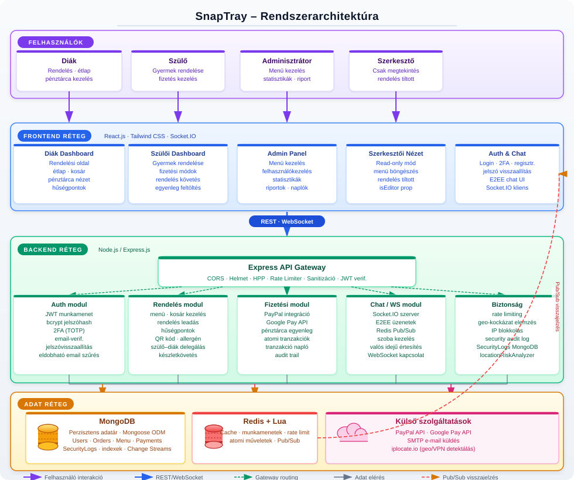

<span id="41-komponensekmodulok" style="display:block; position:relative; top:-80px; visibility:hidden;"></span>
### 4.1 Komponensek/modulok {#41-komponensekmodulok}

| Modul | Leírás |
|-------|--------|
| Frontend/UI | React.js, szerepkör-alapú dashboardok, autentikáció, rendelés UI |
| API réteg | Express.js REST végpontok, üzleti logika |
| Adatréteg | MongoDB (perzisztens), Redis (gyorsítótár, munkamenet) |
| Hitelesítés és biztonság | JWT, rate limiting, biztonsági naplózás |
| Fizetés | PayPal és Google Pay integráció |
| Hűségprogram | Pontszámítás, szintkezelés, kedvezmények |

<span id="42-adatfolyam" style="display:block; position:relative; top:-80px; visibility:hidden;"></span>
### 4.2 Adatfolyam {#42-adatfolyam}

1. A felhasználó a React frontenddel interaktál, HTTP kéréseket küld.
2. Az Express szerver middleware-eken (hitelesítés, rate limiting, sanitizáció) keresztül irányítja a kéréseket.
3. Az üzleti logika MongoDB-ből vagy Redis cache-ből olvassa az adatokat.
4. Írási műveletek frissítik az adatbázist és érvénytelenítik a cache bejegyzéseket.
5. A válasz JSON formátumban kerül vissza a frontendhez.
6. Valós idejű frissítések Redis pub/sub-on és Socket.IO-n keresztül érkeznek.
7. Minden jelentős esemény naplózásra kerül a SecurityLogs kollekcióba.

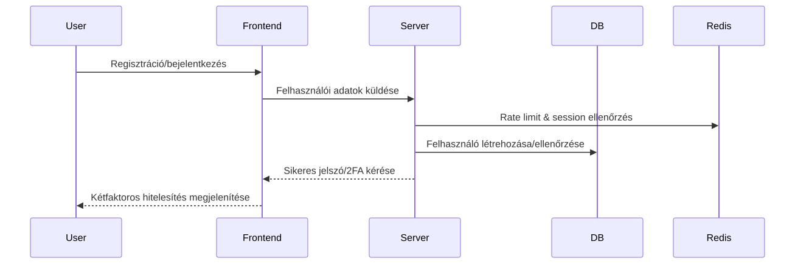

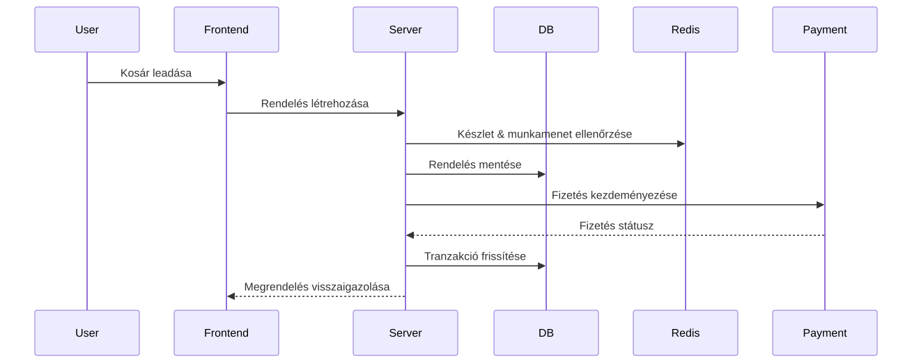

<span id="43-technologiak" style="display:block; position:relative; top:-80px; visibility:hidden;"></span>
### 4.3 Technológiák {#43-technologiak}


| Technológia | Indok |
|-------------|-------|
| Node.js + Express.js | JavaScript full-stack konzisztencia, gyors fejlesztés |
| MongoDB + Mongoose | Rugalmas dokumentum-séma, skálázható |
| Redis + Lua | Gyors cache, atomi műveletek, rate limiting |
| React.js + Tailwind CSS | Komponens-alapú UI, reszponzív Tervezés |
| JWT + bcrypt | Iparági standard hitelesítés és jelszóvédelem |
| PayPal / Google Pay | Megbízható, PCI-kompatibilis fizetési integrációk |
| Socket.IO | Kétirányú valós idejű kommunikáció |
| Helmet, HPP, CORS | HTTP biztonsági fejlécek és védelmi middleware |

<span id="44-technologiai-valasztas" style="display:block; position:relative; top:-80px; visibility:hidden;"></span>
### 4.4 Technológiai választás {#44-technologiai-valasztas}

Ez a rendszer olyan technológiákat használ, amelyek gyors fejlesztést, skálázhatóságot és biztonságot biztosítanak az oktatási menza-rendelő platformhoz:

- **Node.js + Express.js**: Egységes JavaScript fejlesztési élményt nyújt backend és frontend között, és lehetővé teszi a gyors, eseményalapú I/O kezelést.
- **MongoDB + Mongoose**: Rugalmas dokumentum-modell révén jól kezeli a változó felhasználói, rendelési és menü-adatsémát, miközben gyorsan skálázható.
- **Redis + Lua**: Redis a gyorsítótárazáshoz, munkamenetekhez és rate limitinghez, Lua a tömör, atomi műveletekhez a tranzakciók és cache érvénytelenítés megbízhatósága érdekében.
- **React.js + Tailwind CSS**: Komponens-alapú felhasználói felület helyi állapotkezeléssel és gyors, reszponzív stílusokkal.
- **JWT + bcrypt**: Biztonságos hitelesítés és munkamenet-kezelés a token-alapú autentikációhoz, valamint erős jelszóhash-elés.
- **PayPal / Google Pay**: Megbízható külső fizetési szolgáltatók a PCI-kompatibilitás és a gyors fizetési folyamatok miatt.
- **Socket.IO**: Valós idejű kommunikációhoz szükséges chat és élő frissítések támogatása.
- **Helmet, HPP, CORS**: Alapvető HTTP biztonsági fejlécek és request sanitizáció a támadások megelőzése érdekében.

Ez a kombináció lehetővé teszi a gyors fejlesztést, a magas rendelkezésre állást és a biztonságos, valós idejű felhasználói élményt.

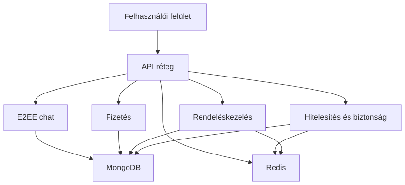

---

<span id="5-tervezes" style="display:block; position:relative; top:-80px; visibility:hidden;"></span>
## 5. Tervezés {#5-tervezes}

<span id="51-tervezesi-elvek" style="display:block; position:relative; top:-80px; visibility:hidden;"></span>
### 5.1 Tervezési elvek {#51-tervezesi-elvek}

| Elv | Megvalósítás |
|-----|-------------|
| Modularitás | Réteges architektúra (útvonalak / szolgáltatások / modellek), laza csatolás modulok között |
| Biztonság-központú | Mélységi védelem, minimális jogosultság elve, minden végpont alapértelmezetten hitelesítést igényel |
| Skálázhatóság | Állapotmentes JWT, Redis gyorsítótár, MongoDB indexek és kapcsolatkezelés |
| Felhasználóközpontú tervezés | Reszponzív Tailwind UI, egyértelmű hibaüzenetek, visszajelzési mechanizmusok |
| Megbízhatóság | Fokozatos degradáció, tranzakciókezelés, kiterjedt naplózás |
| Karbantarthatóság | Tiszta kód, git verziókezelés, RESTful API konvenciók, környezetfüggő konfiguráció |
| Adatintegritás | Többszintű validáció, atomi műveletek, audit naplózás |
| Platformfüggetlenség | Modern böngészők (Chrome, Firefox, Safari, Edge), mobil-reszponzív |


<span id="52-adatbazis-tervezes" style="display:block; position:relative; top:-80px; visibility:hidden;"></span>
### 5.2 Adatbázis tervezés {#52-adatbazis-tervezes}

#### 5.2.1 Cél, funkció és a tárolt információk összefoglalása {#521-cel-funkcio-tarolt-informaciok}

Ez az adatbázis egy iskolai menzarendszer része (MERN stack projekt), amely lehetővé teszi a felhasználók számára (diákok, szülők, tanárok), hogy ételeket rendeljenek, kifizessék azokat és értékeléseket adjanak. A rendszer támogatja a felhasználóhitelesítést, menükezelést, rendelések kezelését, fizetéseket, hűségprogramokat, E2EE chatet és biztonsági naplózást. A fő cél az iskolai étkezések hatékony és biztonságos kezelése, beleértve a készletgazdálkodást, értékeléseket és pénzügyi tranzakciókat. Az adatbázis MongoDB-t használ Mongoose ODM-mel, amely NoSQL adatbázis, de sémákkal struktúrált. Redis gyorsítótárazásra és ideiglenes adatokra szolgál.

Az adatbázis modell típusa: NoSQL (MongoDB), lekérdező nyelv: JavaScript (Mongoose query-k). Redis memóriában tárolt adatbázis gyorsítótárazásra, munkamenetekre és rövid életű adatokra.

#### 5.2.2 Adatbázis terv és séma {#522-adatbazis-terv-sema}

##### Entitások és kapcsolatok (ER modell összefoglaló)

A rendszer fő entitásai és kapcsolataik:

- **User** (Felhasználó): Központi entitás, minden más ehhez kapcsolódik.
- **UserPersonalInfo**: Személyes adatok a felhasználóról (beágyazott dokumentum).
- **MenuItems** (Menüelemek): Ételválaszték elemei.
- **Order** (Rendelés): Felhasználói rendelések.
- **OrderItems** (Rendelési tételek): Menüelemek egy rendeléshez (beágyazott a Rendelésben).
- **Payment** (Fizetés): Pénzügyi tranzakciók.
- **Review** (Értékelés): Menüelemek értékelései (beágyazott a MenuItems-ben).
- **DailyMenu** (Napi menü): Dátum/időszak alapú menürekord, ObjectId referenciákkal a `MenuItems` elemekre.
- **ParentStudent** (Szülő-diák kapcsolat): Szülők és diákok összekapcsolása.
- **SecurityLogs** (Biztonsági naplók): Eseménynaplózás.
- **UserLoyalty** (Hűségprogram): Felhasználói pontok, kedvezmények és hűségszint.
- **DeviceSyncSession** (Eszköz szinkronizációs munkamenet): Eszközkulcs-szinkronizáció (önálló, nincs kapcsolva másokhoz).
- **Message** (Üzenetek): E2EE chat üzenetek.
- **PreKey** (Prekeyek): ECDH prekeyek.
- **StorageBlob** (Tárhely blob): Titkosított üzenet/munkamenet előzmények.

A teljes adatbázis entitás-diagram:


##### Relációk és logikai szerkezet
- User 1:N Payment, Order, SecurityLogs, UserLoyalty, Message (sender/recipient), PreKey, StorageBlob, ParentStudent.
- MenuItems 1:N OrderItems (Rendelésben beágyazva), Review (MenuItems-ben beágyazva).
- Order 1:N OrderItems (beágyazott tételsorokkal).
- DailyMenu 1:N MenuItems referenciákkal (`menuItems` tömb a DailyMenu dokumentumban).
- Message a sender/recipient User relációt használ; a PreKey gyűjtemény külön, eszközönkénti kulcskészletet tárol.
- StorageBlob 1:1 User (kulcspáros: userId + blobType + partitionKey, egyedi indexelés).
- DeviceSyncSession: önálló entitás rövid életű E2EE szinkronizációhoz.

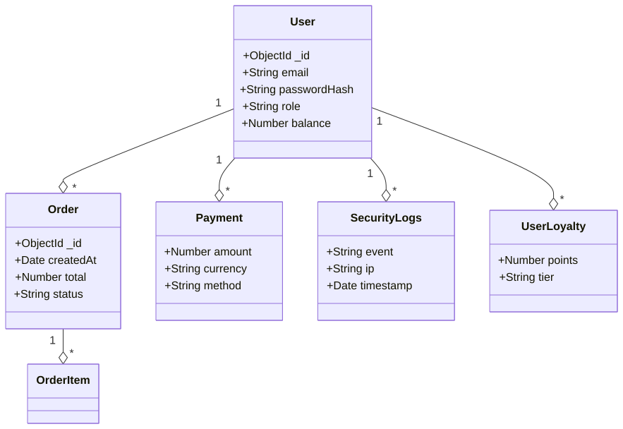

##### Relációs séma – részletes táblaelemzés

A következők részletesen ismertetik az egyes entitások mezőit, típusait, szerepét, megszorításait és indexelését. Minden tábla optimalizációs javaslatot kap, és felhívjuk a figyelmet a törölhető duplikációkra.

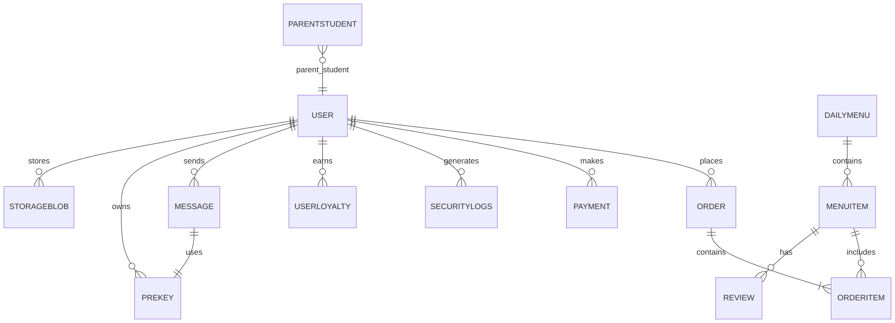

#### 5.2.3 Részletes entitásleírások

Ez a szakasz kifejezetten az entitásokra koncentrál: mezők, szabályok, indexek, tranzakciós minták és teljesítményoptimalizáció.

##### Általános indexelési irányelv
- Minden gyakori lekérdezési mezőre, szűrési feltételre és rendezési kulcsra helyi egyszeres index (simple index), szükség esetén compound index.
- Magas trillásoknál TTL index (pl. `DeviceSyncSession.expiresAt`), és egyediségellenőrzés `(userId, blobType, partitionKey)` típusokat használunk.
- Vegyes OLTP-OLAP terhelésnél az olvasott mezők bevált `covered index` mintára optimalizált struktúrát kapnak.
- Integrált `stats` gyűjtés; `planCache` és `db.stats()` monitorozás.

---

##### User (Felhasználók)

A `User` kollekció a rendszert használók identitását és jogosultságait kezeli; a CRUD, bejelentkezés, 2FA és hűségpont rendszer fő kulcsa.
- Az egyedi `username` és `email` biztosítja a duplikáció megelőzését.
- A beágyazott `userPersonalInfo` csomag rendezi a profil-adatokat (osztály, iskola, kapcsolattartás).
- Az `identity` és `devices` terület a E2EE és multi-device hitelesítést szolgálja biztonságos kulcskezeléssel.
- `balance` és `isBanned` mezőkkel a valósidejű pénzügyi és tiltása állapot is követhető.

| Field Name | Type | Meaning/Role | Constraints | Indexek | Optimálás |
|------------|------|--------------|-------------|---------|----------|
| username | String | Felhasználónév | Required, unique | {_id: 1}, {username: 1} (unique) | Egyetlen lefedett index a loginhoz |
| password | String | Hash-olt jelszó | Kötelező | {_id: 1} | A jelszó hash-olt formában tárolódik, nem indexelt. |
| email | String | Email cím | Kötelező, egyedi, email formátum, trim | {email: 1} (unique) | Email cím szűrés és ellenőrzés gyorsításához |
| isVerified | Boolean | Email ellenőrzöttség | Alapértelmezett false | - | Jól használható újregisztrációs szűrőhöz |
| usertype | String | Szerepkör | Enum, alapértelmezett érték szerepkör | {usertype: 1} | Szerepkör-alapú lekérdezés gyorsításához |
| createdAt | Date | Regisztráció dátum | Alapértelmezett Date.now | - | Archiválás és lapozás támogatásához |
| balance | Number | Pénztárca egyenleg | Alapértelmezett 0 | - | Pénzügyi aggregációs lekérdezésekhez |
| isBanned | Boolean | Tiltott felhasználó | Alapértelmezett false | - | Gyors ideiglenes tiltás-szűréshez |
| banReason | String | Tiltás oka | Optional | _id | Felesleges indexelni ritkán használt lekérdezésnél |
| userPersonalInfo | Subdocument | Profiladatok | Optional | - | Subdocumentben változó lekérdezett mezők miatt nincs index |
| identity.publicKey | String | E2EE kulcs | Optional | - | Keresés eszközazonosításra |
| identity.keyId | String | Kulcspéldány | Optional | - | Kizárólagos kulcspárosított ellenőrzés |
| devices | Array | Regisztrált eszközök | Optional | - | Multi-device azonosítók tárolása |
| recoveryBlob.encryptedData | String | Titkosított blob | Optional | _id | Nincs szükség extra indexre |
| recoveryBlob.iv | String | Inicializáló vektor | Optional | _id | - |
| recoveryBlob.salt | String | Salt | Optional | _id | - |
| recoveryBlob.storedAt | Date | Mentési időpont | Optional | - | TTL index javasolt (jelenleg nincs definiálva) |

Üzleti szabályok: Aktív/tiltott státusz ellenőrzése minden bejelentkezésnél; `usertype` határozza meg az API-engedélyt. A `balance`-t tranzakciós Redis cache-sel támogathatjuk, és rollback esetén a fő adatbázis konzisztenciáját is helyreállítjuk.

**V2 E2EE architektúra (ECDH P-256):** Az aktuális sémaverziója ECDH P-256 kriptográfiát használ, szemben a korábbi V1 RSA-OAEP megközelítéssel. Az `identity` aldokumentum tartalmazza a `signingPublicKey` (ECDSA P-256) mezőt. Minden eszközre (`devices` tömb) kerül: `deviceId`, `publicKey` (DID-SPKI formátumban), és `signedPreKey` (keyId, publicKey, signature) — ez a teljes Signal protokoll kompatibilis prekey-csomag. A V1 RSA-OAEP mezők (`encryption.*`) visszafelé kompatibilitás érdekében megmaradnak a sémában, de migráció után nem kerülnek feltöltésre.

##### Fizetés (Payments)

A `Payment` gyűjtemény a pénzügyi tranzakciók auditját, státuszát és külső azonosítóit tárolja.
- A `transactionId` mező külső fizetési azonosítók tárolására szolgál; egyediség-ellenőrzést az alkalmazási logika is végez.
- `status` mezőnél szigorú enum és text szűrés biztosítja a befejezett/feldolgozás alatt/hibás tételek elkülönítését.

| Field Name | Type | Meaning/Role | Constraints | Indexek | Optimálás |
|------------|------|--------------|-------------|---------|-----------|
| userId | ObjectId (ref: User) | Fizető felhasználó | Optional | {userId: 1} | Felhasználói összegzések gyorsítása |
| amount | Number | Fizetett összeg | Required | - | Range query-khez, aggregációhoz |
| currency | String | Devizanem | Required | {paymentMethod:1, currency:1} | Többdevizás pénzügyi lekérdezéshez |
| paymentMethod | String | Fizetési mód | Required | {paymentMethod:1, currency:1} | Módszer alapú számlázási riporthoz |
| status | String | Állapot | Required, enum ['Completed','Pending','Failed'] | {status:1} | Népszerű statusz szűréshez |
| transactionId | String | Külső tranzakciós ID | Optional | - | Idempotencia azonosításra |
| createdAt | Date | Létrehozás idő | Default now | {userId:1, createdAt:-1}, {userId:1, status:1, createdAt:-1} | Legfrissebb tranzakciók lekérése |

Index-optimalizációk:
- compound index `{userId:1, status:1, createdAt:-1}` a felhasználói tranzakciók lekérdezéséhez.
- `paymentMethod+currency` index a fizetési típus szerinti kimutatásokhoz.

---

##### Menüelemek (Menu Items)

A `MenuItems` gyűjtemény a jelenleg elérhető menü tételeket kínálja, beleértve ár, készlet, allergének és napi ajánlat státuszokat.
- `stock` és `available` mezők konszisztens validációt kapnak pre-save hookon keresztül.
- A `category` kulcsból származtatott aggregált riportok (kedvencek, kategória népszerűség) készülnek napi batch folyamatban.

| Field Name | Type | Meaning/Role | Constraints | Indexek | Optimálás |
|------------|------|--------------|-------------|---------|-----------|
| name | String | Tétel neve | Required | {name:1}, {name:1, available:1} | Név szerinti gyors keresés/listázás |
| description | String | Leírás | Required | - | Megjelenítési és részletes információs mező |
| stock | Number | Készlet | Required, min 0, default 0 | {stock:1} | készletfigyelő triggerhez gyors lookup |
| price | Number | Ár | Required | {price:1} | ár alapú szűréshez |
| category | String | Kategória | Required, enum | {category:1}, {category:1, available:1} | kategória alapú listázás gyorsítása |
| available | Boolean | Elérhető-e | Default true | {available:1} | listázás pull-up optimalizálása |
| QRCode | String | QR kód | Optional | - | opcionális azonosítási mező |
| allergens | [String] | Allergének | Default [] | - | allergénszűrés kliens/aggregációs oldalon |
| nutritionalInfo.calories | Number | Kalóriaérték | Optional | - | statisztikai kimutatásokhoz |
| nutritionalInfo.protein | Number | Fehérje | Optional | - | RT kalkulációhoz |
| nutritionalInfo.carbs | Number | Szénhidrát | Optional | - | low-carb query-hez |
| nutritionalInfo.fat | Number | Zsír | Optional | - | diet-specific listázáshoz |
| healthScore | Number | Egészségpontszám | Optional, default 0 | {healthScore:1} | hűségkedvezmény-számításhoz |
| reviews.reported | Boolean | Jelentett értékelés jelző | Optional | {'reviews.reported':1} | moderációs nézetek gyorsítása |

Index-optimalizációk:
- Egyedi indexkombinációk a tényleges lekérdezésekhez: `{category:1, available:1}` és `{name:1, available:1}`.
- Moderációs gyorsítás: `{'reviews.reported':1}` index a bejelentett értékelésekhez.
- A készletváltozás `pre('save')` hookban frissíti az `available` értéket.

Üzleti szabályok: Stock <= 0 esetén `available=false`, `price` pozitív (számlázás hitelesítés), `allergens` kötelezően normalizált string tömörítéssel (small lexicographically sorted list).

##### Rendelés (Orders)

A `Order` kollekció az ügyfélrendeléseket, tételsorokat, státuszokat és fizetési metaadatokat tartalmazza.
- `items` többnyire beágyazott dokumentumként használt, de a 10+ tétel esetén szétválasztott normalizációs stratégia aktív a mérhetőség miatt.
- Státusz és időbélyeg `compound index`-el támogatja a visszajátszás alapú késéskezelést és timeout kényszerítést.

| Field Name | Type | Meaning/Role | Constraints | Indexek | Optimálás |
|------------|------|--------------|-------------|---------|-----------|
| userId | ObjectId (ref: User) | Rendelést leadó felhasználó | Required | {userId:1} | felhasználó alapú rendezés |
| items | [OrderItemsScheme] | Rendeléssorok | Required | - | beágyazottan gyors OLTP, 20+ tétel esetén külső OrderItems | 
| orderDate | Date | Rendelés időpontja | Default Date.now | {orderDate:-1} | friss lista/pagination |
| status | String | Rendelés állapot | Enum + default Pending | {status:1}, {orderDate:-1,status:1}, {userId:1,status:1} | állapot-szűrés, backlog clean-up |
| subtotalAmount | Number | Kedvezmény előtti összeg | Required | - | pénzügyi bontás |
| discount | Object | Kedvezmény adatai | Optional | - | audit és visszaszámítás |
| totalAmount | Number | Végösszeg | Required | - | pénzügyi jelentésekhez |
| pickupTime | Date | Átvétel ideje | Optional | - | időpont alapú lekérdezések |
| notes | String | Megjegyzés | Optional | - | max 500 char, egységes szűrés minimalizált index nélkül |
| paypalOrderId | String | PayPal azonosító | Optional | {paypalOrderId:1} | idempotencia és visszaellenőrzés |
| paymentMethod | String | Fizetési mód | Optional | - | lekérdezési szegmentálás |
| transactionId | String | Tranzakció ID | Optional | - | cross-system követés |
| publicID | String | Publikus azonosító | Required, unique | {publicID:1} | URL-alapú megosztás, kérésekhez |

Index-optimalizáció:
- Compound index `{userId:1, status:1, orderDate:-1}` a felhasználói rendeléslistázáshoz.
- Külön indexek: `{orderDate:-1,status:1}`, `{status:1}`, `{paypalOrderId:1}`, `{userId:1, orderDate:-1}`.

---

##### Order tétel (Order Items)

A `OrderItems` szabványosított tételtáblázata a rendelések vonatkozású elemcsomagokat tartja nyilván.
- Beágyazott vagy linkelhető: `items` részben beágyazva gyors OLTP-hez; nagy volumen esetén külső `OrderItems` kollekció használata a skálázhatóság javításához.
- `menuItemId` hivatkozás garantálja a tétel referenciális integritását.

| Field Name | Type | Meaning/Role | Constraints | Indexek | Optimálás |
|------------|------|--------------|-------------|---------|-----------|
| menuItemId | ObjectId (ref: MenuItems) | Menüelem referenciája | Required | {menuItemId:1} | hozzáférés a tétel részletekhez |
| orderId | ObjectId (ref: Order) | Rendelés referenciája | Optional (beágyazott használatnál hiányozhat) | {orderId:1} | rendelés alapú agregáció |
| quantity | Number | Mennyiség | Required, min 1 | {quantity:1} | mennyiség alapú riport |

Indexelés:
- A gyakori lekérdezések jellemzően az `Order.items` beágyazott tömbön keresztül futnak.

- Üzleti szabályok: minden tételhez kötelező `menuItemId` és pozitív `quantity`; készletellenőrzés a rendelési szolgáltatási rétegben történik.
---

##### Értékelés (Reviews) - MenuItems beágyazva

A `Review` model a felhasználói feedback-eket rögzíti, a moderálás és jelentés kezdeményezés szűrése szempontjából is.
- Beágyazott struktúra `MenuItems.reviews` listában, mivel egy adott tétel összes tartalmát gyakori egyszerre kérjük le.
- Lehetséges alternatíva: külön `Reviews` kollekció, ha a visszajelzések száma milliós, és átlagpontszám kalkuláció WordPress-szerű 

| Field Name | Type | Meaning/Role | Constraints | Indexek | Optimálás |
|------------|------|--------------|-------------|---------|-----------|
| userId | ObjectId (ref: User) | Értékelő felhasználó | Required | {userId:1} | Előző értékelések lekérése |
| rating | Number | Pontszám +1-5 | Required, min 1, max 5 | {rating:1} | átlagszámítás gyorsítása |
| comment | String | Szöveges vélemény | Optional, maxlength 500 | text index | `{$text: ...}` | felhasználói visszakeresés |
| date | Date | Létrehozás időpont | Default now | {date:-1} | legfrissebbekhez |
| ipAddress | String | IP cím | Optional | {ipAddress:1} | bot-szűrés, fraud elemzés |
| reported | Boolean | Jelentett | Alapértelmezett false | {reported:1} | Moderálási front-endhez |
| moderated | Boolean | Moderált | Alapértelmezett false | {moderated:1} | Automatikus tisztítás |
| moderatorNotes | String | Moderátor megjegyzés | Optional | - | Nincs index, ritkán használt |

Biztonsági szabályok:
- spam kontroll: egy felhasználó 5 percnél gyakrabban nem tehet közzé értékelést.
- `reported=true` esetén dedikált `reportedReviews` nézetet 24h alatt feldolgozza a moderációs pipeline.

**Értékelési API végpontok és profanitásvédelem:**

| Metódus | Útvonal | Leírás |
|---|---|---|
| `POST` | `/order/item_information/:itemName/Review` | Új értékelés beküldése (1–5 csillag, max 500 karakter, felhasználónként csak 1 db) |
| `POST` | `/order/item_information/:itemName/Review/:reviewId/Report` | Értékelés bejelentése (`reported: true`) |

Az `averageRating` mező minden beküldés után automatikusan újraszámítódik. Minden értékelés beküldést a SecurityLogs is rögzít (`REVIEW_SUBMITTED`, `REVIEW_REPORTED`, `DUPLICATE_REVIEW_ATTEMPT`, `REVIEW_CONTAINS_PROFANITY`).

A `containsProfanity()` függvény (`src/Orders/Order.js`) `fast-levenshtein` összehasonlítást használ. A jelenlegi konfigurációban (`PROFANITY_DISTANCE_THRESHOLD = 1` és `<` összehasonlítás) ez gyakorlatban az egzakt egyezéseket blokkolja; a küszöbérték növelésével kapcsolható be lazább, elírás-tűrő fuzzy szűrés.

---

##### DailyMenu (Napi menü)

A `DailyMenu` kollekció a napi menüválasztékot és menüpontokat kezeli, így a heti menü tervezés és változtatás egyszerű.
- `date` + `schoolPeriod` egyedi kombinációval biztosítjuk, hogy mindennaphoz csak egy rekord tartozzon.
- `menuItems` referenciákat használ vagy beágyazott listát (N:M gondos indexeléssel).

| Field Name | Type | Meaning/Role | Constraints | Indexek | Optimálás |
|------------|------|--------------|-------------|---------|-----------|
| date | Date | Nap | Required | {date:1, schoolPeriod:1} (unique) | dátum-alapú gyors keresés |
| schoolPeriod | String | Időszak | Required, enum ['morning','afternoon'] | {schoolPeriod:1} | periodikus szűrés |
| menuItems | [ObjectId] (ref: MenuItems) | Menüelemek | Required | {menuItems:1} multi-key | gyors N:M join-hez |
| createdAt | Date | Létrehozás | Default now | {createdAt:-1} | audit és rollback adat |

Index-optimalizációk:
- Unique compound index `{date:1, schoolPeriod:1}` a hozzárendelés konzisztenciájához.
- `menuItems` multi-key index az események prompt lekérdezéséhez (napi újradefiniálás, audit).
- Konstant menü esetén tárhely-kímélő `compress` and read-only snapshot mechanizmus a MongoDB modernebb tárolási engine-jeivel (WiredTiger, zlib).

Üzleti logika:
- naponta egyszeri generálás a rendelési ablak nyitásakor;
- menü-elkülönítést biztosítjuk `dailyMenu`-val a feketelistázás és változtatás nyomon követéséhez.

---

##### ParentStudent (Parent-Student Relationship)

| Field Name | Type | Meaning/Role | Constraints | Indexes |
|------------|------|--------------|-------------|---------|
| parentId | ObjectId (ref: User) | Parent user | Required | parentId |
| studentId | ObjectId (ref: User) | Student user | Required | studentId |
| status | String | Kapcsolat állapota | Enum: pending/approved/denied | parentId+status, studentId+status |
| createdAt | Date | Creation time | Default: current time | createdAt |
| approvedAt | Date | Jóváhagyás időpontja | Optional | - |
| deniedAt | Date | Elutasítás időpontja | Optional | - |

Üzleti szabályok: Parents can be linked to multiple students; rendelési jogosultsághoz `status: 'approved'` szükséges.

##### SecurityLogs (Biztonsági naplók)

| Field Name | Type | Meaning/Role | Constraints | Indexes |
|------------|------|--------------|-------------|---------|
| userId | ObjectId (ref: User) | User | Optional | _id, userId |
| action | String | Action (e.g., LOGIN_SUCCESS) | Required | _id, action |
| type | String | Type (INFO, WARNING, ERROR) | Required | _id, type |
| ipAddress | String | IP address (hashed) | Optional | _id, ipAddress |
| Timestamp | Date | Timestamp | Default: current time | _id, Timestamp |
| details | String | Additional info | Optional | _id, details |
| country | String | Country | Optional | _id, country |
| CountryCode | String | Country code | Optional | _id, CountryCode |
| currency | String | Currency | Optional | _id, currency |
| Continent | String | Continent | Optional | _id, Continent |
| IsVPN | Boolean | VPN usage | Optional | _id, isVPN |
| isTor | Boolean | Tor usage | Optional | _id, isTor |
| isProxy | Boolean | Proxy usage | Optional | _id, isProxy |

Üzleti szabályok: Minden fontos esemény naplózásra kerül (bejelentkezés, regisztráció, jelszócsere, 2FA, rendelések stb.). Az IP-cím keyed HMAC-SHA256 formában tárolódik (`IP_HASH_SECRET`), ezért kulcs nélkül nem visszafejthető (GDPR megfelelőség). Az automatikus TTL és felhasználónkénti cap mechanizmus részletesen a [5.5.2 fejezetben](#552-securitylogs-automatikus-adatkezeles) olvasható.

##### Reward (Jutalmak/Beváltható tételek)

| Mező | Típus | Szerepe | Korlátozások |
|---|---|---|---|
| name | String | Jutalom neve | Required, unique |
| description | String | Leírás | Optional |
| pointCost | Number | Beváltáshoz szükséges pontok | Required |
| marketValue | Number | Valódi piaci érték (USD) | Required |
| healthScore | Number | Egészségességi pontszám (0–100) | Required |
| dailyStockLimit | Number | Napi korlát (mennyi váltható be) | Optional |
| minTier | String | Minimum szint a beváltáshoz | Enum: none/Bronze/Silver/Gold/Platinum |
| category | String | Kategória | Enum: drink/fruit/dessert/meal/upgrade/mystery/token |
| isActive | Boolean | Aktív-e | Default: true |

Üzleti szabályok: A `minTier` mező korlátozza, hogy csak az adott Tier-en lévő (vagy magasabb) felhasználó válthatja be az adott jutalmat. A `dailyStockLimit` megakadályozza a napi készletkimerülést. A `healthScore` a hűségrendszer egészségszint-bónuszaihoz is bekerül.

##### Redemption (Beváltások)

| Mező | Típus | Szerepe | Korlátozások |
|---|---|---|---|
| userId | ObjectId (ref: User) | Beváltó felhasználó | Required |
| rewardId | ObjectId (ref: Reward) | Beváltott jutalom | Required |
| voucherCode | String | Egyedi utalványkód | Unique, sparse |
| status | String | Az utalvány státusza | Enum: pending/fulfilled/expired/cancelled |
| redemptionType | String | Beváltás módja | Enum: shop/cart_discount/tier_perk/streak_bonus |
| pointsSpent | Number | Elköltött pontok | Required |
| fulfilledAt | Date | Feldolgozás időpontja | Optional |
| fulfilledBy | String | Feldolgozó azonosító | Optional |

Üzleti szabályok: A `voucherCode` mező a `/dashboard/student/loyalty/voucher/fulfill` végponton keresztül váltható be (büfékezelő oldal). A `status` változása naplózódik. A `cart_discount` típus pénztárnál automatikusan kerül levonásra.

##### MoneyRequest (Pénzátutalási kérelmek)

| Mező | Típus | Szerepe | Korlátozások |
|---|---|---|---|
| studentId | ObjectId (ref: User) | Kérelmező diák | Required |
| parentId | ObjectId (ref: User) | Szülő, aki jóváhagyja | Required |
| amount | Number | Kért összeg | Required, positive |
| status | String | Kérelem állapota | Enum: pending/approved/denied |
| reason | String | Diák üzenete/indoklása | Optional |
| processedAt | Date | Feldolgozás időpontja | Optional |
| processedBy | ObjectId (ref: User) | Jóváhagyó szülő | Optional |

Üzleti szabályok: A sémadefiníció jelen van a kódbázisban, de önálló `MoneyRequest` Mongoose modell-export jelenleg nincs. A tényleges szülő→diák pénzmozgás a `/dashboard/parent/transfer` végponton valósul meg.

##### DeviceSyncSession (Device Sync Session)

| Field Name | Type | Meaning/Role | Constraints | Indexes |
|------------|------|--------------|-------------|---------|
| responderDeviceId | String | Responder device ID | Required | responderDeviceId |
| initiatorDeviceId | String | Initiator device ID | Optional | _id |
| encryptedPayload | String | Encrypted payload | Required | _id |
| iv | String | Initialization vector | Required | _id |
| ephemeralKey | String | Ephemeral key | Required | _id |
| expiresAt | Date | Expiration time | Default: current time + 10 minutes | expiresAt (TTL) |

Üzleti szabályok: Rövid életű munkamenet az eszközök közötti titkosítási kulcsok szinkronizálására. TTL index segítségével 10 perc után automatikusan törlődik. Az E2EE kulcskezelésben biztonságos párosítást tesz lehetővé.

##### Üzenet (Messages)

| Field Name | Type | Meaning/Role | Constraints | Indexes |
|------------|------|--------------|-------------|---------|
| senderId | ObjectId (ref: User) | Sender user ID | Required | senderId, recipientId, createdAt |
| recipientId | ObjectId (ref: User) | Recipient user ID | Required | recipientId, status |
| schemaVersion | Number | Schema version | Default: 2 | _id |
| encryptedContent | String | Legacy encrypted content | Optional | _id |
| encryptionMetadata.senderEncryptedKey | String | Legacy sender key | Optional | _id |
| encryptionMetadata.recipientEncryptedKey | String | Legacy recipient key | Optional | _id |
| encryptionMetadata.iv | String | Legacy IV | Optional | _id |
| encryptionMetadata.algorithm | String | Encryption algorithm | Default: 'AES-GCM' | _id |
| status | String | Message status | Enum: ['sent', 'delivered', 'read', 'replaced'], default: 'sent' | status |
| messageType | String | Message type | Enum: ['text', 'file', 'image'], default: 'text' | _id |
| createdAt | Date | Creation time | Default: current time | createdAt |
| readAt | Date | Read time | Optional | _id |
| senderKeyRecovery.needed | Boolean | Key recovery needed | Default: false | senderKeyRecovery.needed |
| senderKeyRecovery.failed | Boolean | Key recovery failed | Default: false | _id |
| senderKeyRecovery.senderPublicKey | String | Recovery public key | Optional | _id |
| senderKeyRecovery.senderKeyId | String | Recovery key ID | Optional | _id |

Üzleti szabályok: End-to-end titkosított üzeneteket tárol, `status` és `senderKeyRecovery` állapotmezőkkel. A migráció érdekében a legacy titkosítási mezők (`encryptedContent`, `encryptionMetadata`) is megmaradnak. Az indexek optimalizáltak a beszélgetések lekérésére és állapotszűrésre.

##### PreKey (Prekeys)

| Field Name | Type | Meaning/Role | Constraints | Indexes |
|------------|------|--------------|-------------|---------|
| userId | ObjectId (ref: User) | User ID | Required | userId, deviceId, used |
| deviceId | String | Device ID | Required | userId, keyId (unique) |
| keyId | Number | Key ID | Required | _id |
| publicKey | String | ECDH public key | Required | _id |
| used | Boolean | Whether key has been used | Default: false | used |
| createdAt | Date | Creation time | Default: current time | _id |

Üzleti szabályok: Egyszer használatos prekey-ek (OPK-k) tárolása X3DH kulcscsere céljára E2EE üzenetküldésre. Minden kulcs egyszer használatos és megjelöltként kerül tárolásra. Egyedi keyId felhasználónként biztosítja a duplikációmentességet. Magas forgalmú gyűjtemény, a kulcsok használat után törlésre kerülnek a forward secrecy megtartása érdekében.

##### StorageBlob (Storage Blobs)

| Field Name | Type | Meaning/Role | Constraints | Indexes |
|------------|------|--------------|-------------|---------|
| userId | ObjectId (ref: User) | User ID | Required | userId, blobType, partitionKey (unique) |
| blobType | String | Blob type | Required, enum: ['message_log', 'session_state', 'skipped_keys'] | blobType |
| partitionKey | String | Partition key (e.g., conversation ID) | Required | partitionKey |
| encryptedPayload | String | Encrypted data | Required | _id |
| iv | String | GCM IV | Required | _id |
| version | Number | Version number | Default: 1 | _id |
| updatedAt | Date | Last update time | Default: current time | updatedAt |

Üzleti szabályok: Titkosított tárolás E2EE kapcsolódó adatoknak, beleértve az üzenetnaplókat, munkamenet állapotokat és kihagyott üzenetkulcsokat. Felhasználó, típus és kulcs szerint particionált a hatékony hozzáférés érdekében. Egyedi korlátozások megakadályozzák az adatok felülírását. Állandó kriptográfiai állapot tárolására szolgál a munkamenetek között.

---

#### 5.2.4 Fizikai és logikai szerkezet

Az adatbázis MongoDB-t használ elsődleges NoSQL tárolóként Mongoose séma érvényesítéssel. A kollekciók dokumentumalapú tárolásra vannak tervezve, beágyazott al-dokumentumokkal a kapcsolódó adatokhoz (pl. OrderItems az Order-ben, Reviews a MenuItems-ben). A kapcsolatokhoz ObjectId hivatkozásokat használunk. A Redis rövid életű adatok, például munkamenetek, rate limiting és gyorsítótárazás kezelésére szolgál.

A logikai szerkezet az ER-modellt követi: entitások kollekciókban, kapcsolatok hivatkozások és beágyazás révén. A fizikai szerkezet teljesítményhez optimalizált indexeket, ideiglenes adatokhoz TTL-t és gyorsítótár-érvénytelenítéshez change stream-eket tartalmaz.

#### 5.2.5 Használati esetek

- Felhasználói regisztráció és hitelesítés szerepkör-alapú hozzáféréssel.
- Menü böngészése, rendelésleadás és fizetés feldolgozása.
- Hűségpont felhalmozás és kedvezmény alkalmazása.
- E2EE üzenetküldés kulcskezeléssel.
- Biztonsági megfigyelés és auditnaplózás.
- Készletgazdálkodás és készletfrissítések.
- Szülő-diák fiók összekapcsolása felügyelet céljából.

#### 5.2.6 Biztonság és hozzáférés

- JWT alapú hitelesítés, jelszavak bcrypt-tel hash-elve.
- Szerepalapú jogosultságok (admin, diák, szülő stb.).
- IP hash-elés a GDPR megfelelőséghez.
- Titkosított blobok az érzékeny adatokhoz.
- Rate limiting a visszaélések megelőzésére.
- Audit naplók minden biztonsági eseményhez.

#### 5.2.7 Karbantartás és üzemeltetés

- Rendszeres index karbantartás és monitorozás.
- Mentési stratégiák MongoDB és Redis számára.
- Adatmigráció sémaváltozásokhoz.
- Teljesítményhangolás lekérdezéselemzés alapján.
- Lejárt munkamenetek és naplók tisztítása.

#### 5.2.8 E2EE chat és üzenetkezelés

A jelenlegi chat implementáció hibrid E2EE-t használ: kliensoldali RSA-OAEP kulcscserét és AES-GCM üzenettitkosítást (`public/js/e2ee-crypto.js`, `Message.encryptionMetadata`). A `User`/`PreKey`/`StorageBlob`/`DeviceSyncSession` modellekben elérhető ECDH-prekey mezők a többeszközös E2EE migráció alapját adják.

**Publikus kulcs Redis gyorsítótár:** Kulcsregisztrálás és -frissítés után a szerver a publikus kulcsot `e2ee:pubkey:{userId}` Redis kulcson tárolja 30 napos TTL-lel. A `GET /chat/public-key/:userId` végpont először a Redis cache-t ellenőrzi, és csak cache-miss esetén kér le MongoDB-ből. A `invalidatePublicKey()` metódus (`src/services/chat-service.js`) törli a cache-bejegyzést, ha a kulcs frissítése megtörténik.

#### 5.2.9 Kódalap leképezése (dokumentációs kiterjesztés)

Ez a szakasz kiegészíti a fent leírt adatbázisséma leírást közvetlen hivatkozásokkal a megvalósító kódokra és a rendszer működési helyeire.

##### Fő MongoDB modellek és helyek

- `src/models/User.js`: `User` and sub-schemas (`userPersonalInfo`, `identity`, `devices`, `recoveryBlob`, `encryption`).
- `config/database_queries.js`: `Payment`, `MenuItems`, `Order`, `OrderItems`, `DailyMenu`, `ParentStudent`, `SecurityLogs`, `UserLoyalty`, `Reward`, `Redemption` + indexek és pre-save hookok.
- `src/models/DeviceSyncSession.js`: `DeviceSyncSession`, TTL index `expiresAt`.
- `src/models/Message.js`: `Message` (E2EE metadata, state-tracking, indexes, markAsRead helper).
- `src/models/PreKey.js`: `PreKey` (X3DH keys, `userId`/`deviceId` indexes and `keyId` uniqueness).
- `src/models/StorageBlob.js`: `StorageBlob` (saved encrypted session data, `userId/blobType/partitionKey` unique index).

##### Adatműveletek és szolgáltatási réteg

- `src/api.js`: Központi REST végpontok, amelyekben a rendelés- és fizetésfolyamatok valamint az e-mailkezelés történik.
  - `/api/orders` CRUD + PayPal/Google Pay + egyenleg alapú fizetés + `save-order` feladat.
  - `orderService`, `paypalService`, `googlePayService` importok, `validateOrderInput` és `validatePaymentInput` middleware.
- `src/Orders/Order.js` és `src/LoyaltySystem/*`: Eszközök rendelésfeldolgozáshoz, `UserLoyalty` pontfrissítéshez, lojalitáspont számításhoz.
- `src/auth/*.js`: Felhasználói hitelesítési események (`register.js`, `login.js`, `2fa.js`, `password_reset.js`, `email_verification.js`), `SecurityLogs` használat.
  - Bejelentkezéskor `SecurityLogs` rögzítése és `User.lastActive` frissítése.
- `src/services/*`: Logika az adatbázis transzparens frissítéseihez, pontos számításokhoz (kedvezmények, kuponok, jutalmak).

##### Adatbázis integráció és indítási lépések

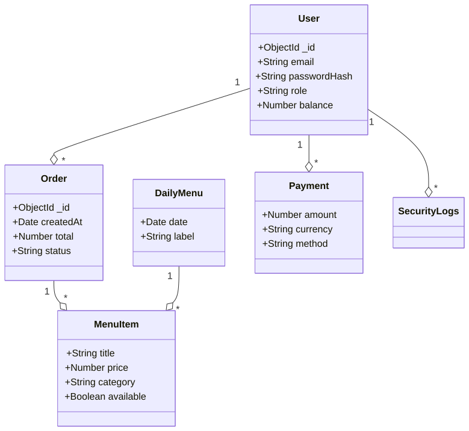

1. `.env` változók betöltése (pl. `MONGODB_URI`, `DB_NAME`) különféle helyeken (`src/models/User.js`, `config/database_queries.js`).
2. Kezdeti `mongoose.connect` kötés két fő komponensben (felhasználói hitelesítés és adatbázis lekérdezés csomagoló).
3. A modellek `module.exports`-e más modulokba importálva (`src/api.js`, `src/auth/login.js`, `src/dashboard/...`).
4. Redis kapcsolódás a `src/redis.js` és `src/cache/*` rétegben (rate limit, cache, Change Stream Manager, KeyRegistry).

##### Főbb funkciók és adatfolyamok a fő modulokban

- **Rendelés beküldése**: `src/api.js` -> `orderService.validateOrderStock` -> `orderService.convertCartToDbFormat` -> `Order.create/Order.save` => `UserLoyalty.updatePointsAtomically` (mentés) -> `SecurityLogs` hívás.
- **Címzett és szülő-diák kapcsolatok**: `ParentStudent` séma, adminisztráció és hozzáférés `src/dashboard/*` és `src/models/User.js` szerint `userPersonalInfo` kapcsolaton keresztül.
- **E2EE üzenetek**: `src/models/Message.js` és `src/models/PreKey.js` + `src/models/StorageBlob.js` + `src/LoyaltySystem` (további konzisztencia, audit) + frontend `src/chat/**`.

##### Biztonság és karbantarthatóság jegyzetek

- Jelszavak: A `src/auth/passwordhash.js` `bcrypt`-tel hasheli és ellenőrzi őket (hash + compare).
- Naplózás: Minden fontos művelet (`SecurityLogs`) a `src/auth/login.js`, `src/auth/register.js` és `src/api.js` végpontoknál történik.

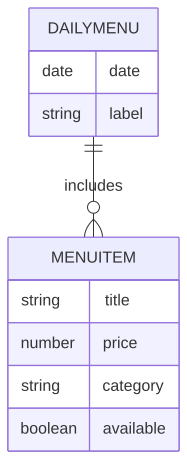

<span id="55-teljesitmenyoptimalizalas" style="display:block; position:relative; top:-80px; visibility:hidden;"></span>
### 5.5 Teljesítményoptimalizálás {#55-teljesitmenyoptimalizalas}

#### 5.5.0 HTTP szintű optimalizációk (tömörítés és keep-alive hangolás)

A `src/main.js`-ben a `compression()` middleware a teljes alkalmazásra globálisan engedélyezi a gzip/deflate válasz-tömörítést, csökkentve a hálózati átviteli méretet.

A Node.js HTTP szerver két időtúllépési értékkel van finomhangolva az AWS ALB (Application Load Balancer) alapértelmezett 60 másodperces keep-alive időkorlátja miatt:

```js
server.keepAliveTimeout = 65000; // ms — 1 másodperccel ALB felett
server.headersTimeout   = 66000; // ms — keepAlive felett kell lennie
```

Ez megakadályozza, hogy az ALB 60 másodperc után lezárja a tartós kapcsolatokat mielőtt a szerver is lezárná azokat, megelőzve a `504 Gateway Timeout` hibákat forgalmas időszakokban.

#### 5.5.1 Mongoose `.lean()` lekérdezés-optimalizálás

Az összes csak olvasásra szánt Mongoose lekérdezés `.lean()` módban fut. A `.lean()` hidratált Mongoose dokumentumok helyett egyszerű JavaScript objektumokat ad vissza, így elkerülhető a dokumentumok felépítésével, virtuális tulajdonságaival és prototípusláncával járó többletköltség. Ez a megközelítés különösen a nagy adatmennyiségű, kizárólag olvasási műveletek esetében csökkenti a memóriahasználatot és javítja a válaszidőt.

**Ahol a `.lean()` alkalmazásra kerül:**

| Fájl | Érintett lekérdezések |
|------|-----------------------|
| `src/dashboard/admin/admin.js` | Minden csak olvasásra szánt `find`, `findById`, `findOne` |
| `src/dashboard/editor/editor.js` | `MenuItems.find`, `findByIdAndUpdate` (a művelet visszatérési értéke), `Reward.find` |
| `src/dashboard/parent/parent.js` | Minden csak olvasásra szánt felhasználó-, rendelés- és hűségpont-lekérdezés |
| `src/dashboard/student/student.js` | Minden csak olvasásra szánt lekérdezés (profil, rendelések, hűségpontok) |
| `src/dashboard/statistics/statistics.js` | `User.find({}, 'createdAt')` |
| `src/Orders/Order.js` | `MenuItems.findById`, `User.findById`, `UserLoyalty.findOne`, `Order.findByIdAndUpdate` |
| `src/auth/register.js` | `User.findOne` (username és email duplikáció-ellenőrzés) |
| `src/auth/login.js` | `SecurityLogs.findOne` (legutóbbi esemény lekérése) |
| `src/auth/password_reset.js` | `User.findById` (token ellenőrzés), `User.findOne` (email keresés) |
| `src/services/order-service.js` | `MenuItems.findOne`, `UserLoyalty.findOne`, `MenuItems.findById` minden blokkban |
| `src/services/googlepay-service.js` | `MenuItems.findOne` (kosár érvényesítés) |
| `src/LoyaltySystem/loyalty-service.js` | `MenuItems.find` |
| `src/services/chat-service.js` | Minden `User.findById`, `Message.findById`, `Message.find`, `User.find` csak olvasási hívás |
| `config/database_queries.js` | `updatePointsAtomically` – `findOneAndUpdate` `{ lean: true }` opcióval |

**Ahol a `.lean()` szándékosan NEM kerül alkalmazásra:**

| Fájl | Ok |
|------|----|
| `src/auth/login.js` — `User.findOne` | `user.id` Mongoose virtuális getter használata JWT és munkamenet létrehozáshoz |
| `src/auth/2fa.js` — `User.findOne` | `user.id` virtuális getter használata (`storePendingSession` függvény) |
| Bármely `.save()` előtt futó lekérdezés | A lean objektum nem használható `.save()`-vel, ezért tranzakciókezeléshez nem megfelelő |
| `.toObject()` hívások előtt (pl. `userPersonalInfo` aldokumentumban) | A részdokumentum metódusai nem lennének elérhetők |
| `session(session)` paraméterrel futó lekérdezések | A tranzakción belüli mentésekhez hidratált dokumentum szükséges |

#### 5.5.2 SecurityLogs automatikus adatkezelés

A biztonsági naplók kezelése két szinten történik az adatbázis korlátlan növekedésének megelőzése érdekében:

1. **TTL index** — A `Timestamp` mezőre 90 napos TTL-index (`expireAfterSeconds: 7 776 000`) került, amely automatikusan törli a 90 napnál régebbi rekordokat. Így nincs szükség külön ütemezett karbantartó feladatra.

2. **Felhasználónkénti korlát** — Felhasználónként legfeljebb 500 napló tárolható. A `SecurityLogsScheme.post('save')` hook minden mentés után ellenőrzi a darabszámot, és a limit túllépése esetén a legrégebbi bejegyzéseket törli.

Ez a kétszintű megközelítés biztosítja:
- Globális adatmennyiség-korlátot (TTL)
- Felhasználói méltányosságot (egy célzott támadás sem töltheti meg korlátlan naplórekordokkal a rendszert)
- Nulla adminisztrációs terhet (minden automatikus)

A frekventált lekérdezési útvonalakhoz további adatbázis-optimalizációk is bekerültek:
- A `Payment` kollekció összetett indexet kapott a `userId + status + createdAt` mintára.
- Az `Order` kollekció `userId + orderDate` indexet kapott a rendeléstörténeti és irányítópult-lekérdezések gyorsítására.
- A `ParentStudent` kollekció `parentId + status` és `studentId + status` indexeket kapott a kapcsolat-alapú listázások támogatására.
- A `MenuItems` kollekcióhoz `reviews.reported` index került a moderációs nézetek gyorsítására.
- A `UserLoyalty.pointHistory` tömb 200 bejegyzésre korlátozott, hogy az adatdokumentum mérete ellenőrzötten maradjon.
- A napi menü tartalékolt lekérdezése MongoDB `$sample` művelettel történik, így nem szükséges a teljes menükészlet memóriába töltése és véletlen sorrendbe rendezése.
- A szülői pénzügyi összesítés aggregációval számítódik, nem teljes `Payment` dokumentumok beolvasásával és JavaScript oldali összegezéssel.
- A rendeléstartalom és a voucherlista mezőszinten szűkített projekciót használ, hogy csak a megjelenítéshez szükséges adat kerüljön a válaszba.
- A 2FA és jelszó-visszaállítás modulok már nem hoznak létre külön MongoDB kapcsolatot; a megosztott alkalmazáskapcsolatra támaszkodnak, ami csökkenti a Render környezetben az indulási és memóriaigényt.

<span id="53-algoritmusok-es-adatszerkezetek" style="display:block; position:relative; top:-80px; visibility:hidden;"></span>
### 5.3 Algoritmusok és adatszerkezetek {#53-algoritmusok-es-adatszerkezetek}

#### 5.3.1 Adatszerkezetek

- **MongoDB gyűjtemények**: BSON dokumentumok, beágyazott dokumentumokkal (OrderItems az Order-ben), ObjectId referenciákkal és tömbökkel (allergének, napi menü tételek).
- **Redis Stringek/Hash-ek**: Munkamenet tárolás, gyorsítótárazott felhasználói adatok, komplex dashboard objektumok.
- **Redis rendezett halmazok**: Csúszó ablakos rate limiting, időbélyeg alapú score-okkal.
- **JavaScript**: Objektumok API válaszokhoz, tömbök kosár- és tömeges műveletekhez, Map/Set gyorskereséshez.

#### 5.3.2 Alapvető algoritmusok

**Jelszó hash-elés (bcrypt):**
```javascript
const hashedPassword = await bcrypt.hash(password, 12);
const isValid = await bcrypt.compare(password, hashedPassword);
```

**JWT token generálás (HS256):**
```javascript
const token = jwt.sign(payload, secretKey, { expiresIn: '24h' });
const decoded = jwt.verify(token, secretKey);
```

**IP hashing (SHA-256, GDPR megfelelőség):**
```javascript
const hashedIP = crypto.createHash('sha256').update(ipAddress).digest('hex');
```

**Hűségpont számítás:**
```javascript
function ConvertPoints(dollarAmount, tier, healthLevel, date) {
  let total = 0;
  for (let i = 0; i < Math.floor(dollarAmount); i++) {
    total += Math.floor(Math.random() * 6) + 4; // 4–9 points per dollar
  }
  if (isHoliday(date)) total *= 1.5;
  else if (isHolidaySeason(date)) total *= 1.2;
  total *= 1 + (healthLevel * 0.2);
  const tierBonus = DISCOUNT_RATES[tier] || 0;
  total *= 1 + tierBonus;
  return Math.floor(total);
}
```

**Szint meghatározás:**
```javascript
const determineTier = (totalPoints) => {
  if (totalPoints >= 40000) return 'Platinum';
  if (totalPoints >= 15000) return 'Gold';
  if (totalPoints >= 5000)  return 'Silver';
  if (totalPoints >= 1200)  return 'Bronze';
  return 'none';
};
```

**Tier-szintek, automatikus kedvezmények és havi ingyenes italok:**

A tier-meghatározás (`determineTier`) küszöbértékei és az automatikusan hozzárendelt kedvezmények:

| Tier | Pont-küszöb | Automatikus kedvezmények | Havi ingyenes ital |
|---|---|---|---|
| Bronze | 1 200 | Egészséges ételek: 5% | 0 |
| Silver | 5 000 | Egészséges: 10%, Ital: 5% (90 napos lejárat) | 1 |
| Gold | 15 000 | Egészséges: 15%, Teljes étkezés: 10% | 2 |
| Platinum | 40 000 | Egészséges: 20%, Általános: 15% | 4 |

**Pontszám-romlás (decay) rendszer:**

Ha egy felhasználó több mint 90 napja nem adott le rendelést (`lastUpdated > 90 napja`), és az utolsó decay több mint 6 hónapja volt (`lastDecay > 6 hónapja`), a rendszer pontokat von le:

- **Platinum tier**: a pontok **30%-a** kerül levonásra
- **Minden más tier** (Gold, Silver, Bronze, none): **50%-os** pontlevonás

A levonás `reason: 'decay'` bejegyzésként kerül a `pointHistory`-ba, és a `lastDecay` mezőt frissíti — ezzel biztosítva a 6 hónapos szünetperiódust.

**Bónusz szorzók:**

- **Ünnepi bónusz**: 1,5× szorzó meghatározott ünnepnapokon (pl. Húsvét — Gauss-függvénnyel közelített dátum), 1,2× karácsony előtt.
- **Egészségpontszám-bónusz**: Ha a megrendelt tételek egészségpontszáma ≥75 → +40% bónusz; ≥50 → +20%.
- **Alap pont-eloszlás**: Rendelésenként véletlenszerűen 4–9 pont/dollár.

**Menüelem szűrés:**
```javascript
const filterMenuItems = (items, filters) =>
    items.filter(item =>
        (!filters.category   || item.category === filters.category) &&
        (!filters.priceRange || isInRange(item.price, filters.priceRange)) &&
        (!filters.allergens  || !hasAllergens(item, filters.allergens)) &&
        (!filters.searchTerm || item.name.toLowerCase().includes(filters.searchTerm.toLowerCase()))
    );
```

**Redis Lua implementációk:**
A projekt valódi Redis Lua szkriptek a `src/scripts` könyvtárban találhatók, és több rétegbeli hibakezelést, bemeneti validációt és naplózást tartalmaznak.

- `src/scripts/rate_limit.lua`: csúszó ablakos rate limit ellenőrzés, `fnv1a` kulcshashing, típusellenőrzés és biztonságos `redis.call` wrapper.
- `src/scripts/wallet_update.lua`: atomi pénztárca-módosítás, negatív egyenleg visszautasítása, Redis hibák hibaválasszal történő kezelése.
- `src/scripts/process_order.lua`: készletellenőrzés, pénztárcaegyenleg ellenőrzés, tranzakciós rollback Redis hibák esetén, és megrendelés rekord létrehozása.

A `rate_limit.lua` működése a következőket tartalmazza:
- `fnv1a` kulcshash a rövid, stabil Redis kulcsokhoz
- bemeneti típusvalidáció és hibaválaszok `redis.error_reply` segítségével
- régi bejegyzések törlése `ZREMRANGEBYSCORE`-ral
- jelenlegi kérésszám lekérdezése `ZCARD`-dal
- új bejegyzés hozzáadása és kulcseredmény beállítása

Példakód részlet:
```lua
local key = "rl:" .. fnv1a(KEYS[1])
local window = tonumber(ARGV[1])
local max_requests = tonumber(ARGV[2])
local now = tonumber(ARGV[3])

redis.call('ZREMRANGEBYSCORE', key, 0, now - window)
local current_count = redis.call('ZCARD', key)
if current_count >= max_requests then
    return {0, current_count}
end
redis.call('ZADD', key, now, now)
redis.call('EXPIRE', key, window)
return {1, current_count + 1}
```

A `wallet_update.lua` script a pénztárca-módosítást is biztonságosabbá teszi:
- számszerűsíti a bemenetet
- hitelesíti a Redis értékformátumot
- visszautasítja a negatív egyenlegű tranzakciókat `INSUFFICIENT_FUNDS` hibával
- csak sikeres Redis frissítés után adja vissza az új egyenleget
- minden Redis hívást `pcall`-lal csomagolva végez a stabil működésért

Példakód részlet:
```lua
local current_balance = tonumber(redis.call('GET', KEYS[1]) or '0')
local amount = tonumber(ARGV[1])
if amount < 0 and (current_balance + amount) < 0 then
    return redis.error_reply('INSUFFICIENT_FUNDS')
end
redis.call('SET', KEYS[1], tostring(current_balance + amount))
return current_balance + amount
```

A `process_order.lua` esetén a dokumentációban érdemes hangsúlyozni, hogy a script nem csak egyszerű `DECRBY`-t használ, hanem:
- készlet és pénztárca ellenőrzést hajt végre
- Redis hibák esetén visszagörgeti a már elvégzett műveleteket
- `HMSET`-tel order recordot hoz létre
- részletes naplózást végez `redis.log`-gal

Példakód részlet:
```lua
local available_stock = tonumber(redis.call('GET', KEYS[1]) or '0')
if available_stock < tonumber(ARGV[1]) then
    return redis.error_reply('INSUFFICIENT_STOCK')
end
local wallet_balance = tonumber(redis.call('GET', KEYS[2]) or '0')
local total_cost = tonumber(ARGV[1]) * tonumber(ARGV[2])
if wallet_balance < total_cost then
    return redis.error_reply('INSUFFICIENT_FUNDS')
end
redis.call('DECRBY', KEYS[1], tonumber(ARGV[1]))
redis.call('DECRBY', KEYS[2], total_cost)
redis.call('HMSET', KEYS[3], 'user_id', ARGV[3], 'quantity', ARGV[1], 'price', ARGV[2])
```

Ez a dokumentáció most már tükrözi a valós implementációt: a Lua szkriptek nem egyszerű példák, hanem robosztus, hibakezeléssel és bemeneti validációval ellátott Redis műveletek.


**reCAPTCHA ellenőrzés:**
```javascript
const verifyRecaptcha = async (token) => {
    const result = await fetch('https://www.google.com/recaptcha/api/siteverify', {
        method: 'POST',
        body: new URLSearchParams({ secret: process.env.RECAPTCHA_SECRET, response: token })
    }).then(r => r.json());
    return result.score >= 0.5; // 0.0 = bot, 1.0 = ember
};
```

#### 5.3.3 Teljesítményoptimalizálás

- **Adatbázis indexek**: Összetett indexek gyakran lekérdezett mezőkre (például `{ email: 1, isVerified: 1 }`, `{ userId: 1, orderDate: -1 }`).
- **Lapozás**: Skip-limit stratégia teljes elemszám használatával nagy adatkészletekhez.
- **Tömeges feldolgozás**: `bulkWrite` többszörös rekordfrissítésekhez.
- **Gyorsítótár middleware**: Redis gyorsítótár elsődlegesen, visszaesés MongoDB-re, mintázat alapú érvénytelenítéssel írások esetén.

<span id="54-biztonsagi-tervezes" style="display:block; position:relative; top:-80px; visibility:hidden;"></span>
### 5.4 Biztonsági tervezés {#54-biztonsagi-tervezes}

#### 5.4.1 Biztonsági funkciók

| Funkció | Részletek |
|---------|---------|
| Hitelesítés | JWT (HS256), szerepalapú hozzáférés-vezérlés (RBAC) |
| Jelszó tárolás | bcrypt, 10–12 salt kör |
| 2FA | Megvalósítva; 2 jegyű challenge-kód (`10..99`) Redis/memória fallback tárolással, tokenes jóváhagyási folyamattal |
| Rate limiting | `express-rate-limit` (általános) + Redis Lua csúszó ablak (admin/dashboard) |
| Bemenet-ellenőrzés | Kliens oldali, szerver oldali, adatbázis szintű; egyéni Express middleware (`src/middleware/security.js`), Mongoose sémák |
| NoSQL injekció elleni védelem | A központi middleware detektálja a MongoDB-szerű `$` operátorokat és blokkolja őket egy barátságos `Nice try buddy :)` válasszal |
| XSS / injekció | `xss-clean`, `helmet`, `express-mongo-sanitize` |
| CSRF | Teljes double-submit cookie implementáció: `GET`/`HEAD`/`OPTIONS` kérésekre a szerver beállítja az `XSRF-TOKEN` sütit (`req.session.csrfToken`, 30 perces lejárat); mutáló kérésekre az `x-xsrf-token` / `x-csrf-token` fejlécet vagy `_csrf` body mezőt ellenőrzi. Token: `crypto.randomBytes(24)`. |
| CORS | Szigorú szabályzat; csak a hivatalos frontend domain engedélyezett |
| Eldobható email blokkolás | Regisztrációkor az email domén ellenőrzésre kerül a `data/disposable_email_list.json` fájl alapján |
| Tiltott jelszó lista | Regisztrációkor és jelszóváltáskor a `data/Most_used_passwords.json` fájl (nagy méretű közismert jelszólista) alapján ellenőrzés; egybevágó jelszavak elutasítva |
| Tiltott jelszóminták | `containsForbiddenPasswordPattern()`: tiltja a `( ) [ ] { } < > " ' \` \ / $ db.` karaktereket/stringeket injekció-szerű jelszó payloadok megelőzésére |
| Anti-enumeráció | Regisztrációkor meglévő fiók esetén a szerver ugyanazt a HTTP 200 választ adja vissza; az email küldési logika változik, de a response nem — ez megakadályozza a felhasználónév/email enumeration támadásokat |
| Biztonsági middleware | Központosított Helmet/CORS/XSS/NoSQL sanitizáció és validáció a `src/middleware/security.js`-ben |
| NoSQL injekció elleni middleware | `hasNoSqlInjectionPattern()` és `noSqlInjectionEasterEgg()` a központi express middleware-ben |
| Biztonsági fejlécek | Helmet.js (CSP, HSTS stb.), eval() tiltva, nonce alapú inline script-ek |

```javascript
// src/middleware/security.js
function hasNoSqlInjectionPattern(value) {
    if (value && typeof value === 'object') {
        return Object.entries(value).some(([key, nested]) => {
            if (typeof key === 'string' && key.startsWith('$')) return true;
            return hasNoSqlInjectionPattern(nested);
        });
    }
    if (typeof value === 'string') {
        return /(?:^|[^\w\$])\$(?:ne|gt|lt|gte|lte|in|nin|or|and|regex|where|expr|size|type)(?:\b|[^\w])?/i.test(value);
    }
    return false;
}

function noSqlInjectionEasterEgg(req, res, next) {
    if (['body', 'query', 'params'].some(src => hasNoSqlInjectionPattern(req[src]))) {
        console.warn('NoSQL injection attempt blocked:', {
            ip: req.ip,
            url: req.originalUrl,
            method: req.method
        });
        return res.status(400).json({
            error: 'Nice try buddy :)',
            message: 'Your input was flagged as NoSQL injection and blocked.'
        });
    }
    next();
}
```
| IP hash-elés | Keyed HMAC-SHA256 (`crypto.createHmac('sha256', IP_HASH_SECRET)`) a SecurityLogs tárolása előtt; a titkosítókulcs nélkül az eredeti IP cím visszafejthetetlen (GDPR 32. cikk) |
| reCAPTCHA | Google reCAPTCHA v3 regisztrációhoz és bejelentkezéshez |
| Geolokáció | iplocate.io VPN/Proxy/Tor észlelésre és kockázatpontozásra |
| Fizetési biztonság | PayPal/Google Pay PCI-kompatibilis átjárók |
| Környezeti titkok | Minden hitelesítő adat `.env`-ben, soha verziókezelésben |

##### 5.4.1.1 Kétfaktoros hitelesítés (2FA)
A rendszer második faktoros hitelesítést használ challenge-kód alapú jóváhagyással. A szerver egy kétjegyű kódot generál (`10..99`), amit Redisben tárol (fallback: in-memory `Map`), majd a kliens a tokenes 2FA végpontokon (`/2fa/code`, `/2fa/approve`, `/2fa/status`) keresztül végigviszi a jóváhagyást. Ez a lépés a jelszón felüli extra belépésvédelmet ad.

**2FA kihívás-kód generálás és tárolás (`src/auth/2fa.js`):**

A szerver a `crypto.randomInt(10, 100)` segítségével egy 10–99 közötti kétjegyű kódot állít elő, amelyet Redis-ben tárol 1500 másodperces TTL-lel. Ha Redis nem elérhető, in-memory `Map`-be esik vissza:

```javascript
// src/auth/2fa.js — Redis/memória kettős tároló
async function store2FACode(userId, code, ttlSeconds = 1500) {
    const key = `2fa:${userId}`;
    if (isRedisAvailable) {
        try { await redisClient.setEx(key, ttlSeconds, String(code)); return; }
        catch (err) { console.error('Redis 2FA store failed:', err.message); }
    }
    pendingCodes.set(String(userId), { code, expires: Date.now() + ttlSeconds * 1000 });
}
```

A `POST /2fa` végpont idempotens: ha már létezik kód az adott felhasználóhoz (pl. a companion app már lekérte), nem állít elő újat — ezzel megakadályozza, hogy az asztali és mobil kliens egymás kódját írja felül:

```javascript
// Meglévő kód újrafelhasználása (idempotens)
const existingCode = await get2FACode(user._id);
const code = existingCode ? parseInt(existingCode, 10) : crypto.randomInt(10, 100);
```

A companion alkalmazás a `GET /2fa/code` végpontot kéri le Bearer tokennel (`JWT_2FA_SECRET`), majd megjeleníti a kódot. A `POST /2fa/approve` végpont jelzi a jóváhagyást. A `GET /2fa/status` polling-gal észleli a jóváhagyást, majd egy műveletben törli az összes 2FA kulcsot és felépíti a munkamenetet:

```javascript
// GET /2fa/status — jóváhagyás detektálás és munkamenet-felépítés
const approved = await getApproval(decoded.userId);
if (!approved) return res.json({ approved: false });

// Atomikusan törli a kódot, jóváhagyást és pending session-t
await Promise.all([
    delete2FACode(decoded.userId),
    deleteApproval(decoded.userId),
    deletePendingSession(decoded.userId),
]);

req.session.user = { ...sessionData, IsLoggedIn: true };
res.json({ approved: true, redirect: redirectMap[sessionData.usertype] || '/dashboard/student' });
```

**DX-SnapTray companion kliens snippetek (külső projekt: DX-SnapTray repository):**

```rust
// src/components/two_factor_auth/api.rs
pub async fn api_start_2fa(email: &str) -> Result<TwoFaInitResponse, String> {
  let resp = client()
    .post(format!("{}/2fa", API_BASE))
    .form(&[("email", email)])
    .send()
    .await
    .map_err(|e: reqwest::Error| e.to_string())?;
  let raw = resp.text().await.map_err(|e: reqwest::Error| e.to_string())?;
  serde_json::from_str::<TwoFaInitResponse>(&raw)
    .map_err(|e| format!("Parse error: {e} — body: {raw}"))
}

pub async fn api_approve(token: &str) -> Result<(), String> {
  let resp = client()
    .post(format!("{}/2fa/approve", API_BASE))
    .bearer_auth(token)
    .send()
    .await
    .map_err(|e: reqwest::Error| e.to_string())?;
  if !resp.status().is_success() {
    return Err(resp.text().await.unwrap_or_else(|_| "Approval failed".into()));
  }
  Ok(())
}
```

```rust
// src/components/two_factor_auth/model.rs
pub enum Status {
  Ready,
  Loading,
  Idle,      // 3 szám megjelenítése, /2fa/status polling
  Verifying, // jóváhagyási kérés folyamatban
  Success,
  Error,
  Expired,
}
```

```rust
// src/components/two_factor_auth/mod.rs
if picked != expected {
  error_msg.set("Wrong number - try again.".into());
  return;
}

match api_approve(&token).await {
  Ok(()) => status.set(Status::Success),
  Err(e) => {
    error_msg.set(format!("Approval failed: {e}"));
    status.set(Status::Error);
  }
}
```

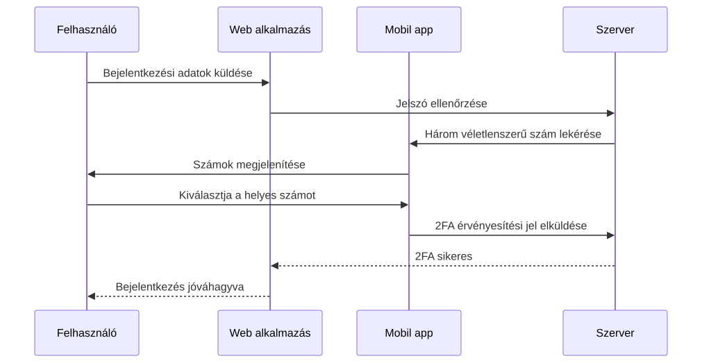

##### 5.4.1.2 Rétegzett rate limiting (útvonalankénti korlátok)

A `src/main.js` hat különböző `express-rate-limit` példányt alkalmaz, mindegyiket más-más időablakkal és maximummal, az érzékenység alapján:

| Limiter neve | Időablak | Max kérés | Alkalmazott útvonalak |
|---|---|---|---|
| `limiter` | 1 óra | 250 | `/api`, `/database`, `/pay`, `/email-verification`, `/passwordhash` |
| `registerLimiter` | 1 óra | 100 | `/register` |
| `LoginLimiter` | 15 perc | 35 | `/login` |
| `dashboardLimiter` | 15 perc | 1 000 | `/dashboard` |
| `twoFALimiter` | 15 perc | 900 | `/2fa` |

A `/dashboard` útvonalakon ezentúl a Redis Lua csúszóablakos középréteg (`createDashboardRateLimiter`) is aktív, ami felhasználói session alapján alkalmaz limiteket és `X-RateLimit-Limit/Remaining/Reset` fejléceket ad vissza. Blokkolás esetén a szerver a `public/429/429.html` oldalt adja vissza.

A `/order` modul külön Redis Lua korlátot is használ (`rateLimit` middleware a `src/Orders/Order.js`-ben), alapértéken 20 kérés/perc limitálással.

##### 5.4.1.3 Regisztráció biztonsági rétegei

A regisztrációs folyamat (`src/auth/register.js` + `src/auth/validation.js`) több egymást erősítő ellenőrzési réteget alkalmaz:

1. **reCAPTCHA v3**: Google Siteverify API-n keresztül, `0.5`-ös küszöbbel. A titkos kulcs a `process.env.Server_Side_Captha` változóból olvasódik.
2. **Eldobható email szűrő**: A domain kivonódik az emailből és összehasonlítódik a `data/disposable_email_list.json` listával. Egyezés esetén elutasítás.
3. **zxcvbn jelszóerősség**: Minimális erősségi szint kikényszerített.
4. **Közismert jelszó tiltólista**: A `data/Most_used_passwords.json` alapján case-insensitive egyezés ellenőrzés.
5. **Tiltott jelszóminták**: `containsForbiddenPasswordPattern()` tiltja az injekció-szerű karaktereket: `( ) [ ] { } < > " ' \` \ / $ db.`
6. **Magyar karaktertámogatás**: A `USERNAME_ALLOWED_CHARS` és a jelszó-nagybetű ellenőrzés tartalmazza a `data/password_characters.json`-ból betöltött magyar ábécé karaktereit.
7. **Tiltott szólista**: A `config/hu.json` alapján felhasználónév- és jelszóellenőrzés.
8. **Anti-enumeráció**: Meglévő fiók esetén a szerver ugyanazt a HTTP 200 választ adja — a response nem különbözteti meg az „email már létezik" és az „új felhasználó" eseteket; csak az email-küldési logika tér el.

##### 5.4.1.4 VerificationStore — Redis/memória kettős fallback

A `src/verificationStore.js` modul az email-ellenőrző kódok ideiglenes tárolását végzi. Ha Redis elérhető, 10 perces TTL-lel írja oda az adatokat; ha Redis leáll, egy in-memory `Map`-be esik vissza manuális lejárat-ellenőrzéssel. Ez biztosítja, hogy a regisztrációs folyamat Redis-leállás esetén is működőképes maradjon — azzal a fenntartással, hogy az in-memory tároló adatai szerver-újraindításkor elvesznek.

#### 5.4.2 Fenyegetésmodellezés

##### Azonosított fenyegetések
- **Hitelesítés megkerülése**: Brute force támadások, hitelesítő adatok kitöltése, JWT token lopás.
- **Adatbefecskendezés**: SQL/NoSQL injekció, XSS, CSRF támadások. A rendszer speciális NoSQL bemenet-detektálást is tartalmaz, amely gyanús MongoDB `$` operátorokra barátságos "Nice try buddy :)" választ ad.
- **Szolgáltatásmegtagadás (DoS)**: Rate limit megkerülése, erőforráskimerülés.
- **Adatszivárgás**: Jogosulatlan hozzáférés felhasználói adatokhoz, fizetési információkhoz.
- **E2EE kompromittálás**: Gyenge kulcscsere, közbeékelt támadások a chaten.
- **Belső fenyegetések**: Admin jogosultságok visszaélése, adat kimentése.

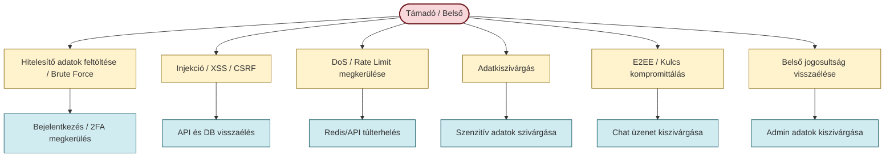

##### Mitigációs stratégiák
- Többrétegű hitelesítés reCAPTCHA-val és geolokációs kockázatpontozással.
- Átfogó bemenet-szűrés és parametrizált lekérdezések.
- Elosztott rate limiting Redis-szel a DoS elleni védelemhez.
- Titkosítás nyugalmi helyzetben és átvitel közben (HTTPS, E2EE chathez).
- Legkisebb jogosultság elve és audit naplózás minden műveletnél.
- Rendszeres biztonsági auditok és függőség sebezhetőség vizsgálat.

#### 5.4.3 Incidensreagálási terv

1. **Felderítés**: Automatikus monitorozás SecurityLogs, rate limit riasztások és anomália észlelés alapján.
2. **Értékelés**: Incidens súlyosságának osztályozása (alacsony/közepes/magas) az adatkitettség és rendszerszintű hatás szerint.
3. **Elzárás**: Érintett rendszerek azonnali izolálása, token visszavonás, fiók zárolás.
4. **Eltávolítás**: Alapokozat elemzése, javítás telepítése, kulcs forgatása E2EE esetén.
5. **Helyreállítás**: Rendszer visszaállítása biztonsági mentésekből, felhasználói értesítés, szolgáltatás újraindítása.
6. **Tapasztalatok levonása**: Incidens utáni felülvizsgálat, dokumentáció frissítése, megelőző intézkedések.

#### 5.4.4 Megfelelés és adatvédelem

- **GDPR megfelelőség**: Adatminimalizálás, hozzájárulás kezelése, törlés joga, IP hash-elés az anonimizáláshoz.
- **PCI DSS**: A fizetési adatokat nem tároljuk helyben; minden tranzakció minősített átjárókon keresztül történik.
- **Adattárolási szabályok**: A `SecurityLogs` bejegyzések 90 napos TTL-lel törlődnek, és felhasználónként 500 rekordos cap is érvényesül. A felhasználói adatok a fiók törléséig maradnak.
- **Privacy by Design**: Alapértelmezett titkosítás, hozzáférésszabályozás és audit naplók.

#### 5.4.5 Biztonsági tesztelés

- Automatizált tesztcsomagok hitelesítési folyamatokhoz, bemenet-szűréshez és rate limitinghez.
- Rendszeres manuális penetrációs tesztelés az automata eszközökkel nem észlelt sebezhetőségek feltárására.
- Függőségek vizsgálata `npm audit` és Snyk integráció segítségével.
- OWASP ZAP a dinamikus alkalmazásbiztonsági teszteléshez.

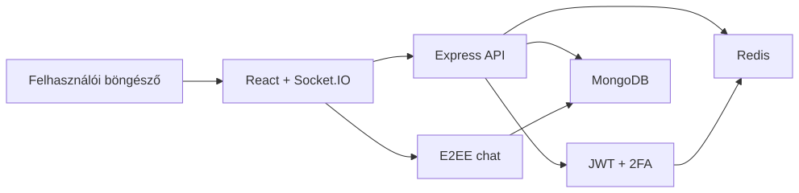

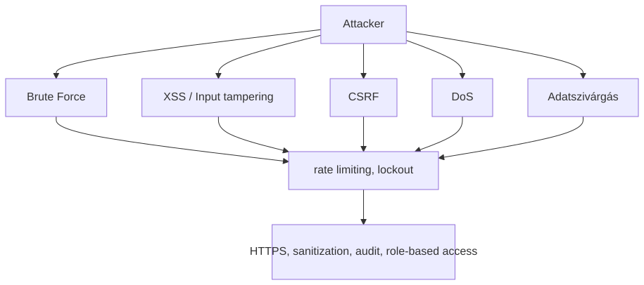

---

<span id="6-megvalositas" style="display:block; position:relative; top:-80px; visibility:hidden;"></span>
## 6. Megvalósítás {#6-megvalositas}

<span id="61-konyvtarszerkezet" style="display:block; position:relative; top:-80px; visibility:hidden;"></span>
### 6.1 Könyvtárstruktúra {#61-konyvtarszerkezet}

```
├── config/
│   ├── DATABASE_CONSTANTS.JS
│   ├── database_queries.js
│   └── hu.json
├── data/
│   ├── disposable_email_list.json
│   ├── Most_used_passwords.json
│   └── database_test/
├── docs/
├── public/
│   ├── chat/
│   ├── dashboard/
│   │   ├── admin/
│   │   ├── editor/
│   │   ├── parent/
│   │   └── student/
│   └── Order/
├── src/
│   ├── main.js
│   ├── auth/
│   │   ├── 2fa.js
│   │   ├── login.js
│   │   ├── register.js
│   │   ├── password_reset.js
│   │   └── validation.js
│   ├── cache/
│   │   ├── ChangeStreamManager.js
│   │   └── KeyRegistry.js
│   ├── dashboard/
│   ├── LoyaltySystem/
│   │   └── loyalty-service.js
│   ├── models/
│   ├── Orders/
│   ├── payments/
│   └── services/
└── tests/
    └── performance_tests/
```

<span id="62-backend-megvalositas" style="display:block; position:relative; top:-80px; visibility:hidden;"></span>
### 6.2 Backend megvalósítás {#62-backend-megvalositas}

#### 6.2.1 Technológiai stack

Node.js + Express.js, MongoDB + Mongoose, Redis + Lua szkriptek, JWT, bcrypt, PayPal és Google Pay API-k, Socket.IO.

#### 6.2.2 Fő alkalmazási felépítés

- **`src/main.js`**: Belépési pont — Express beállítása, middleware-ek (Helmet, CORS, munkamenet, rate limit), és az útvonalak felcsatolása.
- **`src/database.js`**: Háttérkompatibilitási réteg az új modularizált auth rendszerhez és a legacy exportokhoz.
- **`src/verificationStore.js`**: Redis-fallback kódellenőrző tároló, amely hibás Redis esetén memóriában tartja a hitelesítési kódokat.
- **`src/middleware/security.js`**: Központosított biztonsági réteg, amely kezeli a fejléceket, CORS-t, rate limitinget, body parsinget, XSS/NoSQL sanitizációt és egyedi request validációt.
- **`src/services/Geosecurity-service.js`**: Helyalapú biztonsági végpontok, VPN/Tor/Proxy kockázatbecslés és „impossible travel” detektálás.
- **`src/locationRiskAnalyzer/locationRiskAnalyzer.js`**: A geobiztonsági elemzés logikája, amely kockázati pontszámot és kockázati szintet számít.
- **Redis Lua orchestration**: `src/redis-lua.js`, `src/script-loader.js`, `src/services/redis-lua-service.js` és a `src/examples/lua-demo.js` példakód a Redis Lua szkriptek kezeléséhez.
- **Útvonalak**: Domain alapú moduláris szétválasztás (`auth`, `dashboard`, `orders`, `payments`, `chat`, `geosecurity`).
- **Modellek**: Mongoose sémák a `src/models/` mappában.
- **Szolgáltatások**: Üzleti logika külön modulokban (`loyalty-service.js`, `paypal-service.js`, `cache-service.js`, `geosecurity-service.js`, stb.).

#### 6.2.3 Hitelesítés és biztonság

A regisztráció érvényesíti a bemenetet, ellenőrzi a reCAPTCHA-t, bcrypttel hash-eli a jelszót, küld egy e-mailes ellenőrzőkódot, és naplózza az eseményt. A bejelentkezés ellenőrzi a hitelesítő adatokat, JWT-t ad ki, naplózza az IP/hely alapú kockázatot és IP-nként rate limitinget alkalmaz.

**Bejelentkezéskori Redis brute-force védelem (`src/auth/login.js`):**

```javascript
// src/auth/login.js — IP-alapú bejelentkezési kísérlet számláló
if (isRedisAvailable) {
    const rateLimitKey = `login_attempts:${clientIp}`;
    const attempts = await redisClient.get(rateLimitKey);
    const attemptCount = attempts ? parseInt(attempts) : 0;

    if (attemptCount >= 5) {
        return res.status(429).send('Too many login attempts. Please try again later.');
    }
    // 1 óra TTL — minden sikertelen kísérlet növeli a számlálót
    await redisClient.setEx(rateLimitKey, 3600, (attemptCount + 1).toString());
}
```

**IP-változás észlelése és SecurityLog bejegyzés (`src/auth/login.js`):**

```javascript
// IP hash és geolokáció alapú biztonsági naplózás
const hashedIP = crypto.createHash('sha256').update(clientIp).digest('hex');
const lastLog = await SecurityLogs.findOne({ userId: user._id }).sort({ Timestamp: -1 }).lean();
const ipMatches = lastLog && lastLog.ipAddress === hashedIP;

if (!ipMatches && lastLog) {
    await createSecurityLog({
        userId: user._id,
        ipAddress: clientIp,
        action: 'ip_mismatch_login_attempt',
        type: 'WARNING',
        country: geo?.country ?? 'unknown',
        IsVPN: geo?.privacy?.is_vpn ?? false,
        isTor: geo?.privacy?.is_tor ?? false,
        isProxy: geo?.privacy?.is_proxy ?? false,
    });
}
```

A rendszer hitelesítési folyamatait az alábbi aktivitási diagram mutatja be:

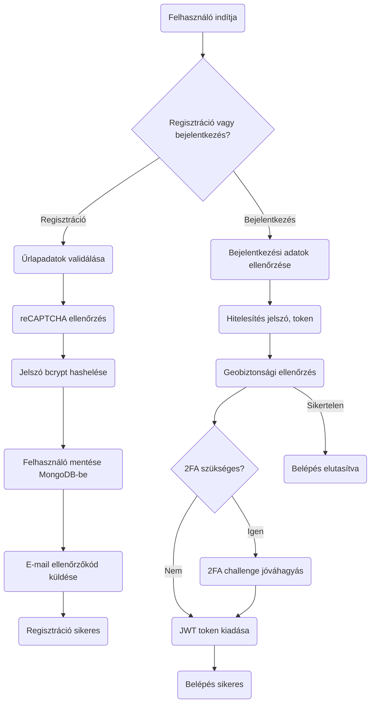

A backend tokenes 2FA folyamatot biztosít a `POST /2fa`, `GET /2fa/code`, `POST /2fa/approve`, `GET /2fa/status` és `POST /2fa/verify` végpontokon keresztül. A folyamat a külön DX-SnapTray companion klienssel is működik (DX-SnapTray repository), miközben ez a repo a szerveroldali 2FA API-kat tartalmazza.

A rendszer emellett egy belső geobiztonsági szolgáltatást is tartalmaz (`src/services/Geosecurity-service.js`), amely az IP-alapú helyadatokat elemzi, VPN/Tor/Proxy kockázatpontszámot számít és lehetetlen utazás detektálást végez a `src/locationRiskAnalyzer/locationRiskAnalyzer.js` modulon keresztül.

```javascript
// Regisztrációs példa — src/auth/register.js
const hashedPassword = await bcrypt.hash(password, 10);
const user = new User({ username, password: hashedPassword, email });
await user.save();
await createSecurityLog({
  userId: user._id,
  ipAddress: clientIp,
  action: 'registration_attempt',
  type: 'INFO',
  details: '--'
});
res.status(200).json({ message: 'Regisztráció sikeres! Ellenőrizze e-mailjét az érvényesítéshez.' });
```

#### 6.2.4 Rendelés- és fizetésfeldolgozás

A rendelési folyamat érvényesíti a kosarat a valós készlet alapján, létrehoz egy függőben lévő rendelést MongoDB-ben, meghívja a PayPal vagy Google Pay API-t, majd foglaláskor megerősíti a fizetést, levonja a készletet, jóváírja a hűségpontokat és naplózza a tranzakciót.

A rendelés és fizetés folyamata:

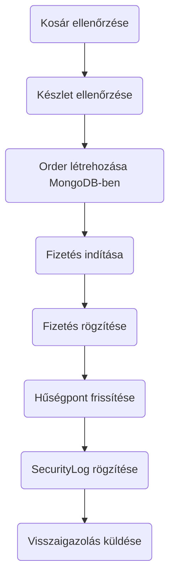

```javascript
// Rendelés létrehozása — src/api.js
router.post('/orders', async (req, res) => {
  // felhasználó és készlet ellenőrzése...
  const { jsonResponse, httpStatusCode } = await paypalService.createOrder(cart, currency, amount);
  // rendelés mentése az adatbázisba...
  res.status(httpStatusCode).json(jsonResponse);
});
```

##### Editor szerepkör – rendelés tiltása

Minden rendelési és fizetési végpont előtt a `denyEditorOrderPlacement` middleware fut le (`src/api.js` és `src/Orders/Order.js`). Ha az aktuális munkamenetben szereplő felhasználó `usertype` értéke `editor`, a middleware `403 Forbidden` választ ad, és a kérés feldolgozása megszakad:

```javascript
// src/api.js
const isEditorUser = req => req.session?.user?.usertype?.toString().toLowerCase() === 'editor';

const denyEditorOrderPlacement = (req, res, next) => {
    if (isEditorUser(req)) {
        return res.status(403).json({
            error: 'Forbidden',
            message: 'Editor accounts may browse the menu but cannot place orders.'
        });
    }
    next();
};

// Alkalmazva minden order végponton:
router.post('/orders',              validateOrderInput, denyEditorOrderPlacement, ...);
router.post('/save-order',          validatePaymentInput, denyEditorOrderPlacement, ...);
router.post('/orders/googlepay',    validateOrderInput, denyEditorOrderPlacement, ...);
router.post('/pay-with-balance',    validatePaymentInput, denyEditorOrderPlacement, ...);
```

A frontend (`public/order/order.jsx`) az autentikáció során beállítja az `isEditor` állapotot, amelyet prop-ként átad a `Cart`, `MobileCart` és `MenuItem` komponenseknek. Ez letiltja a „Kosárba" gombot, szürkébe fordítja a fizetési gombokat, és egy figyelmeztető bannert jelenít meg.

##### Szülő→gyermek rendelés (Parent ordering)

Szülői bejelentkezés esetén a rendelési oldal betöltésekor a `loadParentStudentList` lekérdezi a `/dashboard/parent/studentlist` végpontot, majd megjeleníti a kapcsolt diákok listáját egy legördülő panelben. A kiválasztott gyermek azonosítója (`selectedChildId`) átkerül minden fizetési handlerbe (`handleGooglePayPayment`, `handlePayPalPayment`, `handleBalancePayment`) és az API-kérések törzsében `selectedStudentId` mezőként utazik a backendhez.

A szerver oldalon a `resolveOrderTargetUserId` segédfüggvény a `ParentStudent` gyűjteményen ellenőrzi, hogy a szülő valóban hozzá van-e rendelve a kiválasztott diákhoz (`status: 'approved'`). Ha igen, a rendelés a diák (`orderUserId`) nevére jön létre; ha nem, `403 Forbidden` válasz születik. Egyenleg-alapú fizetésnél a `processBalancePayment` külön kezeli a két felet: a szülő (`payerUserId`) egyenlegéből von le, de a rendelést és a hűségpontokat a gyermek (`orderUserId`) fiókjához rendeli:

```javascript
// src/api.js
const resolveOrderTargetUserId = async (req, userId) => {
    if (!isParentUser(req)) return userId;
    const selectedStudentId = getSelectedStudentId(req);
    if (!selectedStudentId) throw errorWith(400, 'Parent orders must specify a linked student.');
    const link = await ParentStudent.findOne({
        parentId: userId, studentId: selectedStudentId, status: 'approved'
    }).lean();
    if (!link) throw errorWith(403, 'Selected student is not linked to your parent account.');
    return selectedStudentId;
};

// src/services/order-service.js
const processBalancePayment = async (payerUserId, orderUserId, items, ...) => {
    // Egyenleg levonása a szülő fiókjáról
    const payer = await User.findById(payerUserId).session(session);
    payer.balance = currentBalance - totalInUSD;
    await payer.save({ session });
    // Rendelés létrehozása a gyermek fiókján
    const newOrder = await createOrderRecord(orderUserId, dbOrderItems, ...);
    // Hűségpontok a gyermeknek
    await UserLoyalty.updatePointsAtomically(orderUserId, totalPoints, ...);
};
```

**MongoDB többdokumentumos tranzakció:** A `processBalancePayment` az egyetlen kódútvonal, ahol MongoDB natív tranzakciókat (`startSession()` → `withTransaction()`) alkalmaznak. Ez egy atomi csomagban végzi el: az egyenleg-levonást a szülő nevében, a készletcsökkentést minden rendelési tételnél, és a rendelésrekord létrehozását a gyerek fiókján. Ez replica set-et vagy MongoDB Atlas-t igényel.

**Devizakonverzió:** A `convertCurrencyToUSD()` segédfüggvény (`src/services/order-service.js`) hardkódolt árfolyamokat alkalmaz:

| Deviza | Szorzó (→ USD) |
|---|---|
| HUF | × 0,0027 |
| EUR | × 1,1 |
| USD | × 1 (nincs konverzió) |

Ezek az árfolyamok az egyenlegek összevetéséhez és a pénztárca-levonásokhoz szükségesek, és manuálisan kell frissíteni, ha az árfolyamok lényegesen változnak.

**NanoID a publikus rendelésazonosítóhoz:** Minden rendelés kap egy 6 karakteres `publicID` mezőt a `nanoid()` könyvtárból (`src/services/order-service.js`). Ez az ügyfél számára látható rendelésreferencia (pl. visszaigazoló emailben), és megakadályozza a szekvenciális azonosítók kitalálásából eredő információszivárgást.

**Rendelés automatikus törlési szabály:** Pre-save hook (`config/database_queries.js`): ha `orderDate + 15 perc < jelenleg` ÉS `status === 'Pending'`, a rendelés státusza automatikusan `'Cancelled'`-re áll. Ez minden `save()` hívásnál lefut — nem háttérfolyamat hajtja végre.

#### 6.2.5 Gyorsítótárazás és teljesítmény

A Redis az alkalmazás teljes területén az elsődleges gyorsítótárazási réteg, al-másodperces válaszidőt biztosítva gyakran lekérdezett adatok esetén, és lehetővé téve összetett atomi műveleteket Lua szkripteléssel. A rendszer többrétegű gyorsítótárazási stratégiát valósít meg, mely Redis-t és MongoDB változásfolyamokat (change stream) használ a gyorsítótár érvénytelenítésére.

A gyorsítótár és érvénytelenítés folyamata:

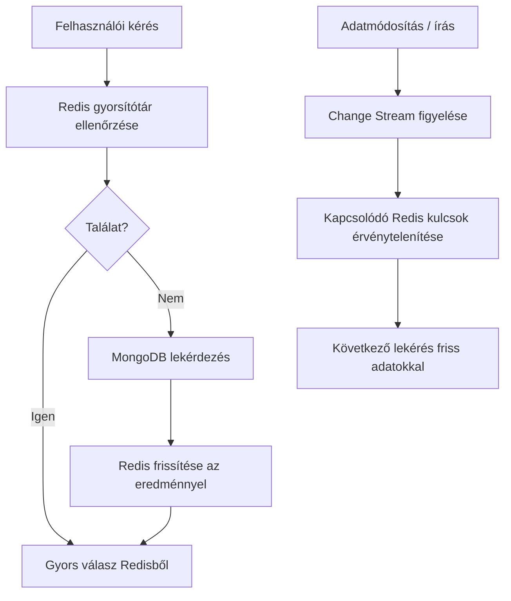

##### Redis adatstruktúra térkép

A következő ábra bemutatja a fő Redis kulcsneveket, adattípusokat és a tipikus TTL viselkedést az alkalmazásban:



##### Redis használata az oldalon

- **Munkamenet-kezelés**: A felhasználói munkamenetek Redisben tárolódnak automatikus lejárattal (TTL), lehetővé téve a backend állapotmentes vízszintes skálázását. A munkamenetek tartalmazzák a felhasználó azonosítóját, szerepkört és ideiglenes tokeneket.
- **Irányítópult adatgyorsítótárazása**: Admin és felhasználói irányítópult statisztikák (felhasználó-szám, rendelés összeg, menüpont elérhetősége) 5-10 percig vannak gyorsítótárazva, hogy csökkentsék az adatbázis terhelését csúcsidőben.
- **Menüpont gyorsítótár**: A napi menü és elérhető tételek gyorsítótárazva vannak változásfolyam érvénytelenítéssel, amikor a készletszintek változnak vagy új tételek kerülnek hozzáadásra.
- **Rate limit tároló**: Az általános API rate limitek és az admin-specifikus csúszó ablakos limitek Redis-t használnak háttértárolóként az elosztott érvényesítéshez.
- **Hűségpont gyorsítótár**: A felhasználói hűségadatok (pontok, szint, kedvezmények) rövid ideig vannak gyorsítótárazva, hogy elkerüljük a többszöri számítást az irányítópult betöltésekor.
- **Biztonsági naplók összegzése**: A legutóbbi biztonsági események gyorsítótárazva vannak az admin gyors hozzáférése érdekében, időnkénti frissítéssel MongoDB-ból.
- **Fizetési munkamenet gyorsítótár**: Ideiglenes fizetési szándékok és PayPal/Google Pay munkamenet adatok Redisben tárolódnak a tranzakció feldolgozása során.

##### Gyorsítótár-érvénytelenítési stratégia

A rendszer MongoDB változásfolyamokat (`src/cache/ChangeStreamManager.js`) használ az adatbázis írási műveleteinek figyelésére, és automatikusan érvényteleníti a kapcsolódó Redis kulcsokat. Például:
- A menüelemek frissítései érvénytelenítik a menü gyorsítótár kulcsait.
- A felhasználói egyenleg változásai érvénytelenítik a hűség- és irányítópult gyorsítótárakat.
- Az új rendelések érvénytelenítik a statisztika gyorsítótárakat.

**ChangeStreamManager kulcs-érvénytelenítési logika (`src/cache/ChangeStreamManager.js`):**

```javascript
// insert / update / replace / delete eseményekre fut
async function handleChange(collectionName, change) {
    if (!WATCHED_OPS.has(change.operationType)) return;

    const doc = change.fullDocument ?? { _id: change.documentKey?._id };

    // OrderItems esetén a rendelés userId-ját kell feloldani aszinkron
    let ids;
    if (collectionName === COLLECTIONS.orderitems) {
        ids = await resolveOrderItemsIds(doc);
    } else {
        const extractor = idExtractors[collectionName];
        ids = extractor ? extractor(doc) : [doc._id];
    }

    // A KeyRegistry-ból kiszámolja az érintett Redis kulcsokat és törli őket
    await invalidateKeys(collectionName, ids.filter(Boolean));
}

// Stream újraindítás hibától való felépülés esetén (5 s backoff)
stream.on('error', (err) => {
    activeStreams.delete(collectionName);
    stream.close().catch(() => {});
    setTimeout(() => watchCollection(collectionName), 5000);
});
```

##### Teljesítmény optimalizálás

- **Kapcsolat poolozás**: Redis kapcsolatok poolozva és újrahasznosítva vannak a terhelés minimalizálása érdekében.
- **Kulcsnév konvenció**: Strukturált kulcsok (pl. `menu:items:category:soup`) lehetővé teszik a mintaalapú érvénytelenítést.
- **TTL menedzsment**: Az automatikus lejárat megakadályozza a memória szivárgását, hosszabb TTL-lel a stabil adatoknál (24 óra felhasználói profilok esetén), rövidebb TTL-lel a változékony adatoknál (5 perc statisztikáknál).
- **Tartalék kezelés**: Ha a Redis nem elérhető, a rendszer zökkenőmentesen átvált közvetlen MongoDB lekérdezésekre naplózással.

```javascript
// Expanded cacheResult middleware with invalidation hooks
function cacheResult(cacheKey, ttl = 300, invalidationPatterns = []) {
  return async (req, res, next) => {
    if (!isRedisAvailable()) return next();
    const key = typeof cacheKey === 'function' ? cacheKey(req) : cacheKey;
    const cached = await redisClient.get(key);
    if (cached) {
      res.set('X-Cache', 'HIT');
      return res.status(200).json(JSON.parse(cached));
    }
    res.set('X-Cache', 'MISS');
    const originalJson = res.json;
    res.json = function(data) {
      redisClient.setEx(key, ttl, JSON.stringify(data));
      // Register invalidation patterns for change streams
      invalidationPatterns.forEach(pattern => registerInvalidation(key, pattern));
      return originalJson.call(this, data);
    };
    next();
  };
}
```

##### Monitoring and Metrics

A Redis teljesítményét beépített INFO parancsokkal figyelik, nyomon követve a találati arányokat (>90% cél), memóriahasználatot és kiszórási arányokat. A lassú lekérdezéseket optimalizáció céljából naplózzák.

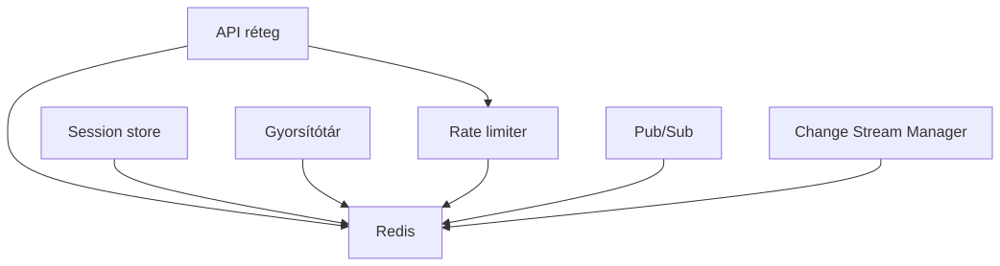

#### 6.2.6 Hűségprogram

A pontok rendelésenként számolódnak véletlenszerű érték alapján (4–9 pont/dollár), szorzva ünnepi, egészségszint és tier bónuszokkal. Tier-ek: none → Bronze (1200 pont) → Silver (5000) → Gold (15000) → Platinum (40000). Lásd `src/LoyaltySystem/loyalty-service.js` és `config/DATABASE_CONSTANTS.JS` a díjszabásokhoz.

#### 6.2.7 Rate Limiting

Két szintű stratégiát alkalmaz: globális `express-rate-limit` korlátokat (`/api` 250/óra, `/dashboard` 1000/15 perc), valamint dashboard-modulonként Redis Lua csúszóablakos limitet (`admin` 30/perc, `editor` 20/perc, `parent` 45/perc, `student` 60/perc). A Lua megvalósítás atomi — egyetlen megszakíthatatlan tranzakcióként fut, ezzel elkerülve a versenyhelyzeteket nagy párhuzamos terhelésnél. Lásd a Lua scriptet az 5.3.2 szakaszban.

#### 6.2.8 Bővíthetőség és karbantarthatóság

A backend rétegezett, szolgáltatásorientált architektúrát használ (route-ok → szolgáltatások → modellek). A konfiguráció környezeti változókon keresztül történik `.env` fájl segítségével. A hibakezelés központilag történik Express hibakezelő middleware-eken keresztül, amelyek naplózzák a biztonsági eseményeket és biztonságos üzeneteket küldenek a kliensnek. Az állapotmentes JWT tervezés és a Redis munkamenet tárolás vízszintes skálázást tesz lehetővé. A függőségek `npm audit`-tal vannak kezelve és naprakészen tartva.

<span id="63-frontend-megvalositas" style="display:block; position:relative; top:-80px; visibility:hidden;"></span>
### 6.3 Frontend megvalósítás {#63-frontend-megvalositas}

#### 6.3.1 Technológiai stack

React.js JSX-szel, Tailwind CSS stílushoz, Socket.IO kliens valós idejű kommunikációhoz, egyéni E2EE kriptó könyvtár, mobil-first reszponzív tervezés.

#### 6.3.2 Fő alkalmazás felépítés

- **Statikus HTML oldalak**: Belépési pontok a `public/` mappában (pl. `index.html`, `login.html`, `chat/index.html`).
- **React komponensek**: Moduláris JSX komponensek, `<script>` címkékből betöltve, ReactDOM-mal renderelve.
- **Állapotkezelés**: Lokális komponensállapot `useState`, `useEffect` és egyéni hook-ok (pl. `useAdminData.js`) használatával.
- **Routing**: Kliens oldali útválasztás URL hash változások és feltételes renderelés alapján.
- **Stílus**: Tailwind CSS osztályok reszponzív, utility-first tervezéshez.
- **2FA companion kliens (opcionális)**: A backend 2FA API-k (`/2fa/*`) külső kliensből is használhatók. A companion alkalmazás nem része ennek a repónak.

A dashboard adatfolyama:

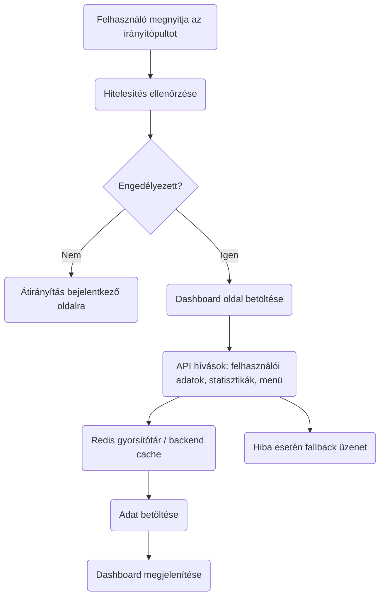

A felhasználói munkamenet állapotai a frontendben:

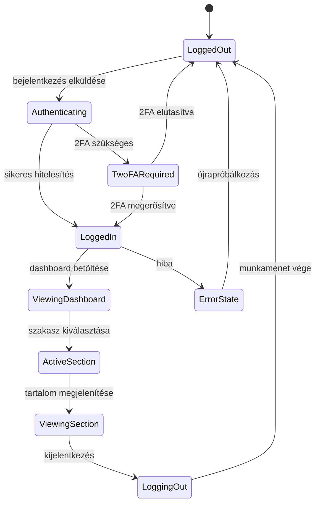

#### 6.3.3 Kulcsfontosságú komponensek és funkciók

##### Dashboard rendszer
Az adminisztrációs irányítópult (`public/dashboard/admin/admin.jsx`) sidebar navigációt, felhasználók, statisztikák, menüpontok, jutalmak, egészségellenőrzések és beállítások szakaszait tartalmazza. Egy egyedi `useAdminData` hookot használ az adatok REST API-król történő lekérésére és kezelésére.

A rendszer integrálja a 2FA folyamatot is; a backend 2FA végpontjai a felhasználói fiókhoz tartozó második hitelesítési lépést kezelik, külső kliensből is használható módon.

```jsx
// Admin irányítópult felépítés — public/dashboard/admin/admin.jsx
const AdminDashboard = () => {
    const [activeSzakasz, setActiveSzakasz] = useState('users');
    const { stats, users, menuItems, rewards, loading } = useAdminData();

    return (
        <div className="min-h-screen bg-gradient-to-br from-accent to-white">
            <AdminHeader />
            <div className="flex">
                <AdminSidebar activeSzakasz={activeSzakasz} setActiveSzakasz={setActiveSzakasz} />
                <main className="flex-1 p-4">
                    {activeSzakasz === 'users' && <UsersSzakasz users={users} />}
                    {/* Other Szakaszs */}
                </main>
            </div>
        </div>
    );
};
```

###### Admin dashboard
Az adminisztrátori felület célja a rendszer felügyelete és tartalomkezelése. Az admin dashboard a következőket kínálja:
- Felhasználók, rendelési statisztikák és regisztrációs adatok megtekintése.
- Menüelemek létrehozása, frissítése és törlése.
- Készletfigyelés és alacsony készlet riasztások.
- Fizetési statisztikák és rendszerállapot ellenőrzés (adatbázis, Redis, PayPal, Google Pay).
- Adminisztrációs riportok exportálása és egészségellenőrzések indítása.
- A `useAdminData` hook REST lekérdezéseivel a dashboard valós idejű összefoglalókat és elemzéseket jelenít meg.

###### Diák dashboard
A diákok számára készült dashboard a rendelési folyamat egyszerű kezelésére fókuszál. A diák dashboard lehetővé teszi:
- Napi menü és elérhető ételválaszték böngészését.
- Kosárhoz adást, rendelés összeállítását és fizetés indítását.
- Rendelés állapotának és előzményeknek a megtekintését.
- Saját virtuális pénztárca egyenlegének ellenőrzését és a hűségpontok nyomon követését.
- Fiókbeállítások, jelszóváltoztatás és fiók felfüggesztése (pl. `/dashboard/student/freeze_account`).
- Szülői fiók összekapcsolását (`/dashboard/student/parent/link`) a felügyelet és támogatás érdekében.

###### Szülő dashboard
A szülők a diák dashboardot használják, de kiegészített jogosultságokkal a kapcsolt diákok rendeléseinek és fizetéseinek felügyeletére. A szülői dashboard jellemzői:
- Kapcsolt diákok és rendeléseik áttekintése egy helyen.
- Szülői fizetési felelősség kezelése, beleértve a tranzakciók jóváhagyását és a fizetési munkamenetek nyomon követését.
- Hozzáférés a diákok hűségpontjaihoz és költési előzményeihez.
- A ParentStudent kapcsolat használata a jogosultságok és adathozzáférés szabályozásához.
- Mobilbarát nézet és egyszerű áttekintés a gyermeki megrendelés státuszáról.
- A rendelési oldalon szülői bejelentkezés esetén megjelenik egy gyermek-kiválasztó panel (`ParentStudent` kapcsolat alapján); rendelés csak kiválasztott gyermek esetén indítható. A fizetés a szülő egyenlegéről (`payerUserId`) kerül levonásra, a rendelés és a hűségpontok a kiválasztott gyermek (`orderUserId`) fiókjához rendelődnek.

###### Editor dashboard
A szerkesztői dashboard a tartalmi és menükezelési folyamatokra fókuszál, de nem tartalmazza az adminisztrációs felhasználókezelést. Az editor dashboard lehetővé teszi:
- Menüelemek és napi menük szerkesztését, csoportosítását és kategorizálását.
- Menüelemek leírásának, árában és allergén információinak frissítését.
- Készletszintek és elérhetőség nyomon követését a menüoldalakon.
- Ételek és kategóriák státuszának beállítását "elérhető" / "elfogyott" mód között.
- Gyors hozzáférést a menü exportálásához és a menü adatainak előnézetéhez.
- A `public/dashboard/editor/` vagy hasonló komponensek használatát a tartalomkezelő felület megjelenítéséhez.
- Az editor felhasználók hozzáférhetnek a rendelési oldalhoz (böngészés megengedett), azonban az `isEditor` prop hatására a kosárba helyezés le van tiltva, a fizetési gombok inaktívak (szürke, `cursor-not-allowed`), és egy figyelmeztető banner jelzi a korlátozott hozzáférést: „Editor accounts may browse the order section and menu, but order placement is disabled for editors."

##### Rendelési és kosár rendszer
A rendelési oldal (`public/order/order.jsx`) bevásárlókosarat valósít meg `useCart` hookkal állapotkezeléshez, valós idejű készletellenőrzéssel és fizetési integrációval. Az oldal az autentikáció során (`/api/current_user`) felismeri az `editor` és `parent` szerepköröket: editor felhasználóknak minden vásárlási funkció le van tiltva (`isEditor` prop), szülők számára egy gyermek-kiválasztó panel jelenik meg (`isParent`, `children`, `selectedChildId` állapotok), és a fizetési handlerek (`handleGooglePayPayment`, `handlePayPalPayment`, `handleBalancePayment`) a `selectedChildId` értéket `selectedStudentId` mezőként adják át a backendnek.

```jsx
// Cart Management — public/order/useCart.js
const useCart = () => {
    const [cart, setCart] = useState([]);
    const addToCart = (item) => setCart([...cart, item]);
    // ... validation, total calculation
    return { cart, addToCart, removeFromCart, getTotal };
};
```

##### E2EE Chat Interface
A chat rendszer (`public/chat/chat.jsx`) végpontok közötti titkosítási beállítást, kulcscserét és valós idejű üzenetküldést kezel Socket.IO-n keresztül. Tartalmaz eszközszinkronizációt és kulcs-helyreállítási funkciókat.

```jsx
// Chat állapotkezelés — public/chat/chat.jsx
const E2EEChatApp = () => {
    const [conversations, setConversations] = useState([]);
    const [activeConversation, setActiveConversation] = useState(null);
    const [messages, setMessages] = useState({});
    // ... E2EE setup, message sending/receiving
};
```

##### E2EE kriptográfia és kulcstárolás
A frontendben az E2EE logika a `public/js/e2ee-crypto.js` fájlban van megvalósítva. A `E2EECrypto` osztály felelős a kulcsgenerálásért, azok helyi tárolásáért, az üzenetek titkosításáért és visszafejtéséért.

- `IndexedDB`-t használ a privát és nyilvános kulcsok biztonságos tárolására, és egy egyszeri migrációt biztosít a korábbi `localStorage`-ból.
- RSA-OAEP 2048 bites kulcspárosokat generál az aszimmetrikus kulcsokhoz.
- AES-GCM 256 bites szimmetrikus kulcsot hoz létre a tényleges üzenet-titkosításhoz.
- A szimmetrikus kulcsot a címzett és a feladó nyilvános RSA kulcsával külön kódolja, így mindkét fél el tudja olvasni az üzenetet.
- A titkosított üzenethez mentett metaadatok tartalmazzák az `iv`, `senderEncryptedKey`, `recipientEncryptedKey` és az algoritmus információit.
- A kulcsok rotálása és újrahasználata támogatott: a régebbi privát kulcsok is automatikusan kipróbálásra kerülnek dekódzáskor.
- Passphrase alapú biztonsági mentés is rendelkezésre áll, amely AES-GCM-mel titkosítja a kulcscsomagot jelszó alapján.
- Hibakereséshez `window.debugE2EE` globális segédfüggvények állnak rendelkezésre, például kulcsellenőrzéshez, hibaszámláló nullázásához és E2EE állapot lekérdezéséhez.

A következő példák az E2EE frontend logikájának tipikus használati mintáit szemléltetik.

```js
// 1. Kulcspár létrehozása és tárolása
const keyInfo = await window.e2eeCrypto.generateKeyPair();
console.log('Kulcs páros létrehozva:', keyInfo.keyId);

// 2. Üzenet titkosítása egy címzett nyilvános kulcsával
const encrypted = await window.e2eeCrypto.encryptMessage(
  'Szia, titkosított üzenet!',
  recipientPublicKeyBase64,
  recipientKeyId
);

// 3. Üzenet visszafejtése a címzett privát kulcsával
const plaintext = await window.e2eeCrypto.decryptMessage(encrypted, true);
console.log('Visszafejtett szöveg:', plaintext);
```

```js
// 4. Kulcsok titkosított biztonsági mentése jelszóval
const backupBundle = await window.e2eeCrypto.encryptPrivateKeyWithPassphrase('erős-jelszó123');

// 5. Mentett kulcs visszaállítása ugyanazzal a jelszóval
const restored = await window.e2eeCrypto.decryptPrivateKeyWithPassphrase(
  backupBundle.encryptedPrivateKey,
  backupBundle.salt,
  backupBundle.iv,
  'erős-jelszó123'
);
console.log('Visszaállított kulcs azonosítója:', restored.keyId);
```

```js
// 6. E2EE állapot és hibakeresés
await window.debugE2EE.enableDebug();
await window.debugE2EE.status();
```

Ez a megközelítés biztosítja, hogy a felhasználói üzenetek titkosítva maradjanak a böngészőben és csak a jogosult kulcsokkal rendelkező eszközök tudják visszafejteni azokat.

##### Mobil reszponzivitás
Mobil-specifikus komponensek (pl. `MobileAdminNav.jsx`, `MobileCart.jsx`) érintésbarát felületet biztosítanak összecsukható navigációval és toast értesítésekkel.

#### 6.3.4 Állapotkezelés és adatlekérés

- **Lokális állapot**: React hook-ok komponens-specifikus állapotkezeléséhez (betöltés, hibák, űrlapadatok).
- **API integráció**: Fetch API REST hívásokhoz, hibakezeléssel és betöltési állapotokkal.
- **Valós idejű frissítések**: Socket.IO chat üzenetekhez és élő értesítésekhez.
- **Gyorsítótárazás**: Böngésző `localStorage` a felhasználói hivatkozások és munkamenet adatok számára.

#### 6.3.5 UI/UX tervezési elvek

- **Akadálymentesség**: ARIA címkék, billentyűzet-navigáció, nagy kontrasztú színek.
- **Teljesítmény**: komponensek késleltetett betöltése, optimalizált képek, minimális újrarenderelés.
- **Felhasználói élmény**: fokozatos funkcióbővítés, hibahatárok, betöltési jelzők.
- **Biztonság**: bemenet-szűrés, XSS védelem a React beépített escape mechanizmusával.

#### 6.3.6 Build és telepítés

- **Fejlesztés**: Hot reloading böngésző fejlesztőeszközökkel.
- **Éles környezet**: Minimalizált csomagok statikusan kiszolgálva a `public/` mappából.
- **Böngésző-kompatibilitás**: Tesztelve modern böngészőkben, visszafelé kompatibilis tartalékmegoldásokkal az régebbi verziókhoz.

#### 6.3.7 Bővíthetőség és karbantarthatóság

A frontend komponens-alapú architektúrát követ újrafelhasználható UI elemekkel. A Tailwind utility osztályai egységes stílust biztosítanak. Az egyedi hookok összefoglalják az összetett logikát, így a komponensek tesztelhetők és karbantarthatók. A mobil-first megközelítés eszközfüggetlen skálázhatóságot biztosít.

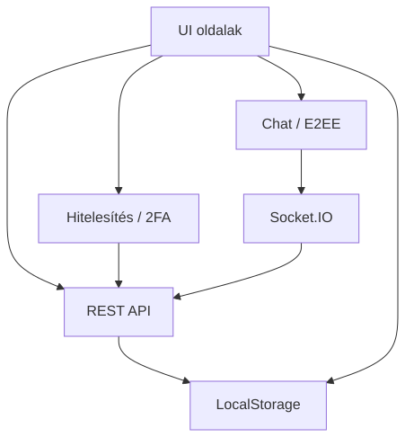

---

<span id="7-api-referencia" style="display:block; position:relative; top:-80px; visibility:hidden;"></span>
## 7. API referencia {#7-api-referencia}

Minden végpont aktív munkamenetet igényel, kivéve, ha **nyilvános** megjelölést kap. A hitelesítési hiba `401 Unauthorized`-t ad vissza; a jogosultság hiánya `403 Forbidden`-t.

<span id="foalkalmazas-utvonalak" style="display:block; position:relative; top:-80px; visibility:hidden;"></span>
### Főalkalmazás útvonalak {#foalkalmazas-utvonalak}

| Módszer | Végpont | Hitelesítés | Leírás |
|--------|----------|-------------|--------|
| GET | `/login` | Nyilvános | Bejelentkező oldal |
| GET | `/register` | Nyilvános | Regisztrációs oldal |
| GET | `/password-reset/:token` | Nyilvános | Jelszó-visszaállítás oldal |
| GET | `/pay` | Munkamenet | Fizetési oldal |
| GET | `/chat` | Munkamenet | E2EE chat felület |

<span id="hitelesitesi-utvonalak" style="display:block; position:relative; top:-80px; visibility:hidden;"></span>
### Hitelesítési útvonalak {#hitelesitesi-utvonalak}

| Módszer | Végpont | Hitelesítés | Leírás |
|--------|----------|-------------|--------|
| POST | `/register` | Nyilvános | Felhasználói regisztráció |
| POST | `/login` | Nyilvános | Felhasználói bejelentkezés |
| POST | `/logout` | Munkamenet | Felhasználói kijelentkezés |
| GET | `/logout` | Munkamenet | Kijelentkezés (átirányítás) |
| POST | `/2fa` | Nyilvános | Kétfaktoros hitelesítés |
| GET | `/2fa/code` | Bearer token | Függő 2FA kód lekérése |
| POST | `/2fa/approve` | Bearer token | 2FA jóváhagyás jelzése |
| GET | `/2fa/status` | Bearer token | 2FA jóváhagyási állapot és session felépítés |
| POST | `/2fa/verify` | Nyilvános | 2FA kód ellenőrzése token + kód alapon |
| POST | `/email-verification/verify-code` | Nyilvános | E-mail kód ellenőrzése |
| GET | `/email-verification/verify/:token` | Nyilvános | E-mail token ellenőrzése |
| POST | `/password-reset/` | Nyilvános | Jelszó-visszaállítás kérése |
| GET | `/password-reset/:token` | Nyilvános | Jelszó-visszaállítás űrlap |
| POST | `/password-reset/:token` | Nyilvános | Új jelszó küldése |
| POST | `/forgot-password/` | Nyilvános | Elfelejtett jelszó kérése |

**Példa — POST /register:**
```json
// Kérés
{ "username": "johndoe", "password": "SecurePass123!", "email": "john@example.com", "isParent": "false", "g-recaptcha-response": "token" }
// Válasz 200
{ "message": "Regisztráció sikeres! Ellenőrizze e-mailjét az ellenőrzőkódért." }
// Hibák: 400 (validálás/CAPTCHA), 429 (túl sok kérés), 500
```

**Példa — POST /login:**
```json
// Kérés
{ "username": "johndoe", "password": "SecurePass123!" }
// Válasz 200: "Üdvözlünk, johndoe"
// Hibák: 400, 401 (hibás hitelesítő adatok), 429, 500
```

<span id="iranyitopult-utvonalak" style="display:block; position:relative; top:-80px; visibility:hidden;"></span>
### Irányítópult útvonalak {#iranyitopult-utvonalak}

| Módszer | Végpont | Hitelesítés | Leírás |
|--------|----------|-------------|--------|
| GET | `/dashboard/` | Munkamenet | Fő irányítópult (szerepkör átirányítás) |
| GET | `/dashboard/admin` | Admin | Adminisztrátori irányítópult |
| GET | `/dashboard/editor` | Editor/Admin | Szerkesztői irányítópult |
| GET | `/dashboard/student` | Diák/Admin | Diák irányítópult |
| GET | `/dashboard/parent` | Szülő/Admin | Szülői irányítópult |

<span id="adminisztratori-iranyitopult-api-utvonalak" style="display:block; position:relative; top:-80px; visibility:hidden;"></span>
### Adminisztrátori irányítópult API útvonalak {#adminisztratori-iranyitopult-api-utvonalak}

Minden útvonal admin munkamenetet igényel. Hibák: `401`, `403`, `500`.

| Módszer | Végpont | Leírás |
|--------|----------|--------|
| GET | `/dashboard/admin/usercount` | Összes felhasználó száma |
| GET | `/dashboard/admin/userlist` | Az összes felhasználó listája |
| GET | `/dashboard/admin/stats` | Statisztikai elemzés: regisztrációs időbélyegek mean/median/stddev (`simple-statistics`) |
| GET | `/dashboard/admin/signup-stats` | Napi regisztrációk száma (idősor formátumban) |
| GET | `/dashboard/admin/stats/most_bought_items` | Top-5 legtöbbet rendelt tétel (összes) |
| GET | `/dashboard/admin/stats/most_bought_items-lastweek` | Top-5 legtöbbet rendelt tétel (utolsó 7 nap) |
| GET | `/dashboard/admin/stats/revenue-lastmonth` | Elmúlt havi bevétel idősor |
| GET | `/dashboard/admin/stats/average-order-value` | Átlagos rendelésérték |
| GET | `/dashboard/admin/stats/total-revenue` | Összesített bevétel |
| GET | `/dashboard/admin/orders` | Összes rendelés |
| GET | `/dashboard/admin/soldout` | Elfogyott tételek |
| GET | `/dashboard/admin/itemcount` | Menüelemek száma |
| GET | `/dashboard/admin/menulist` | Menüelemek listája |
| GET | `/dashboard/admin/stockalerts` | Alacsony készlet figyelmeztetések |
| GET | `/dashboard/admin/paymentstats` | Fizetési statisztikák |
| GET | `/dashboard/admin/health` | Rendszer állapot ellenőrzés és szolgáltatásstátuszok |
| GET | `/dashboard/admin/menuitem_export` | Menüelemek exportálása |
| GET | `/dashboard/admin/delete_menuitem/:id` | Menüelem törlése |
| POST | `/dashboard/admin/create_menuitem` | Menüelem létrehozása |
| PUT | `/dashboard/admin/menuitem/:id` | Menüelem frissítése |

A statisztikai végpontok (`/stats`, `/signup-stats`, `/stats/most_bought_items*`, `/stats/revenue-lastmonth`, `/stats/average-order-value`, `/stats/total-revenue`) a `simple-statistics` npm csomagot használják, és csak admin szerepkör számára érhetők el. Az eredmények Redis-ben gyorsítótárazódnak a `cacheResult()` middleware segítségével (`src/dashboard/services/cache-service.js`), amely transzparensen (a route handler módosítása nélkül) köti be a cache-logikát — csak 2xx GET válaszokat tárol, konfiguálható TTL-lel és opcionális `shouldCache` feltétel-hookkal.

A `/dashboard/admin/health` végpont a szerveroldali komponensek állapotát ellenőrzi. A Redis kiesése esetén a válasz gyorsan `unavailable`/`degraded` státuszokra vált, így a dashboard nem marad végtelen frissítésben.

**Példa — GET /dashboard/admin/health válasz:**
```json
{
  "overall": "degraded",
  "timestamp": "2026-04-11T12:34:56.789Z",
  "services": {
    "database": "healthy",
    "redis": "unavailable",
    "userModel": "healthy",
    "menuModel": "healthy",
    "orderModel": "healthy",
    "paymentModel": "healthy",
    "loyaltyModel": "healthy",
    "adminEndpoints": "healthy",
    "redisLua": "degraded",
    "sessions": "healthy",
    "caching": "degraded",
    "externalServices": {
      "paypal": "configured",
      "googlepay": "not_configured"
    }
  },
  "details": {
    "redis": "Redis client not available or not connected",
    "redisLua": "Redis Lua scripts unavailable due to Redis connection issue",
    "caching": "Redis cache unavailable"
  },
  "summary": "7/10 core services healthy"
}
```

**Példa — GET /dashboard/admin/userlist válasz:**
```json
[
  { "id": "user_1", "username": "johndoe", "email": "john@example.com", "role": "student", "isVerified": true },
  { "id": "user_2", "username": "annasmith", "email": "anna@example.com", "role": "parent", "isVerified": true }
]
```

<span id="diak-iranyitopult-utvonalak" style="display:block; position:relative; top:-80px; visibility:hidden;"></span>
### Diák irányítópult útvonalak {#diak-iranyitopult-utvonalak}

| Módszer | Végpont | Hitelesítés | Leírás |
|--------|----------|-------------|--------|
| GET | `/dashboard/student/freeze_account` | Diák | Fiók felfüggesztése oldal |
| POST | `/dashboard/student/parent/link` | Diák | Szülői fiók összekapcsolása |
| POST | `/dashboard/student/parent` | Diák | Közvetlen parent kapcsolat létrehozása |
| GET | `/dashboard/student/parent/unlink` | Diák | Szülői kapcsolat megszüntetése |
| GET | `/dashboard/student/loyalty/rewards` | Diák | Elérhető jutalmak listája |
| POST | `/dashboard/student/loyalty/redeem` | Diák | Jutalom beváltása pontokért |
| GET | `/dashboard/student/loyalty/vouchers` | Diák | Saját voucher lista |

<span id="szulo-iranyitopult-utvonalak" style="display:block; position:relative; top:-80px; visibility:hidden;"></span>
### Szülő irányítópult útvonalak {#szulo-iranyitopult-utvonalak}

| Módszer | Végpont | Hitelesítés | Leírás |
|--------|----------|-------------|--------|
| GET | `/dashboard/parent/studentlist` | Szülő | Kapcsolt diákok listája |
| GET | `/dashboard/parent/link-requests` | Szülő | Függőben lévő kapcsolódási kérelmek |
| POST | `/dashboard/parent/link-request/:requestId` | Szülő | Kapcsolódási kérés jóváhagyása/elutasítása |
| GET | `/dashboard/parent/orders` | Szülő | Kapcsolt diákok rendelései |
| GET | `/dashboard/parent/stats` | Szülő | Szülői összesített statisztikák |
| POST | `/dashboard/parent/transfer` | Szülő | Egyenlegátutalás a kapcsolt diáknak |

<span id="rendeleskezelo-utvonalak" style="display:block; position:relative; top:-80px; visibility:hidden;"></span>
### Rendeléskezelő útvonalak {#rendeleskezelo-utvonalak}

| Módszer | Végpont | Hitelesítés | Leírás |
|--------|----------|-------------|--------|
| GET | `/order/` | Munkamenet | Rendelés oldal |
| GET | `/order/menu_items` | Munkamenet | Elérhető menüelemek |
| GET | `/order/:orderID` | Munkamenet | Rendelés részletek |
| POST | `/order/order` | Munkamenet | Új rendelés létrehozása |
| POST | `/order/order/wallet` | Munkamenet | Wallet alapú rendelés |
| PUT | `/order/:orderID/status` | Munkamenet | Rendelés állapot frissítése |
| POST | `/order/:orderID/capture` | Munkamenet | Fizetés rögzítése |
| GET | `/order/DailyMenu` | Munkamenet | Napi menü ajánlások |

**Megjegyzés:** `POST /order/order` és `POST /order/order/wallet` végpontokon a `denyEditorOrderPlacement` middleware `403 Forbidden` hibával blokkolja az editor szerepkörű fiókok rendelés-leadási kísérleteit.

**Példa — POST /order/order:**
```json
// Request
{ "cart": [{ "id": "item_id", "quantity": 2, "price": 8.99 }], "currency": "USD", "amount": 17.98 }
// Response: PayPal order JSON
// Errors: 400 (invalid cart/stock), 401, 500
```

<span id="altalanos-api-utvonalak" style="display:block; position:relative; top:-80px; visibility:hidden;"></span>
### Általános API útvonalak {#altalanos-api-utvonalak}

| Módszer | Végpont | Hitelesítés | Leírás |
|--------|----------|-------------|--------|
| GET | `/api/test` | Nyilvános | API állapot ellenőrzése |
| GET | `/api/current_user` | Nyilvános (session állapot) | Bejelentkezett állapot és session user objektum |
| GET | `/api/current-user` | Munkamenet | Chat-kompatibilis aktuális user adatok |
| GET | `/api/menu-items` | Nyilvános | Elérhető menüelemek |
| GET | `/api/daily-menu` | Nyilvános | Időszak alapú napi menü ajánlás |
| POST | `/api/orders` | Munkamenet | PayPal rendelés létrehozása |
| POST | `/api/orders/:orderID/capture` | Munkamenet | PayPal fizetés rögzítése |
| POST | `/api/orders/googlepay` | Munkamenet | Google Pay rendelés létrehozása |
| POST | `/api/orders/googlepay/complete` | Munkamenet | Google Pay tranzakció lezárása |
| POST | `/api/save-order` | Munkamenet | Befejezett rendelés mentése |
| POST | `/api/pay-with-balance` | Munkamenet | Pénztárca egyenleg alapú fizetés |
| POST | `/api/payments/paypal` | Munkamenet | PayPal fizetés feldolgozása |
| POST | `/api/payments/googlepay` | Munkamenet | Google Pay fizetés feldolgozása |

**Editor korlátozás:** Minden `POST` rendelési és fizetési végponton a `denyEditorOrderPlacement` middleware `403 Forbidden`-nel zárja ki az editor fiókokat.

**Szülő→gyermek rendelés:** A `POST /api/save-order`, `/api/orders/:orderID/capture`, `/api/orders/googlepay/complete` és `/api/pay-with-balance` végpontok elfogadnak egy opcionális `selectedStudentId` mezőt a kérés törzsében. Szülői bejelentkezés esetén ez a mező kötelező; a backend `resolveOrderTargetUserId`-vel ellenőrzi a `ParentStudent` kapcsolatot (`status: 'approved'`), és a rendelést a gyermek nevére hozza létre.

**Példa — POST /api/orders/googlepay/complete:**
```json
// Request
{ "orderId": "order_123", "paymentMethodData": {}, "transactionId": "txn_456" }
// Response
{ "success": true, "orderId": "order_123", "transactionId": "txn_456", "loyaltyPointsAwarded": 8 }
// Errors: 400, 401, 404, 500
```

**Példa — GET /api/current_user válasz:**
```json
{
  "loggedIn": true,
  "user": {
    "id": "user_1",
    "username": "johndoe",
    "usertype": "student",
    "email": "john@example.com",
    "IsLoggedIn": true
  }
}
```

**Példa — GET /api/menu-items válasz:**
```json
[
  { "id": "item_1", "name": "Pizza", "price": 450, "available": true, "allergens": ["gluten", "dairy"] },
  { "id": "item_2", "name": "Saláta", "price": 320, "available": true, "allergens": [] }
]
```

**Példa — POST /api/orders:**
```json
{
  "cart": [
    { "menuItemId": "item_1", "quantity": 2, "price": 450 },
    { "menuItemId": "item_2", "quantity": 1, "price": 320 }
  ],
  "currency": "HUF",
  "amount": 1220
}
```
```json
{ "id": "PAYPAL_ORDER_ID", "status": "CREATED" }
```

<span id="geosecurity-api-utvonalak" style="display:block; position:relative; top:-80px; visibility:hidden;"></span>
### GeoSecurity API útvonalak {#geosecurity-api-utvonalak}

| Módszer | Végpont | Hitelesítés | Leírás |
|--------|----------|-------------|--------|
| GET | `/api/geosecurity/location-info` | Nyilvános (session opcionális) | IP és hely alapú kockázati adatok lekérése |
| POST | `/api/geosecurity/analyze-risk` | Nyilvános (session opcionális) | Helyalapú kockázatelemzés |
| POST | `/api/geosecurity/impossible-travel` | Nyilvános (session opcionális) | Lehetetlen utazás detektálás |

**Példa — POST /api/geosecurity/analyze-risk:**
```json
{ "country": "Hungary", "countryCode": "HU", "continent": "Europe", "isVPN": false, "isTor": false, "isProxy": false }
```

**Válasz:**
```json
{ "riskScore": 1, "riskLevel": "Low" }
```

**Példa — POST /api/geosecurity/impossible-travel:**
```json
{ "lastLogin": "2026-04-04T08:00:00Z", "currentLogin": "2026-04-05T08:00:00Z", "latitude": 47.4979, "longitude": 19.0402 }
```

**Válasz:**
```json
{ "isImpossibleTravel": false, "riskLevel": "LOW" }
```

<span id="chat-api-es-websocket-utvonalak" style="display:block; position:relative; top:-80px; visibility:hidden;"></span>
### Chat API és Socket.IO események {#chat-api-es-websocket-utvonalak}

| Módszer | Végpont | Hitelesítés | Leírás |
|--------|----------|-------------|--------|
| GET | `/chat` | Munkamenet | Chat felület |
| Socket.IO | `io.on('connection')` | Munkamenet | Eseményalapú valós idejű kapcsolat |
| POST | `/chat/setup-e2ee` | Munkamenet | E2EE nyilvános kulcs beállítása |
| GET | `/chat/public-key/:userId` | Munkamenet | Felhasználó nyilvános kulcsának lekérése |
| POST | `/chat/send-message` | Munkamenet | Titkosított üzenet küldése |
| GET | `/chat/messages/:otherUserId` | Munkamenet | Beszélgetés üzeneteinek lekérése |
| GET | `/chat/message/:messageId` | Munkamenet | Egy üzenet lekérése |
| POST | `/chat/message/:messageId/replace` | Munkamenet | Üzenet helyettesítése |
| PUT | `/chat/messages/read/:otherUserId` | Munkamenet | Üzenetek olvasottként jelölése |
| GET | `/chat/conversations` | Munkamenet | Beszélgetések listája |
| GET | `/chat/search-users` | Munkamenet | Felhasználók keresése |
| GET | `/chat/e2ee-status` | Munkamenet | E2EE állapot lekérése a jelenlegi felhasználóhoz |
| POST | `/chat/reset-e2ee` | Munkamenet | E2EE kulcsok visszaállítása |
| POST | `/chat/backup-keys` | Munkamenet | Titkosított privát kulcs mentése |
| GET | `/chat/has-key-backup` | Munkamenet | Kulcsmásolat meglétének ellenőrzése |
| GET | `/chat/restore-keys` | Munkamenet | Privát kulcs visszaállítása |
| <span style="color:#d32f2f;font-weight:bold">POST</span> | <span style="color:#d32f2f;font-weight:bold">`/chat/admin/clear-all-e2ee`</span> | <span style="color:#d32f2f;font-weight:bold">Admin</span> | <span style="color:#d32f2f;font-weight:bold">Minden E2EE adat törlése (csak admin)</span> |
| POST | `/chat/request-sender-recovery` | Munkamenet | Küldőkulcs helyreállításának kérése |
| GET | `/chat/pending-recovery` | Munkamenet | Helyreállítást igénylő üzenetek lekérése |
| POST | `/chat/message/:messageId/update-sender-key` | Munkamenet | Helyreállított kulcs visszaírása |
| POST | `/chat/message/:messageId/recovery-failed` | Munkamenet | Sikertelen helyreállítás jelölése |

**Példa — Socket.IO csatlakozás a chathez:**
```js
import { io } from "socket.io-client";

const socket = io("https://example.com", { withCredentials: true });
socket.on("connect", () => {
  socket.emit("authenticate", "USER_ID");
});
socket.on("newMessage", (payload) => {
  console.log("Üzenet érkezett:", payload);
});
```

**Példa — POST /chat/send-message:**
```json
{
  "recipientId": "user_2",
  "encryptedContent": "BASE64_ENCODED_CIPHERTEXT",
  "encryptionMetadata": {
    "senderEncryptedKey": "BASE64_SENDER_KEY",
    "recipientEncryptedKey": "BASE64_RECIPIENT_KEY",
    "iv": "BASE64_IV"
  },
  "messageType": "text"
}
```

**Socket.IO események:** `newMessage`, `messageReplaced`, `processPendingRecovery`, `resendRequired`

Minden chatüzenet kliensoldalon van titkosítva (E2EE). A szerver csak a titkosított szöveget és metaadatokat tárolja.

<span id="backend-modellek-mongodb" style="display:block; position:relative; top:-80px; visibility:hidden;"></span>
### Backend modellek (MongoDB) {#backend-modellek-mongodb}

A részletes entitásleírások — mezők, indexek, üzleti szabályok — az [5.2.3 fejezetben](#523-reszletes-entitasleirasok) találhatók.

#### Gyorsítótárazás — Redis kulcs-regiszter

A projekt egy központi `src/cache/KeyRegistry.js`-t használ, hogy a MongoDB kollekciókat a vonatkozó Redis gyorsítótár kulcsokhoz társítsa, ezzel biztosítva az írások utáni konzisztens gyorsítótár érvénytelenítést:

```javascript
const keyRegistry = {
  users:        (userId)   => [`user:username:${userId}`, 'admin:usercount', 'admin:userlist', ...],
  menuitems:    (itemName) => [`menu_item:${itemName}`, 'admin:menulist', 'editor:menulist', ...],
  orders:       (orderId)  => [`order:${orderId}`, 'admin:orders', 'admin:most_bought_items_alltime', ...],
  payments:     (userId)   => [`student:transactions:${userId}`, 'admin:paymentstats', ...],
  userloyalties:(userId)   => [`student:loyalty:${userId}`, `wallet:user:${userId}`, ...],
  // ... (see KeyRegistry.js for full list)
};
```

---

<span id="8-adatmodell-es-kodlap-lekepezese" style="display:block; position:relative; top:-80px; visibility:hidden;"></span>
## 8. Adatmodell és kódlap leképezése {#8-adatmodell-es-kodlap-lekepezese}


### 8.1 Fő adatbázis entitások (MongoDB, Mongoose) {#81-fo-adatbazis-entitasok-mongodb-mongoose}

- `User` (a `src/models/User.js`-ben): alap felhasználói fiók entitás hitelesítési mezőkkel, szerepekkel, státuszjelzőkkel, egyenleggel, tiltási adatokkal, E2EE identitással, regisztrált eszközökkel, helyreállítási blobbal és régi titkosítási mezőkkel.
- `Payment` (a `config/database_queries.js`-ben): fizetési rekordok összeggel, valutával, fizetési móddal, státusszal, tranzakció hivatkozással és létrehozás időbélyeggel.
- `MenuItems` (a `config/database_queries.js`-ben): menüelemek készlettel, árazással, kategóriával, elérhetőséggel, QR kóddal, allergénekkel, táplálkozási adatokkal és beágyazott értékelésekkel.
- `Order` (a `config/database_queries.js`-ben): felhasználói rendelések tételekkel, összegekkel, státuszokkal, átvételi idővel, fizetési hivatkozásokkal és nyilvános azonosítóval.
- `OrderItems` (`Order` séma beágyazott eleme): katalógus tételek kapcsolat rendelések mennyiségével.
- `UserLoyalty` (a `config/database_queries.js`-ben): hűségpontok, szintek, kedvezmények, történet, streakek, csökkenés kezelése.
- `DailyMenu` (a `config/database_queries.js`-ben): időponthoz kötött menüsorozat a `MenuItems` elemekhez.
- `ParentStudent` (a `config/database_queries.js`-ben): szülő és diák felhasználók közötti kapcsolódási rekordok.
- `SecurityLogs` (a `config/database_queries.js`-ben): biztonsági esemény audit naplói akcióval, típussal, IP-vel és geolokációs metaadatokkal.
- `DeviceSyncSession` (a `src/models/DeviceSyncSession.js`-ben): átmeneti munkamenet adatok E2EE szinkronizációhoz, TTL indexsel `expiresAt`-on.

- `Message` (a `src/models/Message.js`-ben): E2EE üzenet tároló (legacy metadata + recovery mezők), státusz nyomon követés, indexek hatékony lekéréshez.
- `PreKey` (a `src/models/PreKey.js`-ben): prekey-k X3DH bootstrappinghez, egyedi és indexelési megszorításokkal.
- `StorageBlob` (a `src/models/StorageBlob.js`-ben): titkosított tárolt blobok munkamenet/üzenet állapothoz, egyedi user/blobType/partition kombinációnként.
- `Reward` és `Redemption` (a `config/database_queries.js`-ben): kibővített hűségprogram katalógus és utalvány entitásokkal.

### 8.3 Entitás leképezés kódbeli modulokra {#83-entitas-lekepezes-kodbeli-modulokra}

- Hitelesítési útvonalak: `src/auth/register.js`, `src/auth/login.js`, `src/auth/2fa.js`, `src/auth/password_reset.js`, `src/auth/email_verification.js`.
- API koordináció: `src/api.js` kezeli a rendeléseket (`/orders`, `/orders/googlepay`, `/orders/:orderID/capture`, stb.), a fizetéseket, és kapcsolódik `orderService`, `paypalService` és `googlePayService` szolgáltatásokhoz. Tartalmazza a `denyEditorOrderPlacement` middleware-t (minden rendelési endpoint előtt) és a `resolveOrderTargetUserId` segédfüggvényt, amely szülői bejelentkezés esetén a `ParentStudent` gyűjteményen ellenőrzi az `approved` kapcsolatot és a célzott gyermek `userId`-jét adja vissza.
- Dashboard és admin végpontok: a `src/dashboard/*`-ből csatolva a `src/main.js`-en keresztül.
- Cache és nagy áteresztőképességű műveletek: `src/cache/ChangeStreamManager.js`, `src/cache/KeyRegistry.js`, `src/redis.js`.
- E2EE logika: `src/models/Message.js`, `src/models/PreKey.js`, `src/models/StorageBlob.js`, `src/models/DeviceSyncSession.js`, valamint frontend chat komponensek a `public/chat` alatt.

**Dashboard RBAC (szerepkör-alapú jogosultság) middleware:** A `src/dashboard/middleware/auth-middleware.js` a következő guard-okat biztosítja:

| Middleware | Hozzáférés |
|---|---|
| `requireAdmin` | Csak admin|
| `requireEditor` | Editor + admin |
| `requireStudent` | Student + admin |
| `requireParentAuth` | Parent + admin |

Jogosulatlan próbálkozásnál a szerver **nem JSON 403-at** ad vissza, hanem a `public/no_perm/index.html` HTML oldalt tölti be — ez tudatos döntés, hogy a dashboard-on kívüli böngészők megfelelő felhasználói felületet kapjanak. Az admin szerepkör minden dashboard típushoz hozzáfér.

### 8.4 Adatbázis logika és megszorítások {#84-adatbazis-logika-es-megszoritasok}

- `MenuItems` pre-save hookkal: `available` false, ha `stock <= 0`.
- `Order` pre-save hookkal: 15 percnél régebbi `Pending` rendelések `Cancelled`-re állnak.
- `UserLoyalty` tartalmaz `updatePointsAtomically` statikus metódust tranzakciós logikával, csökkenési szabályokkal, szintfrissítéssel és kedvezmény újraszámolással.
- `DeviceSyncSession` TTL indexszel: `expiresAt` `expireAfterSeconds: 0`-val automatikus tisztításhoz.
- `Message` indexek: `senderId/recipientId/createdAt`, `recipientId/status`, `recipientDeviceId/status`, `createdAt`, és egy `participants` virtuális.
- `PreKey` indexek: `userId/deviceId/used` és egyedi `userId/keyId`.
- `StorageBlob` indexek: egyedi `(userId, blobType, partitionKey)` és `userId/updatedAt`.

### 8.5 Üzleti folyamatok átfogó ábrázolása (dokumentszintű) {#85-uzleti-folyamatok-atfogo-abrazolasa-dokumentszintu}

1. A felhasználó rendelést hoz létre a frontend `/api/orders` útvonalon.
2. Az `api.js` először a `denyEditorOrderPlacement` middleware-rel ellenőrzi, hogy az aktuális felhasználó editor szerepkörű-e; igen esetén a folyamat `403 Forbidden` válasszal megszakad.
3. Ha szülői felhasználóról van szó, a `resolveOrderTargetUserId` lekérdezi a `ParentStudent` gyűjteményt a `selectedStudentId` alapján, és ellenőrzi az `approved` kapcsolatot; sikertelen esetén `400/403` válasz születik.
4. Az `api.js` érvényesíti a rendelés inputját és a készletet az `orderService.validateOrderStock` segítségével.
5. Ha PayPal/Google Pay fizetés történik, a megfelelő külső API hívás megtörténik, majd az `orderService.saveCompletedOrder` vagy `orderService.completePaypalOrder` az `orderUserId` (gyermek) azonosítóval lezárja az adatbázis állapotát. Egyenleg-alapú fizetésnél a `processBalancePayment` a szülő (`payerUserId`) egyenlegéből von le, a rendelés és a hűségpontok a gyermek (`orderUserId`) fiókjára kerülnek.
6. A rendelést menti az `Order` gyűjteménybe és létrehozza a `Payment` rekordot.
7. A `UserLoyalty.updatePointsAtomically` frissíti a pontokat és szinteket a `UserLoyalty` gyűjteményben.
8. Biztonsági naplók íródnak a `SecurityLogs` gyűjteménybe.
9. Ha a rendelés befolyásolja a menü készletét, a `MenuItems` rendezett halmaz gyorsítótára a `KeyRegistry` alapján érvénytelenül, és szükség esetén a `ChangeStreamManager` is érvénytelenít.


### 8.6 Környezet- és konfigurációs alapok {#86-kornyezet-es-konfiguracios-alapok}

- `.env` értékek: `MONGODB_URI`, `DB_NAME`, `JWT_LOGIN_SECRET`, `PAYPAL_CLIENT_ID`, `PAYPAL_SECRET`, `GOOGLE_PAY_MERCHANT_ID`, `RECAPTCHA_SECRET` és `REDIS_URL`.
- `mongoose.connect` a `src/models/User.js` és a `config/database_queries.js` fájlokban van meghívva. Használj kapcsolatpoolozást és monitorozást.
- `dotenv` használat mindkét fájlban `require('dotenv').config()` formában történik.

### 8.7 Tesztelési hivatkozások {#87-tesztelesi-hivatkozasok}

- Egység- és integrációs tesztek a `tests/` és `tests/performance_tests/` könyvtárakban találhatók.
- Létező seed szkriptek: `tests/creating_test_users.js`, `tests/seed_rewards.js`.
- Biztonsági és regressziós tesztek: `tests/query_security_logs.js`, `tests/register_testing.py`.

---

<span id="9-teszteles" style="display:block; position:relative; top:-80px; visibility:hidden;"></span>
## 9. Tesztelés {#9-teszteles}

A projekt tesztelési fókusza az egység-, integrációs, biztonsági és teljesítménytesztek kombinációjára épül.
A konkrét tesztfájlok és hivatkozások listája a [8.7 Tesztelési hivatkozások](#87-tesztelesi-hivatkozasok) szakaszban található.

---

<span id="10-felhasznaloi-kezikonyv" style="display:block; position:relative; top:-80px; visibility:hidden;"></span>
## 10. Felhasználói kézikönyv {#10-felhasznaloi-kezikonyv}

*A felhasználói kézikönyv tartalma eltávolításra került.*

---

<span id="11-telepites-es-karbantartas" style="display:block; position:relative; top:-80px; visibility:hidden;"></span>
## 11. Telepítés és karbantartás {#11-telepites-es-karbantartas}

*A telepítési és karbantartási szakasz tartalma eltávolításra került.*

---

## 12. Következtetés és jövőbeni munka {#12-kovetkeztetes-es-jovobeni-munka}

### 12.1 Összefoglalás {#121-osszefoglalas}

A SnapTray rendszer egy biztonságos, skálázható iskolai büfé-rendelési platformot valósít meg, amely a következő főbb funkciókat tartalmazza:

- **Többfaktoros hitelesítés**: reCAPTCHA v3, email-ellenőrzés, Redis/memória kettős fallback 2FA, opcionális külső companion kliens támogatással.
- **Szerepalapú hozzáférés-vezérlés**: négy felhasználói szerepkör (diák, szülő, admin, editor) teljes RBAC middleware-rel.
- **Biztonságos fizetési rendszer**: PayPal, Google Pay és egyenleg-alapú fizetés, MongoDB natív tranzakcióval az atomicitás biztosítására.
- **Hűségprogram**: pontgyűjtés, szintrendszer, automatikus kedvezmények, ünnepi bónuszok és pontromlás mechanizmus.
- **E2EE üzenetküldés**: RSA-OAEP + AES-GCM alapú kliensoldali titkosítás, IndexedDB-alapú kulcstárolás, kulcsmásolat és -visszaállítás; ECDH-prekey migrációs alapokkal.
- **Valós idejű gyorsítótárazás**: Redis + MongoDB Change Stream alapú érvénytelenítési stratégia.
- **Geobiztonsági kockázatelemzés**: VPN/Tor/Proxy detektálás, lehetetlen utazás ellenőrzés, IP HMAC-SHA256 hash (GDPR).

### 12.2 Jövőbeni fejlesztési irányok {#122-jovobeni-fejlesztesi-iranyok}

| Terület | Leírás |
|---|---|
| Push értesítések | Web Push API integráció rendelésvisszajelzéshez és promóciókhoz |
| Mobilalkalmazás | React Native vagy Flutter kliens natív mobil élményhez |
| Automatikus árfolyam-frissítés | Devizakonverziós API integrálása a `convertCurrencyToUSD()` funkcióhoz |
| Gépi tanulás alapú ajánlórendszer | Rendelési előzmények elemzése személyre szabott menüajánlatokhoz |
| Grafikus analitika | Chart.js / Recharts alapú interaktív adatvizualizáció az admin dashboardon |
| Sormérleg funkció | Napi büfésori hosszbecslés és csúcsidő-értesítő |
| OAuth2 integráció | Google / Microsoft bejelentkezés opcionális alternatívaként |
| Kétirányú szülő–diák üzenetküldés | E2EE chat kiterjesztése szülő–diák kommunikációs csatornával |

---

<span id="14-mellekletek" style="display:block; position:relative; top:-80px; visibility:hidden;"></span>
## 14. Mellékletek {#14-mellekletek}

### 14.1 Kulcsgenerátor parancsok {#141-kulcsgeneralas}

```bash
# JWT titkok generálása (Node.js REPL)
node -e "console.log(require('crypto').randomBytes(64).toString('hex'))"

# IP_HASH_SECRET generálása
node -e "console.log(require('crypto').randomBytes(32).toString('hex'))"
```

### 14.2 Redis kulcsnév-konvenciók {#142-redis-kulcsok}

| Kulcs minta | Típus | TTL | Tartalom |
|---|---|---|---|
| `2fa:{userId}` | String | 1500 s | 2FA kihívás kód |
| `2fa:pending:{userId}` | String (JSON) | 1500 s | Függőben lévő munkamenet adatok |
| `2fa:approved:{userId}` | String | 600 s | Jóváhagyási jelző |
| `e2ee:pubkey:{userId}` | String | 30 nap | E2EE nyilvános kulcs |
| `rl:{hash}` | Sorted Set | ablakidő | Csúszó ablakos rate limit bejegyzések |
| `login_attempts:{ip}` | String | 3600 s | Brute-force számláló |
| `reg_attempts:{ip}` | String | 3600 s | Regisztrációs kísérlet számláló |
| `student:loyalty:{userId}` | String (JSON) | változó | Hűségpont cache |
| `admin:usercount` | String | változó | Felhasználószám cache |
| `menu_item:{name}` | String (JSON) | változó | Menüelem cache |
| `daily_menu:available` | String (JSON) | változó | Napi menü cache |


