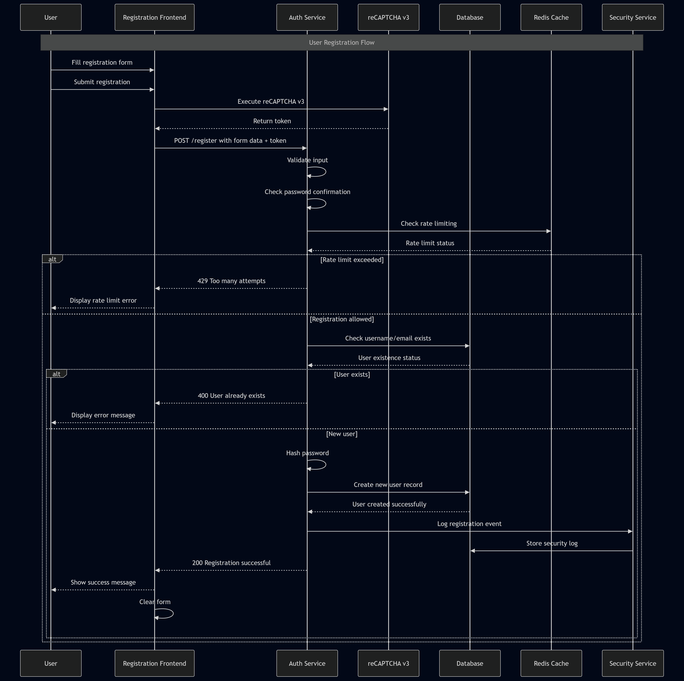
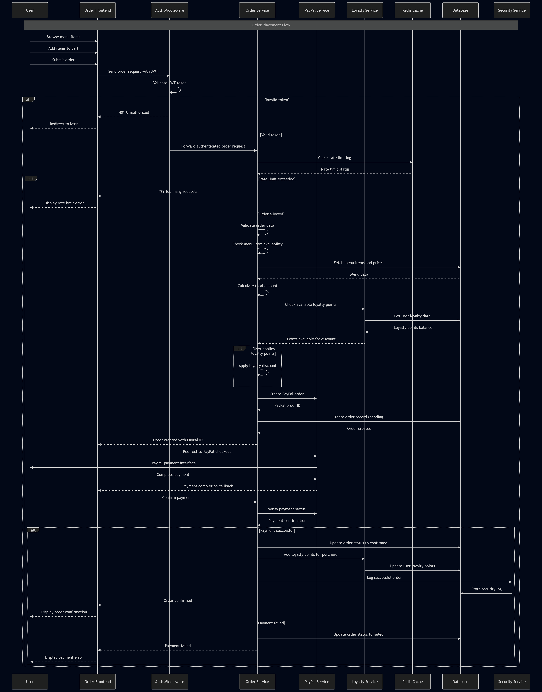
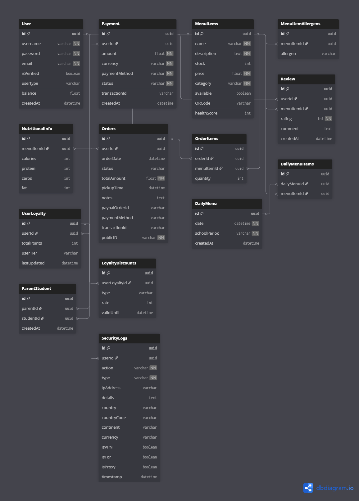
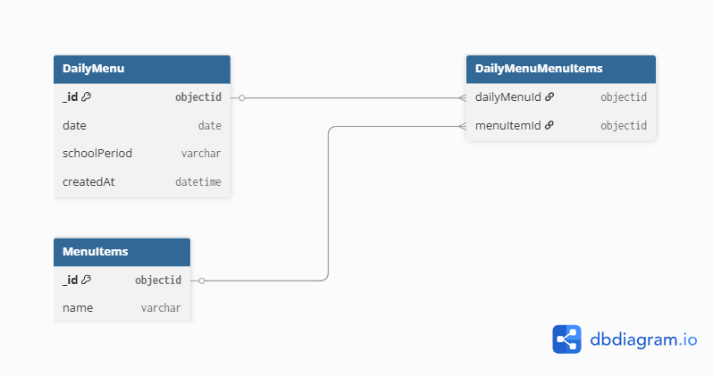

<style>
@page {
  size: A4 landscape;
  margin: 1.5cm;
}

body {
  font-family: -apple-system, BlinkMacSystemFont, 'Segoe UI', 'Roboto', sans-serif;
  line-height: 1.6;
  color: #333;
}

.fullpage {
  page-break-before: always;
  page-break-after: always;
  height: 100vh;
  display: flex;
  align-items: center;
  justify-content: center;
  background: #f8f9fa;
}

img {
  display: block;
  max-width: 98%;
  max-height: 85vh;
  width: auto;
  height: auto;
  object-fit: contain;
  border: 1px solid #e1e5e9;
  border-radius: 8px;
  box-shadow: 0 2px 8px rgba(0,0,0,0.1);
  margin: 1rem auto;
}

table {
  width: 100%;
  border-collapse: collapse;
  margin: 1.5rem 0;
  font-size: 0.9rem;
  background: #fff;
  border-radius: 6px;
  overflow: hidden;
  box-shadow: 0 1px 3px rgba(0,0,0,0.1);
}

th, td {
  padding: 12px 15px;
  text-align: left;
  border-bottom: 1px solid #e1e5e9;
}

th {
  background: #f8f9fa;
  font-weight: 600;
  color: #495057;
}

tr:hover { background: #f8f9fa; }
tr:last-child td { border-bottom: none; }

pre {
  background: #f8f9fa;
  border: 1px solid #e1e5e9;
  border-radius: 6px;
  padding: 1rem;
  overflow-x: auto;
  font-family: 'Consolas', 'Monaco', 'Courier New', monospace;
  font-size: 0.85rem;
  line-height: 1.4;
  margin: 1rem 0;
  page-break-inside: auto;
  orphans: 3;
  widows: 3;
}

code {
  background: #f1f3f4;
  padding: 0.2rem 0.4rem;
  border-radius: 3px;
  font-family: 'Consolas', 'Monaco', 'Courier New', monospace;
  font-size: 0.85rem;
  color: #e83e8c;
}

pre code { background: none; padding: 0; color: inherit; }

h1 { font-size: 2.5rem; color: #1a1a1a; border-bottom: 3px solid #007acc; padding-bottom: 0.5rem; page-break-before: always; page-break-after: avoid; }
h2 { font-size: 2rem; color: #2d3748; border-bottom: 2px solid #e1e5e9; padding-bottom: 0.3rem; page-break-after: avoid; margin-top: 3rem; }
h3 { font-size: 1.5rem; color: #4a5568; page-break-after: avoid; }
h4 { font-size: 1.25rem; color: #718096; page-break-after: avoid; }

ul, ol { margin: 1rem 0; padding-left: 2rem; }
li { margin: 0.5rem 0; }

.directory-tree {
  page-break-inside: avoid;
  font-family: 'Consolas', 'Monaco', 'Courier New', monospace;
  background: #f8f9fa;
  padding: 1rem;
  border-radius: 6px;
  border: 1px solid #e1e5e9;
}

.schema-table { font-size: 0.85rem; }
.schema-table th { background: #343a40; color: #fff; }
.schema-table tr:nth-child(even) { background: #f8f9fa; }
</style>

# SnapTray szoftver dokumentációja

## Tartalomjegyzék

- [1. Bevezetés](#1-bevezetes)
- [2. Rendszer áttekintése](#2-rendszer-attekintese)
- [3. Követelmények](#3-kovetelmenyek)
- [4. Rendszerarchitektúra](#4-rendszerarchitektura)
  - [4.1 Komponensek/modulok](#41-komponensekmodulok)
  - [4.2 Adatfolyam](#42-adatfolyam)
  - [4.3 Technológiák](#43-technologiak)
- [5. Tervezés](#5-tervezes)
  - [5.1 Tervezési elvek](#51-tervezesi-elvek)
  - [5.2 Adatbázis tervezés](#52-adatbazis-tervezes)
  - [5.3 Algoritmusok és adatszerkezetek](#53-algoritmusok-es-adatszerkezetek)
  - [5.4 Biztonsági tervezés](#54-biztonsagi-tervezes)
- [6. Megvalósítás](#6-megvalositas)
  - [6.1 Könyvtárstruktúra](#61-konyvtarszerkezet)
  - [6.2 Backend megvalósítás](#62-backend-megvalositas)
  - [6.3 Frontend megvalósítás](#63-frontend-megvalositas)
- [7. API referencia](#7-api-referencia)
- [8. Adatmodell és kódlap leképezése](#8-adatmodell-es-kodlap-lekepezese)
- [9. Tesztelés és érvényesítés](#9-teszteles-es-ervenyesites)
- [10. Telepítés és karbantartás](#10-telepites-es-karbantartas)
- [11. Következtetés és jövőbeni munka](#11-kovetkeztetes-es-jovobeni-munka)
- [12. Hivatkozások](#12-hivatkozasok)
- [13. Mellékletek](#13-mellekletek)

---

## 1. Bevezetés

A SnapTray egy webalapú menza-rendelőrendszer, amelynek célja, hogy egyszerűsítse az étkezési rendelések lebonyolítását iskolai környezetben. Fő célja, hogy a diákok, szülők és az étkeztető személyzet közötti interakció gyorsabbá és átláthatóbbá váljon az online rendelés, a valós idejű rendeléskövetés és a biztonságos fizetési lehetőségek révén.

A rendszer három fő felhasználói szerepet szolgál ki: a **diákok** böngészhetnek az étlapok között, rendelhetnek és kezelhetik a virtuális pénztárcájukat; a **szülők** figyelemmel kísérhetik gyermekeik rendeléseit és kezelhetik a fizetéseket; az **adminisztrátorok** számára dashboard biztosít lehetőséget az étlapok kezelésére és statisztikák elemzésére.

A SnapTray modern biztonsági megoldásokat alkalmaz (kétlépcsős azonosítás, email-ellenőrzés, gyakori webes támadások elleni védelem), valamint PayPal és Google Pay integrációt kínál.

---

## 2. Rendszer áttekintése

A rendszer egy webalapú rendelési és fizetési platform oktatási intézmények számára, kliens–szerver architektúrában. A backend Node.js alapú Express szerver, a frontend React komponensekből épül fel szerepkör-alapú dashboardokkal. Redis biztosítja a gyorsítótárazást, rate limitinget és az atomi műveleteket, MongoDB az adatok perzisztens tárolását.

### Megvalósított fő funkciók

**Felhasználókezelés és autentikáció:**
- Többszerepkörű felhasználói rendszer (diák, szülő, adminisztrátor)
- Email alapú fiókellenőrzés és kétlépcsős azonosítás (2FA)
- JWT alapú munkamenet-kezelés Redis tárolással
- Jelszó biztonság bcrypt hasheléssel és erősség validációval

**Rendelés és menü rendszer:**
- Dinamikus menükezelés kategóriákkal és táplálkozási információkkal
- Valós idejű készletkövetés riasztásokkal
- Napi menü funkcionalitás, QR kód integráció, allergén információk

**Fizetés feldolgozás:**
- PayPal és Google Pay API integráció
- Pénztárca egyenleg rendszer atomi műveletekkel
- Biztonságos tranzakció naplózás és audit trail

---

## 3. Követelmények

### Fő célok
- Biztonságos és ellenőrzött rendelési folyamat
- Digitális pénztárca és hűségpont rendszer
- Skálázható és nagy teljesítményű backend
- Külső fizetési szolgáltatók integrálása (PayPal, Google Pay)

**Felhasználókezelés:** Regisztráció, email alapú fiókellenőrzés, szerepkör-alapú hozzáférés (diák, szülő, admin).

**Hitelesítés és biztonság:** JWT alapú hitelesítés, kétlépcsős azonosítás (2FA), rate limiting brute-force védelem ellen.

**Rendelések és fizetések:** Rendelés leadás, végösszeg számítás, PayPal és Google Pay támogatás, tranzakció naplózás.

**Adminisztráció:** Felhasználókezelés, statisztikák és riportok.

---

## 4. Rendszerarchitektúra {#4-rendszerarchitektura}

A rendszer három fő rétegből áll:

**Megjelenítési réteg (Frontend):** React.js komponensek, szerepkör-alapú dashboardok, Tailwind CSS, REST API kommunikáció, valós idejű frissítések Socket.IO-val.

**Alkalmazási réteg (Backend):** Node.js/Express.js szerver, JWT hitelesítés, üzleti logika szolgáltatásokban, Redis Lua szkriptek atomi műveletekhez, rate limiting middleware.

**Adatréteg:** MongoDB perzisztens adatbázis Mongoose ODM-mel, Redis cache munkamenetekhez és rate limitinghez.

<div class="fullpage"></div>

### 4.1 Komponensek/modulok {#41-komponensekmodulok}

| Modul | Leírás |
|-------|--------|
| Frontend/UI | React.js, szerepkör-alapú dashboardok, autentikáció, rendelés UI |
| API Layer | Express.js REST végpontok, üzleti logika |
| Data Layer | MongoDB (perzisztens), Redis (cache, session) |
| Hitelesítés és biztonság | JWT, rate limiting, biztonsági naplózás |
| Payment | PayPal és Google Pay integráció |
| Hűségprogram | Pontszámítás, tier kezelés, kedvezmények |

### 4.2 Adatfolyam {#42-adatfolyam}

1. A felhasználó a React frontenddel interaktál, HTTP kéréseket küld.
2. Az Express szerver middleware-eken (hitelesítés, rate limiting, sanitizáció) keresztül irányítja a kéréseket.
3. Az üzleti logika MongoDB-ből vagy Redis cache-ből olvassa az adatokat.
4. Írási műveletek frissítik az adatbázist és érvénytelenítik a cache bejegyzéseket.
5. A válasz JSON formátumban kerül vissza a frontendhez.
6. Valós idejű frissítések Redis pub/sub-on és Socket.IO-n keresztül érkeznek.
7. Minden jelentős esemény naplózásra kerül a SecurityLogs kollekcióba.





### 4.3 Technológiák {#43-technologiak}

| Technológia | Indok |
|-------------|-------|
| Node.js + Express.js | JavaScript full-stack konzisztencia, gyors fejlesztés |
| MongoDB + Mongoose | Rugalmas dokumentum-séma, skálázható |
| Redis + Lua | Gyors cache, atomi műveletek, rate limiting |
| React.js + Tailwind CSS | Komponens-alapú UI, reszponzív Tervezés |
| JWT + bcrypt | Iparági standard hitelesítés és jelszóvédelem |
| PayPal / Google Pay | Megbízható, PCI-kompatibilis fizetési integrációk |
| Socket.IO | Kétirányú valós idejű kommunikáció |
| Helmet, HPP, CORS | HTTP biztonsági fejlécek és védelmi middleware |


---

## 5. Tervezés {#5-tervezes}

### 5.1 Tervezési elvek {#51-tervezesi-elvek}

| Elv | Megvalósítás |
|-----|-------------|
| Modularitás | Réteges architektúra (routes / services / models), laza csatolás modulok között |
| Security-First | Defense in depth, least privilege, minden végpont alapértelmezetten hitelesítést igényel |
| Skálázhatóság | Állapotmentes JWT, Redis cache, MongoDB indexek és connection pooling |
| Felhasználóközpontú Tervezés | Reszponzív Tailwind UI, érthetetlen hibaüzenetek, visszajelzési rendszerek |
| Megbízhatóság | Graceful degradation, tranzakció-kezelés, átfogó naplózás |
| Karbantarthatóság | Clean code, git verziókövetés, RESTful API konvenciók, env-alapú konfiguráció |
| Adatintegritás | Többszintű validáció, atomi műveletek, audit trail |
| Platformfüggetlenség | Modern böngészők (Chrome, Firefox, Safari, Edge), mobilreszponzív |


### 5.2 Adatbázis tervezés {#52-adatbazis-tervezes}

#### 5.2.1 Cél, funkció és a tárolt információk összefoglalása {#521-cel-funkcio-tarolt-informaciok}

Ez az adatbázis egy iskolai menzarendszer része (MERN stack projekt), amely lehetővé teszi a felhasználók számára (diákok, szülők, tanárok), hogy ételeket rendeljenek, kifizessék azokat és értékeléseket adjanak. A rendszer támogatja a felhasználóhitelesítést, menükezelést, rendelések kezelését, fizetéseket, hűségprogramokat, E2EE chatet és biztonsági naplózást. A fő cél az iskolai étkezések hatékony és biztonságos kezelése, beleértve a készletgazdálkodást, értékeléseket és pénzügyi tranzakciókat. Az adatbázis MongoDB-t használ Mongoose ODM-mel, amely NoSQL adatbázis, de sémákkal struktúrált. Redis gyorsítótárazásra és ideiglenes adatokra szolgál.

Az adatbázis modell típusa: NoSQL (MongoDB), lekérdező nyelv: JavaScript (Mongoose query-k). Redis memóriában tárolt adatbázis gyorsítótárazásra, munkamenetekre és rövid életű adatokra.

#### 5.2.2 Adatbázis terv és séma {#522-adatbazis-terv-sema}

##### Entitások és kapcsolatok (ER modell összefoglaló)

A rendszer fő entitásai és kapcsolataik:

- **User** (Felhasználó): Központi entitás, minden más ehhez kapcsolódik.
- **UserPersonalInfo**: Személyes adatok a felhasználóról (beágyazott dokumentum).
- **MenuItems** (Menüelemek): Ételválaszték elemei.
- **Order** (Rendelés): Felhasználói rendelések.
- **OrderItems** (Rendelési tételek): Menüelemek egy rendeléshez (beágyazott a Rendelésben).
- **Payment** (Fizetés): Pénzügyi tranzakciók.
- **Review** (Értékelés): Menüelemek értékelései (beágyazott a MenuItems-ben).
- **DailyMenu** (Napi menü): Iskolai időszakokra bontott napi menük, több Menüelem halmazzal (N:N kapcsolat linktáblával).
- **ParentStudent** (Szülő-diák kapcsolat): Szülők és diákok összekapcsolása.
- **SecurityLogs** (Biztonsági naplók): Eseménynaplózás.
- **UserLoyalty** (Hűségprogram): Felhasználói pontok, kedvezmények és hűségszint.
- **DeviceSyncSession** (Eszköz szinkronizációs munkamenet): Eszközkulcs-szinkronizáció (önálló, nincs kapcsolva másokhoz).
- **Message** (Üzenetek): E2EE chat üzenetek.
- **PreKey** (Prekeyek): ECDH prekeyek.
- **StorageBlob** (Tárhely blob): Titkosított üzenet/munkamenet előzmények.

##### Relációk és logikai szerkezet
- User 1:N Payment, Order, SecurityLogs, UserLoyalty, Message (sender/recipient), PreKey, StorageBlob, ParentStudent.
- MenuItems 1:N OrderItems (Rendelésben beágyazva), Review (MenuItems-ben beágyazva).
- Order 1:N OrderItems (beágyazott tételsorokkal).
- DailyMenu N:M MenuItems (normálizált kapcsolattábla: DailyMenuMenuItems).
- Message 1:1 PreKey (opcionális, X3DH kulcscsere támogatására).
- StorageBlob 1:1 User (kulcspáros: userId + blobType + partitionKey, egyedi indexelés).
- DeviceSyncSession: önálló entitás rövid életű E2EE szinkronizációhoz.



##### Relációs séma – részletes táblaelemzés

A következők részletesen ismertetik az egyes entitások mezőit, típusait, szerepét, megszorításait és indexelését. Minden tábla optimalizációs javaslatot kap, és felhívjuk a figyelmet a törölhető duplikációkra.


#### 5.2.3 Részletes entitásleírások

Ez a szakasz kifejezetten az entitásokra koncentrál: mezők, szabályok, indexek, tranzakciós minták és teljesítményoptimalizáció.

##### Általános indexelési irányelv
- Minden gyakori lekérdezési mezőre, szűrési feltételre és rendezési kulcsra helyi egyszeres index (simple index), szükség esetén compound index.
- Magas trillásoknál TTL index (pl. `DeviceSyncSession.expiresAt`), és egyediségellenőrzés `(userId, blobType, partitionKey)` típusokat használunk.
- Vegyes OLTP-OLAP terhelésnél az olvasott mezők bevált `covered index` mintára optimalizált struktúrát kapnak.
- Integrált `stats` gyűjtés; `planCache` és `db.stats()` monitorozás.

---

##### User (Felhasználók)

A `User` kollekció a rendszert használók identitását és jogosultságait kezeli; a CRUD, bejelentkezés, 2FA és hűségpont rendszer fő kulcsa.
- Az egyedi `username` és `email` biztosítja a duplikáció megelőzését.
- A beágyazott `userPersonalInfo` csomag rendezi a profil-adatokat (osztály, iskola, kapcsolattartás).
- Az `identity` és `devices` terület a E2EE és multi-device hitelesítést szolgálja biztonságos kulcskezeléssel.
- `balance` és `isBanned` mezőkkel a valósidejű pénzügyi és tiltása állapot is követhető.

| Field Name | Type | Meaning/Role | Constraints | Indexek | Optimálás |
|------------|------|--------------|-------------|---------|----------|
| username | String | Felhasználónév | Required, unique | {_id: 1}, {username: 1} (unique) | Egyetlen lefedett index a loginhoz |
| password | String | Hash-olt jelszó | Required | {_id: 1} | Nem indexelünk közvetlenül jelszót, csak hash admin | 
| email | String | Email cím | Required, unique, email format, trim | {email: 1} (unique) | Geometry query kétlépcsős e-mail ellenőrzéshez |
| isVerified | Boolean | Email ellenőrzöttség | Default false | {isVerified: 1} | Jól használható újregisztrációs szűrőhöz |
| usertype | String | Szerepkör | Enum, default teen | {usertype: 1} | Role-based query gyorsításhoz |
| createdAt | Date | Regisztráció dátum | Default Date.now | {createdAt: -1} | Archiválás és pagination támogatás |
| balance | Number | Pénztárca egyenleg | Default 0 | {balance: 1} | Pénzügyi aggregációs pipeline-hoz |
| isBanned | Boolean | Tiltott felhasználó | Default false | {isBanned: 1} | Gyors ideiglenes tiltás szűrés |
| banReason | String | Tiltás oka | Optional | _id | Felesleges indexelni ritkán használt lekérdezésnél |
| userPersonalInfo | Subdocument | Profiladatok | Optional | - | Subdocumentben változó lekérdezett mezők miatt nincs index |
| identity.publicKey | String | E2EE kulcs | Optional | {identity.keyId: 1} | Keresés eszközazonosításra |
| identity.keyId | String | Kulcspéldány | Optional, unique | {identity.keyId: 1} (sugallt) | Kizárólagos kulcspárosított ellenőrzés |
| devices | Array | Regisztrált eszközök | Optional | {devices.deviceId: 1} | Multi-key index a device lookuphoz |
| recoveryBlob.encryptedData | String | Titkosított blob | Optional | _id | Nincs szükség extra indexre |
| recoveryBlob.iv | String | Inicializáló vektor | Optional | _id | - |
| recoveryBlob.salt | String | Salt | Optional | _id | - |
| recoveryBlob.storedAt | Date | Mentési időpont | Optional | {recoveryBlob.storedAt: 1} TTL sok stressz | TTL indexsel automatikus érvénytelenítés |

Üzleti szabályok: Aktív/tiltott státusz ellenőrzése minden bejelentkezésnél; `usertype` határozza meg az API-engedélyt. A `balance`-t transzaktív Redis-lakkkal cache-ljük, rollback esetén rollback a fő adatbázisban.

---
| recoveryBlob.storedAt | Date | Recovery blob storage time | Optional | _id, recoveryBlob.storedAt |
| encryption.* | Mixed | V1 legacy E2EE fields (for migration) | Optional | _id, encryption.* |

Üzleti szabályok: Minden felhasználó egyedi felhasználónévvel és e-mail címmel rendelkezik. A felhasználói típus befolyásolja a jogosultságokat (pl. admin mindent elér).

##### Fizetés (Payments)

A `Payment` gyűjtemény a pénzügyi tranzakciók auditját, státuszát és külső azonosítóit tárolja.
- Fontos, hogy a `transactionId` azonosító a PayPal/Google Pay és belső logika számára is egyedi legyen.
- `status` mezőnél szigorú enum és text szűrés biztosítja a befejezett/feldolgozás alatt/hibás tételek elkülönítését.

| Field Name | Type | Meaning/Role | Constraints | Indexek | Optimálás |
|------------|------|--------------|-------------|---------|-----------|
| userId | ObjectId (ref: User) | Fizető felhasználó | Optional | {userId: 1} | Felhasználói összegzések gyorsítása |
| amount | Number | Fizetett összeg | Required | {amount: 1} | Range query-khez, aggregációhoz |
| currency | String | Devizanem | Required | {currency: 1} | Többdevizás pénzügyi lekérdezéshez |
| paymentMethod | String | Fizetési mód | Required | {paymentMethod: 1} | Módszer alapú számlázási riporthoz |
| status | String | Állapot | Required, enum ['Completed','Pending','Failed'] | {status:1} | Népszerű statusz szűréshez |
| transactionId | String | Külső tranzakciós ID | Optional | {transactionId:1} (unique) | Idempotencia azonosításra |
| createdAt | Date | Létrehozás idő | Default now | {createdAt:-1} | Legfrissebb tranzakciók lekérése |

Index-optimalizációk:
- compound index `{userId:1, status:1, createdAt:-1}` a felhasználói tranzakciók lekérdezéséhez.
- `transactionId` egyedi index az idempotens kérések megakadályozásához.
- archival pipeline heti feladat, 2 évesnél idősebb rekordok `history.payments` archív kollekcióba mozgatása.

---

##### Menüelemek (Menu Items)

A `MenuItems` gyűjtemény a jelenleg elérhető menü tételeket kínálja, beleértve ár, készlet, allergének és napi ajánlat státuszokat.
- `stock` és `available` mezők konszisztens validációt kapnak pre-save hookon keresztül.
- A `category` kulcsból származtatott aggregált riportok (kedvencek, kategória népszerűség) készülnek napi batch folyamatban.

| Field Name | Type | Meaning/Role | Constraints | Indexek | Optimálás |
|------------|------|--------------|-------------|---------|-----------|
| name | String | Tétel neve | Required, text index | {name: 'text'} | Teljes szöveges keresés és súlyozott találat |
| description | String | Leírás | Required, text index | {description: 'text'} | Keresés AND/OR támogatás |
| stock | Number | Készlet | Required, min 0, default 0 | {stock:1} | készletfigyelő triggerhez gyors lookup |
| price | Number | Ár | Required | {price:1} | ár alapú szűréshez |
| category | String | Kategória | Required, enum | {category:1} | napi menücsoportosítás gyorsítása |
| available | Boolean | Elérhető-e | Default true | {available:1} | listázás pull-up optimalizálása |
| QRCode | String | QR kód | Optional | {QRCode:1} | QR beolvasásnál pod cache-re hivatkozás |
| allergens | [String] | Allergének | Default [] | {'allergens':1} multi-key | Allergen filter pipeline gyorsítás |
| nutritionalInfo.calories | Number | Kalóriaérték | Optional | {'nutritionalInfo.calories':1} | statisztikai kimutatásokhoz |
| nutritionalInfo.protein | Number | Fehérje | Optional | {'nutritionalInfo.protein':1} | RT kalkulációhoz |
| nutritionalInfo.carbs | Number | Szénhidrát | Optional | {'nutritionalInfo.carbs':1} | low-carb query-hez |
| nutritionalInfo.fat | Number | Zsír | Optional | {'nutritionalInfo.fat':1} | diet-specific listázáshoz |

Index-optimalizációk:
- compound index `{available:1, category:1, price:1}` a gyors menülistázáshoz.
- TTL cache megoldásban `daily-menu-cache` nincs perzisztens lag.
- Schema validation diszkrét consumer-side caching (Mongoose virtuals + readOnly view) biztosítja a tolls forrását.

Üzleti szabályok: Stock <= 0 esetén `available=false`, `price` pozitív (számlázás hitelesítés), `allergens` kötelezően normalizált string tömörítéssel (small lexicographically sorted list).

##### Rendelés (Orders)

A `Order` kollekció az ügyfélrendeléseket, tételsorokat, státuszokat és fizetési metaadatokat tartalmazza.
- `items` többnyire beágyazott dokumentumként használt, de a 10+ tétel esetén szétválasztott normalizációs stratégia aktív a mérhetőség miatt.
- Státusz és időbélyeg `compound index`-el támogatja a visszajátszás alapú késéskezelést és timeout kényszerítést.

| Field Name | Type | Meaning/Role | Constraints | Indexek | Optimálás |
|------------|------|--------------|-------------|---------|-----------|
| userId | ObjectId (ref: User) | Rendelést leadó felhasználó | Required | {userId:1} | felhasználó alapú rendezés |
| items | [OrderItemsScheme] | Rendeléssorok | Required | - | beágyazottan gyors OLTP, 20+ tétel esetén külső OrderItems | 
| orderDate | Date | Rendelés időpontja | Default Date.now | {orderDate:-1} | friss lista/pagination |
| status | String | Rendelés állapot | Enum + default Pending | {status:1, createdAt:-1} | állapot-szűrés, backlog clean-up |
| totalAmount | Number | Végösszeg | Required | {totalAmount:1} | pénzügyi jelentésekhez |
| pickupTime | Date | Átvétel ideje | Optional | {pickupTime:1} | időpont alapú optimalizált lekérdezés |
| notes | String | Megjegyzés | Optional | - | max 500 char, egységes szűrés minimalizált index nélkül |
| paypalOrderId | String | PayPal azonosító | Optional | {paypalOrderId:1} (unique) | idempotencia és visszaellenőrzés |
| paymentMethod | String | Fizetési mód | Optional | {paymentMethod:1} | lekérdezési szegmentálás |
| transactionId | String | Tranzakció ID | Optional | {transactionId:1} | cross-system követés |
| publicID | String | Publikus azonosító | Required, unique | {publicID:1} | URL-alapú megosztás, kérésekhez |

Index-optimalizáció:
- Compound index `{userId:1, status:1, orderDate:-1}` a felhasználói rendeléslistázáshoz.
- Kubebase audit feldolgozási workflow: `status` változás trigger csillapítással.
- Archíválás: 90 nap után lezárt rendeléseket `order_archive` gyűjteménybe mozgatjuk.

---

##### Order tétel (Order Items)

A `OrderItems` szabványosított tételtáblázata a rendelések vonatkozású elemcsomagokat tartja nyilván.
- Beágyazott vagy linkelhető: `items` részben beágyazva gyors OLTP-hez; nagy volumen esetén külső `OrderItems` kollekció használata a skálázhatóság javításához.
- `menuItemId` hivatkozás garantálja a tétel referenciális integritását.

| Field Name | Type | Meaning/Role | Constraints | Indexek | Optimálás |
|------------|------|--------------|-------------|---------|-----------|
| menuItemId | ObjectId (ref: MenuItems) | Menüelem referenciája | Required | {menuItemId:1} | hozzáférés a tétel részletekhez |
| orderId | ObjectId (ref: Order) | Rendelés referenciája | Required | {orderId:1} | rendelés alapú agregáció |
| quantity | Number | Mennyiség | Required, min 1 | {quantity:1} | mennyiség alapú riport |
| unitPrice | Number | Egységár | Required | - | árváltozás követés, pénzügyi rekonstrukció |
| totalPrice | Number | Tétel végösszeg | Required | {orderId:1, totalPrice:-1} | tételes lezárásokhoz |

Indexelés:
- Compound index `{orderId:1, menuItemId:1}` a rendelés tétel lekérdezésekhez.
- Tétel-aggregációkhoz `menuItemId` + `quantity` szűrés.

Üzleti szabályok: Számított mező `totalPrice = unitPrice * quantity`; változáskor audit log generálódik.
---

##### Értékelés (Reviews) - MenuItems beágyazva

A `Review` model a felhasználói feedback-eket rögzíti, a moderálás és jelentés kezdeményezés szűrése szempontjából is.
- Beágyazott struktúra `MenuItems.reviews` listában, mivel egy adott tétel összes tartalmát gyakori egyszerre kérjük le.
- Lehetséges alternatíva: külön `Reviews` kollekció, ha a visszajelzések száma milliós, és átlagpontszám kalkuláció WordPress-szerű 

| Field Name | Type | Meaning/Role | Constraints | Indexek | Optimálás |
|------------|------|--------------|-------------|---------|-----------|
| userId | ObjectId (ref: User) | Értékelő felhasználó | Required | {userId:1} | Előző értékelések lekérése |
| rating | Number | Pontszám +1-5 | Required, min 1, max 5 | {rating:1} | átlagszámítás gyorsítása |
| comment | String | Szöveges vélemény | Optional, maxlength 500 | text index | `{$text: ...}` | felhasználói visszakeresés |
| date | Date | Létrehozás időpont | Default now | {date:-1} | legfrissebbekhez |
| ipAddress | String | IP cím | Optional | {ipAddress:1} | bot-szűrés, fraud elemzés |
| reported | Boolean | Jelentett | Default false | {reported:1} | moderálási front-end 
| moderated | Boolean | Moderált | Default false | {moderated:1} | automatikus clean-up
| moderatorNotes | String | Moderátor megjegyzés | Optional | - | Nincs index, ritkán használt |

Biztonsági szabályok:
- spam kontroll: egy felhasználó 5 percnél gyakrabban nem tehet közzé értékelést.
- `reported=true` esetén dedikált `reportedReviews` nézetet 24h alatt feldolgozza a moderációs pipeline.
---

##### DailyMenu (Napi menü)

A `DailyMenu` kollekció a napi menüválasztékot és menüpontokat kezeli, így a heti menü tervezés és változtatás egyszerű.
- `date` + `schoolPeriod` egyedi kombinációval biztosítjuk, hogy mindennaphoz csak egy rekord tartozzon.
- `menuItems` referenciákat használ vagy beágyazott listát (N:M gondos indexeléssel).

| Field Name | Type | Meaning/Role | Constraints | Indexek | Optimálás |
|------------|------|--------------|-------------|---------|-----------|
| date | Date | Nap | Required | {date:1, schoolPeriod:1} (unique) | dátum-alapú gyors keresés |
| schoolPeriod | String | Időszak | Required, enum ['morning','afternoon'] | {schoolPeriod:1} | periodikus szűrés |
| menuItems | [ObjectId] (ref: MenuItems) | Menüelemek | Required | {menuItems:1} multi-key | gyors N:M join-hez |
| createdAt | Date | Létrehozás | Default now | {createdAt:-1} | audit és rollback adat |

Index-optimalizációk:
- Unique compound index `{date:1, schoolPeriod:1}` a hozzárendelés konzisztenciájához.
- `menuItems` multi-key index az események prompt lekérdezéséhez (napi újradefiniálás, audit).
- Konstant menü esetén tárhely-kímélő `compress` and read-only snapshot mechanizmus a MongoDB modernebb tárolási engine-jeivel (WiredTiger, zlib).

Üzleti logika:
- naponta egyszeri generálás a rendelési ablak nyitásakor;
- menü-elkülönítést biztosítjuk `dailyMenu`-val a feketelistázás és változtatás nyomon követéséhez.
---

Üzleti szabályok: Daily menus are created per period.

##### ParentStudent (Parent-Student Relationship)

| Field Name | Type | Meaning/Role | Constraints | Indexes |
|------------|------|--------------|-------------|---------|
| parentId | ObjectId (ref: User) | Parent user | Required | _id, parentId |
| studentId | ObjectId (ref: User) | Student user | Required | _id, studentId |
| createdAt | Date | Creation time | Default: current time | _id, createdAt |

Üzleti szabályok: Parents can be linked to multiple students.

##### SecurityLogs (Biztonsági naplók)

| Field Name | Type | Meaning/Role | Constraints | Indexes |
|------------|------|--------------|-------------|---------|
| userId | ObjectId (ref: User) | User | Optional | _id, userId |
| action | String | Action (e.g., LOGIN_SUCCESS) | Required | _id, action |
| type | String | Type (INFO, WARNING, ERROR) | Required | _id, type |
| ipAddress | String | IP address (hashed) | Optional | _id, ipAddress |
| Timestamp | Date | Timestamp | Default: current time | _id, Timestamp |
| details | String | Additional info | Optional | _id, details |
| country | String | Country | Optional | _id, country |
| CountryCode | String | Country code | Optional | _id, CountryCode |
| currency | String | Currency | Optional | _id, currency |
| Continent | String | Continent | Optional | _id, Continent |
| IsVPN | Boolean | VPN usage | Optional | _id, isVPN |
| isTor | Boolean | Tor usage | Optional | _id, isTor |
| isProxy | Boolean | Proxy usage | Optional | _id, isProxy |

Üzleti szabályok: Logs record all important events.

##### DeviceSyncSession (Device Sync Session)

| Field Name | Type | Meaning/Role | Constraints | Indexes |
|------------|------|--------------|-------------|---------|
| responderDeviceId | String | Responder device ID | Required | responderDeviceId |
| initiatorDeviceId | String | Initiator device ID | Optional | _id |
| encryptedPayload | String | Encrypted payload | Required | _id |
| iv | String | Initialization vector | Required | _id |
| ephemeralKey | String | Ephemeral key | Required | _id |
| expiresAt | Date | Expiration time | Default: current time + 10 minutes | expiresAt (TTL) |

Üzleti szabályok: Rövid életű munkamenet az eszközök közötti titkosítási kulcsok szinkronizálására. TTL index segítségével 10 perc után automatikusan törlődik. Az E2EE kulcskezelésben biztonságos párosítást tesz lehetővé.

##### Üzenet (Messages)

| Field Name | Type | Meaning/Role | Constraints | Indexes |
|------------|------|--------------|-------------|---------|
| senderId | ObjectId (ref: User) | Sender user ID | Required | senderId, recipientId, createdAt |
| recipientId | ObjectId (ref: User) | Recipient user ID | Required | recipientId, status |
| schemaVersion | Number | Schema version | Default: 2 | _id |
| encryptedContent | String | Legacy encrypted content | Optional | _id |
| encryptionMetadata.senderEncryptedKey | String | Legacy sender key | Optional | _id |
| encryptionMetadata.recipientEncryptedKey | String | Legacy recipient key | Optional | _id |
| encryptionMetadata.iv | String | Legacy IV | Optional | _id |
| encryptionMetadata.algorithm | String | Encryption algorithm | Default: 'AES-GCM' | _id |
| status | String | Message status | Enum: ['sent', 'delivered', 'read', 'replaced'], default: 'sent' | status |
| messageType | String | Message type | Enum: ['text', 'file', 'image'], default: 'text' | _id |
| createdAt | Date | Creation time | Default: current time | createdAt |
| readAt | Date | Read time | Optional | _id |
| senderKeyRecovery.needed | Boolean | Key recovery needed | Default: false | senderKeyRecovery.needed |
| senderKeyRecovery.failed | Boolean | Key recovery failed | Default: false | _id |
| senderKeyRecovery.senderPublicKey | String | Recovery public key | Optional | _id |
| senderKeyRecovery.senderKeyId | String | Recovery key ID | Optional | _id |

Üzleti szabályok: End-to-end titkosított üzeneteket tárol Double Ratchet protokollal. Az állapotkövetés figyeli a kézbesítést és olvasást. Támogatja a kapott kulcsok helyreállítását. A migráció érdekében régi mezők is megmaradnak. Az indexek optimalizáltak a beszélgetések lekérésére és állapotszűrésre.

##### PreKey (Prekeys)

| Field Name | Type | Meaning/Role | Constraints | Indexes |
|------------|------|--------------|-------------|---------|
| userId | ObjectId (ref: User) | User ID | Required | userId, deviceId, used |
| deviceId | String | Device ID | Required | userId, keyId (unique) |
| keyId | Number | Key ID | Required | _id |
| publicKey | String | ECDH public key | Required | _id |
| used | Boolean | Whether key has been used | Default: false | used |
| createdAt | Date | Creation time | Default: current time | _id |

Üzleti szabályok: Egyszer használatos prekey-ek (OPK-k) tárolása X3DH kulcscsere céljára E2EE üzenetküldésre. Minden kulcs egyszer használatos és megjelöltként kerül tárolásra. Egyedi keyId felhasználónként biztosítja a duplikációmentességet. Magas forgalmú gyűjtemény, a kulcsok használat után törlésre kerülnek a forward secrecy megtartása érdekében.

##### StorageBlob (Storage Blobs)

| Field Name | Type | Meaning/Role | Constraints | Indexes |
|------------|------|--------------|-------------|---------|
| userId | ObjectId (ref: User) | User ID | Required | userId, blobType, partitionKey (unique) |
| blobType | String | Blob type | Required, enum: ['message_log', 'session_state', 'skipped_keys'] | blobType |
| partitionKey | String | Partition key (e.g., conversation ID) | Required | partitionKey |
| encryptedPayload | String | Encrypted data | Required | _id |
| iv | String | GCM IV | Required | _id |
| version | Number | Version number | Default: 1 | _id |
| updatedAt | Date | Last update time | Default: current time | updatedAt |

Üzleti szabályok: Titkosított tárolás E2EE kapcsolódó adatoknak, beleértve az üzenetnaplókat, munkamenet állapotokat és kihagyott üzenetkulcsokat. Felhasználó, típus és kulcs szerint particionált a hatékony hozzáférés érdekében. Egyedi korlátozások megakadályozzák az adatok felülírását. Állandó kriptográfiai állapot tárolására szolgál a munkamenetek között.

---

#### 5.2.4 Fizikai és logikai szerkezet

Az adatbázis MongoDB-t használ elsődleges NoSQL tárolóként Mongoose séma érvényesítéssel. A kollekciók dokumentumalapú tárolásra vannak tervezve, beágyazott al-dokumentumokkal a kapcsolódó adatokhoz (pl. OrderItems az Order-ben, Reviews a MenuItems-ben). A kapcsolatokhoz ObjectId hivatkozásokat használunk. A Redis rövid életű adatok, például munkamenetek, rate limiting és gyorsítótárazás kezelésére szolgál.

A logikai szerkezet az ER-modellt követi: entitások kollekciókban, kapcsolatok hivatkozások és beágyazás révén. A fizikai szerkezet teljesítményhez optimalizált indexeket, ideiglenes adatokhoz TTL-t és gyorsítótár-érvénytelenítéshez change stream-eket tartalmaz.

#### 5.2.5 Használati esetek

- Felhasználói regisztráció és hitelesítés szerepkör-alapú hozzáféréssel.
- Menü böngészése, rendelésleadás és fizetés feldolgozása.
- Hűségpont felhalmozás és kedvezmény alkalmazása.
- E2EE üzenetküldés kulcskezeléssel.
- Biztonsági megfigyelés és auditnaplózás.
- Készletgazdálkodás és készletfrissítések.
- Szülő-diák fiók összekapcsolása felügyelet céljából.

#### 5.2.6 Biztonság és hozzáférés

- Authentication via JWT, passwords hashed with bcrypt.
- Role-based permissions (admin, student, etc.).
- IP hashing GDPR megfelelőséghez.
- Encrypted blobs for sensitive data.
- Rate limiting to prevent abuse.
- Audit logs for all security events.

#### 5.2.7 Maintenance and Operations

- Regular index maintenance and monitoring.
- Backup strategies for MongoDB and Redis.
- Data migration for schema updates.
- Teljesítményhangolás lekérdezéselemzés alapján.
- Cleanup of expired sessions and logs.

#### 5.2.8 E2EE chat és üzenetkezelés

A rendszer Double Ratchet protokollt és X3DH kulcscserét használ a végpontok közötti titkosított üzenetküldéshez. Az üzenetek titkosítva tárolódnak, a ratchet metaadat előretitkosságot biztosít. A prekey-ek és storage blob-ok kezelik a kulcselosztást és a munkamenet állapotát.

#### 5.2.9 Kódalap leképezése (dokumentációs kiterjesztés)

Ez a szakasz kiegészíti a fent leírt adatbázisséma leírást közvetlen hivatkozásokkal a megvalósító kódokra és a rendszer működési helyeire.

##### Fő MongoDB modellek és helyek

- `src/models/User.js`: `User` and sub-schemas (`userPersonalInfo`, `identity`, `devices`, `recoveryBlob`, `encryption`).
- `config/database_queries.js`: `Payment`, `MenuItems`, `Order`, `OrderItems`, `DailyMenu`, `ParentStudent`, `SecurityLogs`, `UserLoyalty`, `Reward`, `Redemption`, `MoneyRequest` and regular indexes + pre-save hooks.
- `src/models/DeviceSyncSession.js`: `DeviceSyncSession`, TTL index `expiresAt`.
- `src/models/Message.js`: `Message` (E2EE metadata, state-tracking, indexes, markAsRead helper).
- `src/models/PreKey.js`: `PreKey` (X3DH keys, `userId`/`deviceId` indexes and `keyId` uniqueness).
- `src/models/StorageBlob.js`: `StorageBlob` (saved encrypted session data, `userId/blobType/partitionKey` unique index).

##### Adatműveletek és szolgáltatási réteg

- `src/api.js`: Központi REST végpontok, amelyekben a rendelés- és fizetésfolyamatok valamint az e-mailkezelés történik.
  - `/api/orders` CRUD + PayPal/Google Pay + egyenleg alapú fizetés + `save-order` feladat.
  - `orderService`, `paypalService`, `googlePayService` importok, `validateOrderInput` és `validatePaymentInput` middleware.
- `src/Orders/Order.js` és `src/LoyaltySystem/*`: Eszközök rendelésfeldolgozáshoz, `UserLoyalty` pontfrissítéshez, lojalitáspont számításhoz.
- `src/auth/*.js`: Felhasználói hitelesítési események (`register.js`, `login.js`, `2fa.js`, `password_reset.js`, `email_verification.js`), `SecurityLogs` használat.
  - Bejelentkezéskor `SecurityLogs` rögzítése és `User.lastActive` frissítése.
- `src/services/*`: Logika az adatbázis transzparens frissítéseihez, pontos számításokhoz (kedvezmények, kuponok, jutalmak).

##### Adatbázis integráció és indítási lépések

1. `.env` változók betöltése (pl. `MONGODB_URI`, `DB_NAME`) különféle helyeken (`src/models/User.js`, `config/database_queries.js`).
2. Kezdeti `mongoose.connect` kötés két fő komponensben (felhasználói hitelesítés és adatbázis lekérdezés csomagoló).
3. A modellek `module.exports`-e más modulokba importálva (`src/api.js`, `src/auth/login.js`, `src/dashboard/...`).
4. Redis kapcsolódás a `src/redis.js` és `src/cache/*` rétegben (rate limit, cache, Change Stream Manager, KeyRegistry).

##### Főbb funkciók és adatfolyamok a fő modulokban

- **Rendelés beküldése**: `src/api.js` -> `orderService.validateOrderStock` -> `orderService.convertCartToDbFormat` -> `Order.create/Order.save` => `UserLoyalty.updatePointsAtomically` (mentés) -> `SecurityLogs` hívás.
- **Címzett és szülő-diák kapcsolatok**: `ParentStudent` séma, adminisztráció és hozzáférés `src/dashboard/*` és `src/models/User.js` szerint `userPersonalInfo` kapcsolaton keresztül.
- **E2EE üzenetek**: `src/models/Message.js` és `src/models/PreKey.js` + `src/models/StorageBlob.js` + `src/LoyaltySystem` (további konzisztencia, audit) + frontend `src/chat/**`.

##### Biztonság és karbantarthatóság jegyzetek

- Jelszavak: A `src/auth/passwordhash.js` `bcrypt`-tel hasheli és ellenőrzi őket (hash + compare).
- Naplózás: Minden fontos művelet (`SecurityLogs`) a `src/auth/login.js`, `src/auth/register.js` és `src/api.js` végpontoknál történik.



### 5.3 Algoritmusok és adatszerkezetek {#53-algoritmusok-es-adatszerkezetek}

#### 5.3.1 Data Structures

- **MongoDB Collections**: BSON dokumentumok, beágyazott dokumentumokkal (OrderItems az Order-ben), ObjectId referenciákkal és tömbökkel (allergének, napi menü tételek).
- **Redis Strings/Hashes**: Session tárolás, cached user adatok, komplex dashboard objektumok.
- **Redis Sorted Sets**: Sliding window rate limiting, timestamp alapú score-okkal.
- **JavaScript**: Objektumok API válaszokhoz, tömbök cart és batch műveletekhez, Map/Set cache lookupokhoz.

#### 5.3.2 Core Algorithms

**Password Hashing (bcrypt):**
```javascript
const hashedPassword = await bcrypt.hash(password, 12);
const isValid = await bcrypt.compare(password, hashedPassword);
```

**JWT Token Generation (HS256):**
```javascript
const token = jwt.sign(payload, secretKey, { expiresIn: '24h' });
const decoded = jwt.verify(token, secretKey);
```

**IP hashing (SHA-256, GDPR megfelelőség):**
```javascript
const hashedIP = crypto.createHash('sha256').update(ipAddress).digest('hex');
```

**Loyalty Point Calculation:**
```javascript
function ConvertPoints(dollarAmount, tier, healthLevel, date) {
  let total = 0;
  for (let i = 0; i < Math.floor(dollarAmount); i++) {
    total += Math.floor(Math.random() * 6) + 4; // 4–9 points per dollar
  }
  if (isHoliday(date)) total *= 1.5;
  else if (isHolidaySeason(date)) total *= 1.2;
  total *= 1 + (healthLevel * 0.2);
  const tierBonus = DISCOUNT_RATES[tier] || 0;
  total *= 1 + tierBonus;
  return Math.floor(total);
}
```

**Tier Determination:**
```javascript
const determineTier = (totalPoints) => {
    if (totalPoints >= 20000) return 'PLATINUM';
    if (totalPoints >= 8000)  return 'GOLD';
    if (totalPoints >= 2500)  return 'SILVER';
    if (totalPoints >= 1200)  return 'BRONZE';
    return 'NONE';
};
```

**Menu Item Filtering:**
```javascript
const filterMenuItems = (items, filters) =>
    items.filter(item =>
        (!filters.category   || item.category === filters.category) &&
        (!filters.priceRange || isInRange(item.price, filters.priceRange)) &&
        (!filters.allergens  || !hasAllergens(item, filters.allergens)) &&
        (!filters.searchTerm || item.name.toLowerCase().includes(filters.searchTerm.toLowerCase()))
    );
```

**Csúszó ablakos rate limiting (Redis Lua):**
```lua
local key = KEYS[1]
local window = tonumber(ARGV[1])
local max_requests = tonumber(ARGV[2])
local now = tonumber(ARGV[3])

redis.call('ZREMRANGEBYSCORE', key, 0, now - window)
local current_count = redis.call('ZCARD', key)

if current_count >= max_requests then
    return {0, current_count}
end

redis.call('ZADD', key, now, now)
redis.call('EXPIRE', key, window)
return {1, current_count + 1}
```

**Atomi pénztárca-frissítés (Redis Lua):**
```lua
local current_balance = tonumber(redis.call('GET', KEYS[1]) or '0')
local new_balance = current_balance + tonumber(ARGV[1])
if new_balance < 0 then
    return redis.error_reply('INSUFFICIENT_FUNDS')
end
redis.call('SET', KEYS[1], new_balance)
return new_balance
```

**reCAPTCHA ellenőrzés:**
```javascript
const verifyRecaptcha = async (token) => {
    const result = await fetch('https://www.google.com/recaptcha/api/siteverify', {
        method: 'POST',
        body: new URLSearchParams({ secret: process.env.RECAPTCHA_SECRET, response: token })
    }).then(r => r.json());
    return result.score >= 0.5; // 0.0 = bot, 1.0 = ember
};
```

#### 5.3.3 Teljesítményoptimalizálás

- **Database indexes**: Compound indexes on frequently queried fields (e.g., `{ email: 1, isVerified: 1 }`, `{ userId: 1, orderDate: -1 }`).
- **Lapozás**: Skip-limit stratégia teljes halmazszámmal nagy adatkészletekhez.
- **Batch processing**: `bulkWrite` for multi-record updates.
- **Cache middleware**: Redis cache-first, fallback to MongoDB, with pattern-based invalidation on writes.

### 5.4 Biztonsági tervezés {#54-biztonsagi-tervezes}

#### 5.4.1 Biztonsági funkciók

| Funkció | Részletek |
|---------|---------|
| Hitelesítés | JWT (HS256), szerepalapú hozzáférés-vezérlés (RBAC) |
| Jelszó tárolás | bcrypt, 10–12 salt kör |
| 2FA | Megvalósítva; teljes integráció folyamatban |
| Rate limiting | `express-rate-limit` (általános) + Redis Lua csúszó ablak (admin/dashboard) |
| Bemenet-ellenőrzés | Kliens oldali, szerver oldali, adatbázis szintű; `express-validator`, Mongoose sémák |
| XSS / injekció | `xss-clean`, `helmet`, `express-mongo-sanitize` |
| CSRF | Partial — tokens planned for all state-changing operations |
| CORS | Strict policy; only official frontend domain allowed |
| Security headers | Helmet.js (CSP, HSTS, etc.), no eval(), nonce-based inline scripts |
| IP hashing | SHA-256 before storage in SecurityLogs (GDPR Art. 32) |
| reCAPTCHA | Google reCAPTCHA v3 on registration and login |
| Geolocation | iplocate.io for VPN/Proxy/Tor detection and risk scoring |
| Payment security | PayPal/Google Pay PCI-compliant gateways |
| Környezeti titkok | Minden hitelesítő adat `.env`-ben, soha verziókezelésben |

#### 5.4.2 Threat Modeling

##### Azonosított fenyegetések
- **Hitelesítés megkerülése**: Brute force támadások, hitelesítő adatok kitöltése, JWT token lopás.
- **Adat injektálás**: SQL/NoSQL injekció, XSS, CSRF támadások.
- **Szolgáltatásmegtagadás (DoS)**: Rate limit megkerülése, erőforráskimerülés.
- **Adatszivárgás**: Jogosulatlan hozzáférés felhasználói adatokhoz, fizetési információkhoz.
- **E2EE kompromittálás**: gyenge kulcscsere, közbeékelt támadások a chaten.
- **Belső fenyegetések**: Admin jogosultságok visszaélése, adat kimentése.

##### Mitigációs stratégiák
- Többrétegű hitelesítés reCAPTCHA-val és geolokációs kockázatpontozással.
- Átfogó bemenet-szűrés és parametrizált lekérdezések.
- Elosztott rate limiting Redis-szel a DoS elleni védelemhez.
- Titkosítás nyugalmi helyzetben és átvitel közben (HTTPS, E2EE chathez).
- Legkisebb jogosultság elve és audit naplózás minden műveletnél.
- Rendszeres biztonsági auditok és függőség sebezhetőség vizsgálat.

#### 5.4.3 Incidensreagálási terv

1. **Felderítés**: Automatikus monitorozás SecurityLogs, rate limit riasztások és anomália észlelés alapján.
2. **Értékelés**: Incidens súlyosságának osztályozása (alacsony/közepes/magas) az adatkitettség és rendszerszintű hatás szerint.
3. **Elzárás**: Érintett rendszerek azonnali izolálása, token visszavonás, fiók zárolás.
4. **Eltávolítás**: Alapokozat elemzése, javítás telepítése, kulcs forgatása E2EE esetén.
5. **Helyreállítás**: Rendszer visszaállítása biztonsági mentésekből, felhasználói értesítés, szolgáltatás újraindítása.
6. **Tapasztalatok levonása**: Incidens utáni felülvizsgálat, dokumentáció frissítése, megelőző intézkedések.

#### 5.4.4 Megfelelés és adatvédelem

- **GDPR megfelelőség**: Adatminimalizálás, hozzájárulás kezelése, törlés joga, IP hashing anonimizáláshoz.
- **PCI DSS**: Payment data never stored locally; all transactions via certified gateways.
- **Data Retention**: SecurityLogs retained for 2 years, user data until account deletion.
- **Privacy by Design**: Alapértelmezett titkosítás, hozzáférésszabályozás és audit naplók.

#### 5.4.5 Biztonsági tesztelés

- Automatizált tesztcsomagok hitelesítési folyamatokhoz, bemenet-szűréshez és rate limitinghez.
- Rendszeres manuális penetrációs tesztelés az automata eszközökkel nem észlelt sebezhetőségek feltárására.
- Függőségek vizsgálata `npm audit` és Snyk integráció segítségével.
- OWASP ZAP a dinamikus alkalmazásbiztonsági teszteléshez.


---

## 6. Megvalósítás {#6-megvalositas}

### 6.1 Könyvtárstruktúra {#61-konyvtarszerkezet}

```
├── config/
│   ├── DATABASE_CONSTANTS.JS
│   ├── database_queries.js
│   └── hu.json
├── data/
│   ├── disposable_email_list.json
│   ├── Most_used_passwords.json
│   └── database_test/
├── docs/
├── public/
│   ├── chat/
│   ├── dashboard/
│   │   ├── admin/
│   │   ├── editor/
│   │   ├── parent/
│   │   └── student/
│   └── Order/
├── src/
│   ├── main.js
│   ├── auth/
│   │   ├── 2fa.js
│   │   ├── login.js
│   │   ├── register.js
│   │   ├── password_reset.js
│   │   └── validation.js
│   ├── cache/
│   │   ├── ChangeStreamManager.js
│   │   └── KeyRegistry.js
│   ├── dashboard/
│   ├── LoyaltySystem/
│   │   └── loyalty-service.js
│   ├── models/
│   ├── Orders/
│   ├── payments/
│   └── services/
└── tests/
    └── performance_tests/
```

### 6.2 Backend megvalósítás {#62-backend-megvalositas}

#### 6.2.1 Technológiai stack

Node.js + Express.js, MongoDB + Mongoose, Redis + Lua szkriptek, JWT, bcrypt, PayPal és Google Pay API-k, Socket.IO.

#### 6.2.2 Fő alkalmazási felépítés

- **`src/main.js`**: Belépési pont — Express beállítása, middleware-ek (Helmet, CORS, munkamenet, rate limit), és az útvonalak felcsatolása.
- **Útvonalak**: Domain alapú moduláris szétválasztás (`auth`, `dashboard`, `orders`, `payments`, `chat`).
- **Modellek**: Mongoose sémák a `src/models/` mappában.
- **Szolgáltatások**: Üzleti logika külön modulokban (`loyalty-service.js`, `paypal-service.js`, `cache-service.js`, stb.).

#### 6.2.3 Hitelesítés és biztonság

A regisztráció érvényesíti a bemenetet, ellenőrzi a reCAPTCHA-t, bcrypttel hash-eli a jelszót, küld egy e-mailes ellenőrzőkódot, és naplózza az eseményt. A bejelentkezés ellenőrzi a hitelesítő adatokat, JWT-t ad ki, naplózza az IP/hely alapú kockázatot és IP-nként rate limitinget alkalmaz.

```javascript
// Regisztrációs példa — src/auth/register.js
const hashedPassword = await bcrypt.hash(password, 10);
const user = new User({ username, password: hashedPassword, email });
await user.save();
await createSecurityLog('USER_REGISTER', { username, email }, clientIp);
res.status(200).json({ message: 'Regisztráció sikeres! Ellenőrizze e-mailjét az érvényesítéshez.' });
```

#### 6.2.4 Rendelés- és fizetésfeldolgozás

A rendelési folyamat érvényesíti a kosarat a valós készlet alapján, létrehoz egy függőben lévő rendelést MongoDB-ben, meghívja a PayPal vagy Google Pay API-t, majd foglaláskor megerősíti a fizetést, levonja a készletet, jóváírja a hűségpontokat és naplózza a tranzakciót.

```javascript
// Rendelés létrehozása — src/api.js
router.post('/orders', async (req, res) => {
  // felhasználó és készlet ellenőrzése...
  const { jsonResponse, httpStatusCode } = await paypalService.createOrder(cart, currency, amount);
  // rendelés mentése az adatbázisba...
  res.status(httpStatusCode).json(jsonResponse);
});
```

#### 6.2.5 Gyorsítótárazás és teljesítmény

A Redis az alkalmazás teljes területén az elsődleges gyorsítótárazási réteg, al-másodperces válaszidőt biztosítva gyakran lekérdezett adatok esetén, és lehetővé téve összetett atomi műveleteket Lua szkripteléssel. A rendszer többrétegű gyorsítótárazási stratégiát valósít meg, mely Redis-t és MongoDB változásfolyamokat (change stream) használ a gyorsítótár érvénytelenítésére.

##### Redis használata az oldalon

- **Munkamenet-kezelés**: A felhasználói munkamenetek Redisben tárolódnak automatikus lejárattal (TTL), lehetővé téve a backend állapotmentes vízszintes skálázását. A munkamenetek tartalmazzák a felhasználó azonosítóját, szerepkört és ideiglenes tokeneket.
- **Irányítópult adatgyorsítótárazása**: Admin és felhasználói irányítópult statisztikák (felhasználó-szám, rendelés összeg, menüpont elérhetősége) 5-10 percig vannak gyorsítótárazva, hogy csökkentsék az adatbázis terhelését csúcsidőben.
- **Menüpont gyorsítótár**: A napi menü és elérhető tételek gyorsítótárazva vannak változásfolyam érvénytelenítéssel, amikor a készletszintek változnak vagy új tételek kerülnek hozzáadásra.
- **Rate limit tároló**: Az általános API rate limitek és az admin-specifikus csúszó ablakos limitek Redis-t használnak háttértárolóként az elosztott érvényesítéshez.
- **Hűségpont gyorsítótár**: A felhasználói hűségadatok (pontok, szint, kedvezmények) rövid ideig vannak gyorsítótárazva, hogy elkerüljük a többszöri számítást az irányítópult betöltésekor.
- **Biztonsági naplók összegzése**: A legutóbbi biztonsági események gyorsítótárazva vannak az admin gyors hozzáférése érdekében, időnkénti frissítéssel MongoDB-ból.
- **Fizetési munkamenet gyorsítótár**: Ideiglenes fizetési szándékok és PayPal/Google Pay munkamenet adatok Redisben tárolódnak a tranzakció feldolgozása során.

##### Gyorsítótár-érvénytelenítési stratégia

A rendszer MongoDB változásfolyamokat (`src/cache/ChangeStreamManager.js`) használ az adatbázis írási műveleteinek figyelésére, és automatikusan érvényteleníti a kapcsolódó Redis kulcsokat. Például:
- A menüelemek frissítései érvénytelenítik a menü gyorsítótár kulcsait.
- A felhasználói egyenleg változásai érvénytelenítik a hűség- és irányítópult gyorsítótárakat.
- Az új rendelések érvénytelenítik a statisztika gyorsítótárakat.

##### Teljesítmény optimalizálás

- **Kapcsolat poolozás**: Redis kapcsolatok poolozva és újrahasznosítva vannak a terhelés minimalizálása érdekében.
- **Kulcsnév konvenció**: Strukturált kulcsok (pl. `menu:items:category:soup`) lehetővé teszik a mintaalapú érvénytelenítést.
- **TTL menedzsment**: Az automatikus lejárat megakadályozza a memória szivárgását, hosszabb TTL-lel a stabil adatoknál (24 óra felhasználói profilok esetén), rövidebb TTL-lel a változékony adatoknál (5 perc statisztikáknál).
- **Tartalék kezelés**: Ha a Redis nem elérhető, a rendszer zökkenőmentesen átvált közvetlen MongoDB lekérdezésekre naplózással.

```javascript
// Expanded cacheResult middleware with invalidation hooks
function cacheResult(cacheKey, ttl = 300, invalidationPatterns = []) {
  return async (req, res, next) => {
    if (!isRedisAvailable()) return next();
    const key = typeof cacheKey === 'function' ? cacheKey(req) : cacheKey;
    const cached = await redisClient.get(key);
    if (cached) {
      res.set('X-Cache', 'HIT');
      return res.status(200).json(JSON.parse(cached));
    }
    res.set('X-Cache', 'MISS');
    const originalJson = res.json;
    res.json = function(data) {
      redisClient.setEx(key, ttl, JSON.stringify(data));
      // Register invalidation patterns for change streams
      invalidationPatterns.forEach(pattern => registerInvalidation(key, pattern));
      return originalJson.call(this, data);
    };
    next();
  };
}
```

##### Monitoring and Metrics

A Redis teljesítményét beépített INFO parancsokkal figyelik, nyomon követve a találati arányokat (>90% cél), memóriahasználatot és kiszórási arányokat. A lassú lekérdezéseket optimalizáció céljából naplózzák.


#### 6.2.6 Hűségprogram

A pontok rendelésenként számolódnak véletlenszerű érték alapján (4–9 pont/dollár), szorzva ünnepi, egészségszint és tier bónuszokkal. Tier-ek: NONE → BRONZE (1200 pont) → SILVER (2500) → GOLD (8000) → PLATINUM (20000). Lásd `src/LoyaltySystem/loyalty-service.js` és `config/DATABASE_CONSTANTS.JS` a díjszabásokhoz.

#### 6.2.7 Rate Limiting

Két stratégiát alkalmaz: `express-rate-limit` Redis tárolóval általános API végpontokra, valamint egy egyedi Redis Lua csúszóablakos script admin/dashboard útvonalakhoz (30 kérés/perc). A Lua megvalósítás atomi — egyetlen megszakíthatatlan tranzakcióként fut, ezzel elkerülve a versenyhelyzeteket nagy párhuzamos terhelésnél. Lásd a Lua scriptet az 5.3.2 szakaszban.

#### 6.2.8 Bővíthetőség és karbantarthatóság

A backend rétegezett, szolgáltatásorientált architektúrát használ (route-ok → szolgáltatások → modellek). A konfiguráció környezeti változókon keresztül történik `.env` fájl segítségével. A hibakezelés központilag történik Express hibakezelő middleware-eken keresztül, amelyek naplózzák a biztonsági eseményeket és biztonságos üzeneteket küldenek a kliensnek. Az állapotmentes JWT tervezés és a Redis munkamenet tárolás vízszintes skálázást tesz lehetővé. A függőségek `npm audit`-tal vannak kezelve és naprakészen tartva.

### 6.3 Frontend megvalósítás {#63-frontend-megvalositas}

#### 6.3.1 Technológiai stack

React.js JSX-szel, Tailwind CSS stílushoz, Socket.IO kliens valós idejű kommunikációhoz, egyéni E2EE kriptó könyvtár, mobil-first reszponzív tervezés.

#### 6.3.2 Fő alkalmazás felépítés

- **Statikus HTML oldalak**: Belépési pontok a `public/` mappában (pl. `index.html`, `login.html`, `chat/index.html`).
- **React komponensek**: Moduláris JSX komponensek, `<script>` címkékből betöltve, ReactDOM-mal renderelve.
- **Állapotkezelés**: Lokális komponensállapot `useState`, `useEffect` és egyéni hook-ok (pl. `useAdminData.js`) használatával.
- **Routing**: Kliens oldali útválasztás URL hash változások és feltételes renderelés alapján.
- **Stílus**: Tailwind CSS osztályok reszponzív, utility-first tervezéshez.

#### 6.3.3 Kulcsfontosságú komponensek és funkciók

##### Dashboard rendszer
Az adminisztrációs irányítópult (`public/dashboard/admin/admin.jsx`) sidebar navigációt, felhasználók, statisztikák, menüpontok, jutalmak, egészségellenőrzések és beállítások szakaszait tartalmazza. Egy egyedi `useAdminData` hookot használ az adatok REST API-król történő lekérésére és kezelésére.

```jsx
// Admin irányítópult felépítés — public/dashboard/admin/admin.jsx
const AdminDashboard = () => {
    const [activeSzakasz, setActiveSzakasz] = useState('users');
    const { stats, users, menuItems, rewards, loading } = useAdminData();

    return (
        <div className="min-h-screen bg-gradient-to-br from-accent to-white">
            <AdminHeader />
            <div className="flex">
                <AdminSidebar activeSzakasz={activeSzakasz} setActiveSzakasz={setActiveSzakasz} />
                <main className="flex-1 p-4">
                    {activeSzakasz === 'users' && <UsersSzakasz users={users} />}
                    {/* Other Szakaszs */}
                </main>
            </div>
        </div>
    );
};
```

##### Rendelési és kosár rendszer
A rendelési oldal (`public/order/order.jsx`) bevásárlókosarat valósít meg `useCart` hookkal állapotkezeléshez, valós idejű készletellenőrzéssel és fizetési integrációval.

```jsx
// Cart Management — public/order/useCart.js
const useCart = () => {
    const [cart, setCart] = useState([]);
    const addToCart = (item) => setCart([...cart, item]);
    // ... validation, total calculation
    return { cart, addToCart, removeFromCart, getTotal };
};
```

##### E2EE Chat Interface
A chat rendszer (`public/chat/chat.jsx`) végpontok közötti titkosítási beállítást, kulcscserét és valós idejű üzenetküldést kezel Socket.IO-n keresztül. Tartalmaz eszközszinkronizációt és kulcs-helyreállítási funkciókat.

```jsx
// Chat állapotkezelés — public/chat/chat.jsx
const E2EEChatApp = () => {
    const [conversations, setConversations] = useState([]);
    const [activeConversation, setActiveConversation] = useState(null);
    const [messages, setMessages] = useState({});
    // ... E2EE setup, message sending/receiving
};
```

##### Mobil reszponzivitás
Mobil-specifikus komponensek (pl. `MobileAdminNav.jsx`, `MobileCart.jsx`) érintésbarát felületet biztosítanak összecsukható navigációval és toast értesítésekkel.

#### 6.3.4 Állapotkezelés és adatlekérés

- **Lokális állapot**: React hook-ok komponens-specifikus állapotkezeléséhez (betöltés, hibák, űrlapadatok).
- **API integráció**: Fetch API REST hívásokhoz, hibakezeléssel és betöltési állapotokkal.
- **Valós idejű frissítések**: Socket.IO chat üzenetekhez és élő értesítésekhez.
- **Gyorsítótárazás**: Böngésző `localStorage` a felhasználói hivatkozások és munkamenet adatok számára.

#### 6.3.5 UI/UX tervezési elvek

- **Akadálymentesség**: ARIA címkék, billentyűzet-navigáció, nagy kontrasztú színek.
- **Teljesítmény**: komponensek késleltetett betöltése, optimalizált képek, minimális újrarenderelés.
- **Felhasználói élmény**: fokozatos funkcióbővítés, hibahatárok, betöltési jelzők.
- **Biztonság**: bemenet-szűrés, XSS védelem a React beépített escape mechanizmusával.

#### 6.3.6 Build és telepítés

- **Fejlesztés**: Hot reloading böngésző fejlesztőeszközökkel.
- **Éles környezet**: Minimalizált csomagok statikusan kiszolgálva a `public/` mappából.
- **Böngésző-kompatibilitás**: Tesztelve modern böngészőkben, visszafelé kompatibilis tartalékmegoldásokkal az régebbi verziókhoz.

#### 6.3.7 Bővíthetőség és karbantarthatóság

A frontend komponens-alapú architektúrát követ újrafelhasználható UI elemekkel. A Tailwind utility osztályai egységes stílust biztosítanak. Az egyedi hookok összefoglalják az összetett logikát, így a komponensek tesztelhetők és karbantarthatók. A mobil-first megközelítés eszközfüggetlen skálázhatóságot biztosít.


---

## 7. API referencia {#7-api-referencia}

Minden végpont aktív munkamenetet igényel, kivéve, ha **nyilvános** megjelölést kap. A hitelesítési hiba `401 Unauthorized`-t ad vissza; a jogosultság hiánya `403 Forbidden`-t.

### Főalkalmazás útvonalak

| Módszer | Végpont | Hitelesítés | Leírás |
|--------|----------|-------------|--------|
| GET | `/login` | Nyilvános | Bejelentkező oldal |
| GET | `/register` | Nyilvános | Regisztrációs oldal |
| GET | `/password-reset/:token` | Nyilvános | Jelszó-visszaállítás oldal |
| GET | `/pay` | Munkamenet | Fizetési oldal |
| GET | `/chat` | Munkamenet | E2EE chat felület |

### Hitelesítési útvonalak

| Módszer | Végpont | Hitelesítés | Leírás |
|--------|----------|-------------|--------|
| POST | `/register` | Nyilvános | Felhasználói regisztráció |
| POST | `/login` | Nyilvános | Felhasználói bejelentkezés |
| POST | `/logout` | Munkamenet | Felhasználói kijelentkezés |
| GET | `/logout` | Munkamenet | Kijelentkezés (átirányítás) |
| POST | `/2fa` | Nyilvános | Kétfaktoros hitelesítés |
| POST | `/email-verification/verify-code` | Nyilvános | E-mail kód ellenőrzése |
| GET | `/email-verification/verify/:token` | Nyilvános | E-mail token ellenőrzése |
| POST | `/password-reset/` | Nyilvános | Jelszó-visszaállítás kérése |
| GET | `/password-reset/:token` | Nyilvános | Jelszó-visszaállítás űrlap |
| POST | `/password-reset/:token` | Nyilvános | Új jelszó küldése |
| POST | `/forgot-password/` | Nyilvános | Elfelejtett jelszó kérése |

**Példa — POST /register:**
```json
// Kérés
{ "username": "johndoe", "password": "SecurePass123!", "email": "john@example.com", "isParent": "false", "g-recaptcha-response": "token" }
// Válasz 200
{ "message": "Regisztráció sikeres! Ellenőrizze e-mailjét az ellenőrzőkódért." }
// Hibák: 400 (validálás/CAPTCHA), 429 (túl sok kérés), 500
```

**Példa — POST /login:**
```json
// Kérés
{ "username": "johndoe", "password": "SecurePass123!" }
// Válasz 200: "Üdvözlünk, johndoe"
// Hibák: 400, 401 (hibás hitelesítő adatok), 429, 500
```

### Irányítópult útvonalak

| Módszer | Végpont | Hitelesítés | Leírás |
|--------|----------|-------------|--------|
| GET | `/dashboard/` | Munkamenet | Fő irányítópult (szerepkör átirányítás) |
| GET | `/dashboard/admin` | Admin | Adminisztrátori irányítópult |
| GET | `/dashboard/student` | Diák/Szülő | Diák irányítópult |

### Adminisztrátori irányítópult API útvonalak

Minden útvonal admin munkamenetet igényel. Hibák: `401`, `403`, `500`.

| Módszer | Végpont | Leírás |
|--------|----------|--------|
| GET | `/dashboard/admin/usercount` | Összes felhasználó száma |
| GET | `/dashboard/admin/userlist` | Az összes felhasználó listája |
| GET | `/dashboard/admin/stats` | Rendszerstatisztikák |
| GET | `/dashboard/admin/signup-stats` | Regisztrációs statisztikák |
| GET | `/dashboard/admin/orders` | Összes rendelés |
| GET | `/dashboard/admin/soldout` | Elfogyott tételek |
| GET | `/dashboard/admin/itemcount` | Menüelemek száma |
| GET | `/dashboard/admin/menulist` | Menüelemek listája |
| GET | `/dashboard/admin/stockalerts` | Alacsony készlet figyelmeztetések |
| GET | `/dashboard/admin/paymentstats` | Fizetési statisztikák |
| GET | `/dashboard/admin/health` | Rendszer állapot ellenőrzés |
| GET | `/dashboard/admin/menuitem_export` | Menüelemek exportálása |
| GET | `/dashboard/admin/delete_menuitem/:id` | Menüelem törlése |
| POST | `/dashboard/admin/create_menuitem` | Menüelem létrehozása |
| PUT | `/dashboard/admin/menuitem/:id` | Menüelem frissítése |

**Példa — GET /dashboard/admin/health válasz:**
```json
{ "overall": "ok", "services": { "database": "healthy", "redis": "healthy", "sessions": "healthy", "externalServices": { "paypal": "configured", "googlepay": "configured" } } }
```

### Diák irányítópult útvonalak

| Módszer | Végpont | Hitelesítés | Leírás |
|--------|----------|-------------|--------|
| GET | `/dashboard/student/freeze_account` | Diák | Fiók felfüggesztése oldal |
| POST | `/dashboard/student/parent/link` | Diák | Szülői fiók összekapcsolása |

### Rendeléskezelő útvonalak

| Módszer | Végpont | Hitelesítés | Leírás |
|--------|----------|-------------|--------|
| GET | `/Order/` | Munkamenet | Rendelés oldal |
| GET | `/Order/menu_items` | Munkamenet | Elérhető menüelemek |
| GET | `/Order/:orderID` | Munkamenet | Rendelés részletek |
| POST | `/Order/Order` | Munkamenet | Új rendelés létrehozása |
| PUT | `/Order/:orderID/status` | Munkamenet | Rendelés állapot frissítése |
| POST | `/Order/:orderID/capture` | Munkamenet | Fizetés rögzítése |

**Példa — POST /Order/Order:**
```json
// Request
{ "cart": [{ "id": "item_id", "quantity": 2, "price": 8.99 }], "currency": "USD", "amount": 17.98 }
// Response: PayPal order JSON
// Errors: 400 (invalid cart/stock), 401, 500
```

### Általános API útvonalak

| Módszer | Végpont | Hitelesítés | Leírás |
|--------|----------|-------------|--------|
| GET | `/api/test` | Nyilvános | API állapot ellenőrzése |
| GET | `/api/current_user` | Munkamenet | Bejelentkezett felhasználó adatok |
| GET | `/api/menu-items` | Munkamenet | Elérhető menüelemek |
| POST | `/api/orders` | Munkamenet | PayPal rendelés létrehozása |
| POST | `/api/orders/:orderID/capture` | Munkamenet | PayPal fizetés rögzítése |
| POST | `/api/orders/googlepay` | Munkamenet | Google Pay rendelés létrehozása |
| POST | `/api/orders/googlepay/complete` | Munkamenet | Google Pay tranzakció lezárása |
| POST | `/api/payments/paypal` | Munkamenet | PayPal fizetés feldolgozása |
| POST | `/api/payments/googlepay` | Munkamenet | Google Pay fizetés feldolgozása |

**Példa — POST /api/orders/googlepay/complete:**
```json
// Request
{ "orderId": "order_123", "paymentMethodData": {}, "transactionId": "txn_456" }
// Response
{ "success": true, "orderId": "order_123", "transactionId": "txn_456", "loyaltyPointsAwarded": 8 }
// Errors: 400, 401, 404, 500
```

### Chat API és WebSocket útvonalak

| Módszer | Végpont | Hitelesítés | Leírás |
|--------|----------|-------------|--------|
| GET | `/chat` | Munkamenet | Chat felület |
| WS | `/chat` | Munkamenet | WebSocket valós idejű chathez |
| POST | `/chat/setup-e2ee` | Munkamenet | E2EE nyilvános kulcs beállítása |
| GET | `/chat/public-key/:userId` | Munkamenet | Felhasználó nyilvános kulcsának lekérése |
| POST | `/chat/send-message` | Munkamenet | Titkosított üzenet küldése |
| GET | `/chat/messages/:otherUserId` | Munkamenet | Beszélgetés üzeneteinek lekérése |
| GET | `/chat/message/:messageId` | Munkamenet | Egy üzenet lekérése |
| POST | `/chat/message/:messageId/replace` | Munkamenet | Üzenet helyettesítése |
| PUT | `/chat/messages/read/:otherUserId` | Session | Mark messages as read |
| GET | `/chat/conversations` | Session | Conversation list |
| GET | `/chat/search-users` | Session | Search users |
| GET | `/chat/e2ee-status` | Session | E2EE status for current user |
| POST | `/chat/reset-e2ee` | Session | Reset E2EE keys |
| POST | `/chat/backup-keys` | Session | Backup encrypted private key |
| GET | `/chat/has-key-backup` | Session | Check for key backup |
| GET | `/chat/restore-keys` | Session | Restore private key from backup |
| <span style="color:#d32f2f;font-weight:bold">POST</span> | <span style="color:#d32f2f;font-weight:bold">`/chat/admin/clear-all-e2ee`</span> | <span style="color:#d32f2f;font-weight:bold">Admin</span> | <span style="color:#d32f2f;font-weight:bold">Clear all E2EE data (admin only)</span> |
| POST | `/chat/request-sender-recovery` | Session | Request sender-key recovery |
| GET | `/chat/pending-recovery` | Session | Get messages needing recovery |

**WebSocket events:** `newMessage`, `messageReplaced`, `processPendingRecovery`

Minden chatüzenet kliensoldalon van titkosítva (E2EE). A szerver csak a titkosított szöveget és metaadatokat tárolja.

### Backend Models (MongoDB)

#### User Model

| Field | Type | Notes |
|-------|------|-------|
| username | String | Required, unique |
| password | String | bcrypt hashed (10 rounds) |
| email | String | Required, unique, validated |
| isVerified | Boolean | Default false |
| usertype | Enum | admin / student / parent / teacher / frozen / editor |
| balance | Number | Wallet balance, default 0 |
| isBanned | Boolean | Default false |
| identity | Subdocument | E2EE identity fields |
| devices | Array | Registered device info |

#### Caching — Redis Key Registry

A projekt egy központi `src/cache/KeyRegistry.js`-t használ, hogy a MongoDB kollekciókat a vonatkozó Redis gyorsítótár kulcsokhoz társítsa, ezzel biztosítva az írások utáni konzisztens gyorsítótár érvénytelenítést:

```javascript
const keyRegistry = {
  users:        (userId)   => [`user:username:${userId}`, 'admin:usercount', 'admin:userlist', ...],
  menuitems:    (itemName) => [`menu_item:${itemName}`, 'admin:menulist', 'editor:menulist', ...],
  orders:       (orderId)  => [`order:${orderId}`, 'admin:orders', 'admin:most_bought_items_alltime', ...],
  payments:     (userId)   => [`student:transactions:${userId}`, 'admin:paymentstats', ...],
  userloyalties:(userId)   => [`student:loyalty:${userId}`, `wallet:user:${userId}`, ...],
  // ... (see KeyRegistry.js for full list)
};
```

---

## 8. Adatmodell és kódlap leképezése {#8-adatmodell-es-kodlap-lekepezese}


### 8.1 Fő adatbázis entitások (MongoDB, Mongoose)

- `User` (a `src/models/User.js`-ben): alap felhasználói fiók entitás hitelesítési mezőkkel, szerepekkel, státuszjelzőkkel, egyenleggel, tiltási adatokkal, E2EE identitással, regisztrált eszközökkel, helyreállítási blobbal és régi titkosítási mezőkkel.
- `Payment` (a `config/database_queries.js`-ben): fizetési rekordok összeggel, valutával, fizetési móddal, státusszal, tranzakció hivatkozással és létrehozás időbélyeggel.
- `MenuItems` (a `config/database_queries.js`-ben): menüelemek készlettel, árazással, kategóriával, elérhetőséggel, QR kóddal, allergénekkel, táplálkozási adatokkal és beágyazott értékelésekkel.
- `Order` (a `config/database_queries.js`-ben): felhasználói rendelések tételekkel, összegekkel, státuszokkal, átvételi idővel, fizetési hivatkozásokkal és nyilvános azonosítóval.
- `OrderItems` (`Order` séma beágyazott eleme): katalógus tételek kapcsolat rendelések mennyiségével.
- `UserLoyalty` (a `config/database_queries.js`-ben): hűségpontok, szintek, kedvezmények, történet, streakek, csökkenés kezelése.
- `DailyMenu` (a `config/database_queries.js`-ben): időponthoz kötött menüsorozat a `MenuItems` elemekhez.
- `ParentStudent` (a `config/database_queries.js`-ben): szülő és diák felhasználók közötti kapcsolódási rekordok.
- `SecurityLogs` (a `config/database_queries.js`-ben): biztonsági esemény audit naplói akcióval, típussal, IP-vel és geolokációs metaadatokkal.
- `DeviceSyncSession` (a `src/models/DeviceSyncSession.js`-ben): átmeneti munkamenet adatok E2EE szinkronizációhoz, TTL indexsel `expiresAt`-on.

- `Message` (a `src/models/Message.js`-ben): E2EE üzenet tároló (Double Ratchet/X3DH metaadat), státusz nyomon követés, indexek hatékony lekéréshez.
- `PreKey` (a `src/models/PreKey.js`-ben): prekey-k X3DH bootstrappinghez, egyedi és indexelési megszorításokkal.
- `StorageBlob` (a `src/models/StorageBlob.js`-ben): titkosított tárolt blobok munkamenet/üzenet állapothoz, egyedi user/blobType/partition kombinációnként.
- `Reward` és `Redemption` (a `config/database_queries.js`-ben): kibővített hűségprogram katalógus és utalvány entitásokkal.

### 8.3 Entitás leképezés kódbeli modulokra

- Hitelesítési útvonalak: `src/auth/register.js`, `src/auth/login.js`, `src/auth/2fa.js`, `src/auth/password_reset.js`, `src/auth/email_verification.js`.
- API koordináció: `src/api.js` kezeli a rendeléseket (`/orders`, `/orders/googlepay`, `/orders/:orderID/capture`, stb.), a fizetéseket, és kapcsolódik `orderService`, `paypalService` és `googlePayService` szolgáltatásokhoz.
- Dashboard és admin végpontok: a `src/dashboard/*`-ből csatolva a `src/main.js`-en keresztül.
- Cache és nagy áteresztőképességű műveletek: `src/cache/ChangeStreamManager.js`, `src/cache/KeyRegistry.js`, `src/redis.js`.
- E2EE logika: `src/models/Message.js`, `src/models/PreKey.js`, `src/models/StorageBlob.js`, `src/models/DeviceSyncSession.js`, valamint frontend chat komponensek a `public/chat` alatt.

### 8.4 Adatbázis logika és megszorítások

- `MenuItems` pre-save hookkal: `available` false, ha `stock <= 0`.
- `Order` pre-save hookkal: 15 percnél régebbi `Pending` rendelések `Cancelled`-re állnak.
- `UserLoyalty` tartalmaz `updatePointsAtomically` statikus metódust tranzakciós logikával, csökkenési szabályokkal, szintfrissítéssel és kedvezmény újraszámolással.
- `DeviceSyncSession` TTL indexszel: `expiresAt` `expireAfterSeconds: 0`-val automatikus tisztításhoz.
- `Message` indexek: `senderId/recipientId/createdAt`, `recipientId/status`, `recipientDeviceId/status`, `createdAt`, és egy `participants` virtuális.
- `PreKey` indexek: `userId/deviceId/used` és egyedi `userId/keyId`.
- `StorageBlob` indexek: egyedi `(userId, blobType, partitionKey)` és `userId/updatedAt`.

### 8.5 Business process flow (cross-document)

1. A felhasználó rendelést hoz létre a frontend `/api/orders` útvonalon.
2. Az `api.js` érvényesíti a rendelés inputját és a készletet az `orderService.validateOrderStock` segítségével.
3. Ha PayPal/Google Pay fizetés történik, a megfelelő külső API hívás megtörténik, majd az `orderService.saveCompletedOrder` vagy `orderService.completePaypalOrder` lezárja az adatbázis állapotát.
4. A rendelést menti az `Order` gyűjteménybe és létrehozza a `Payment` rekordot.
5. A `UserLoyalty.updatePointsAtomically` frissíti a pontokat és szinteket a `UserLoyalty` gyűjteményben.
6. Biztonsági naplók íródnak a `SecurityLogs` gyűjteménybe.
7. Ha a rendelés befolyásolja a menü készletét, a `MenuItems` rendezett halmaz gyorsítótára a `KeyRegistry` alapján érvénytelenül, és szükség esetén a `ChangeStreamManager` is érvénytelenít.


### 8.6 Környezet- és konfigurációs alapok

- `.env` értékek: `MONGODB_URI`, `DB_NAME`, `JWT_LOGIN_SECRET`, `PAYPAL_CLIENT_ID`, `PAYPAL_SECRET`, `GOOGLE_PAY_MERCHANT_ID`, `RECAPTCHA_SECRET` és `REDIS_URL`.
- `mongoose.connect` a `src/models/User.js` és a `config/database_queries.js` fájlokban van meghívva. Használj kapcsolatpoolozást és monitorozást.
- `dotenv` használat mindkét fájlban `require('dotenv').config()` formában történik.

### 8.7 Tesztelési hivatkozások

- Egység- és integrációs tesztek a `tests/` és `tests/performance_tests/` könyvtárakban találhatók.
- Létező seed szkriptek: `tests/creating_test_users.js`, `tests/seed_rewards.js`.
- Biztonsági és regressziós tesztek: `tests/query_security_logs.js`, `tests/register_testing.py`.

---

## 9. Tesztelés és érvényesítés {#9-teszteles-es-ervenyesites}

*(Szakasz to be completed)*

---

## 9. Felhasználói kézikönyv {#9-felhasznaloi-kezikonyv}

*(Szakasz to be completed)*

---

## 10. Telepítés és karbantartás {#10-telepites-es-karbantartas}

*(Szakasz to be completed)*

---

## 11. Következtetés és jövőbeni munka {#11-kovetkeztetes-es-jovobeni-munka}

*(Szakasz to be completed)*

---

## 12. Hivatkozások {#12-hivatkozasok}

*(Szakasz to be completed)*

---

## 13. Mellékletek {#13-mellekletek}

*(Szakasz to be completed)*


