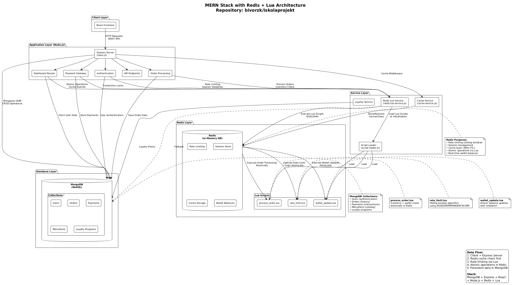

# Cafeteria Ordering System (Final exam Thesis)

## Project Description

This is a web-based application for school cafeterias, allowing students to order food online and administrators to manage menus, users, and orders. It features secure authentication, payment integration (PayPal and Google Pay), and dashboards for both roles.

## Key Features

- User registration and login with email verification and 2FA
- Student dashboard for placing orders, viewing transactions, and managing wallet
- Admin dashboard for managing menu items, users, statistics, and orders
- Payment processing via PayPal and Google Pay
- Security features: rate limiting, XSS protection, password strength checking
- Real-time order status updates
- Loyalty system integration

## Architecture Overview

- **Frontend**: React components with Tailwind CSS for styling
- **Backend**: Node.js with Express.js server
- **Database**: MongoDB with Mongoose ODM
- **Caching**: Redis for session management and rate limiting, with Lua scripts for atomic operations (e.g., wallet updates, order processing)
- **Payments**: PayPal SDK and Google Pay API
- **Authentication**: JWT tokens, bcrypt for hashing
- **Security**: Helmet, CORS, express-validator, etc.

## Prerequisites

- Node.js (version 16 or higher)
- MongoDB (local or cloud instance)
- Redis (for caching; can be run via Docker)
- npm or yarn

## Installation

1. Clone the repository: `git clone <repo-url>`
2. Navigate to the directory: `cd iskolaprojekt`
3. Install dependencies: `npm install`
4. Set up environment variables (see below)
5. Start Redis
6. Run the app: `npm start`

## Environment Configuration
```
1. Create a `.env` file in the root directory
2. Go to Discord #general channel 
3. Go to Pinned Messages
4. Find the messages that has the .env variables
5. Copy and paste it into .env
```
## Troubleshooting

- Redis error: Install Redis via Docker or Chocolatey.
- Database connection: Ensure your IP is added to MongoDB 
- Check if something is missing in .env 

## Technologies 



## Gitignore file tartalma:

```
.vscode/settings.json
node_modules/faker
config/exports
config/sql.js
config/users.sql
node_modules/react
node_modules/artillery
node_modules/redis
node_modules/@redis
node_modules/connect-redis
node_modules/cluster-key-slot
node_modules/
```

## npm list


These are the current node modules that are needed to run the application

```
+-- @google-cloud/recaptcha-enterprise@6.3.0
+-- @paypal/paypal-server-sdk@1.1.0
+-- artillery@2.0.27
+-- autoprefixer@10.4.23
+-- badwords-list@2.0.1-4
+-- bcrypt@6.0.0
+-- connect-redis@9.0.0
+-- cors@2.8.5
+-- crypto@1.0.1
+-- dotenv@17.2.3
+-- ejs@3.1.10
+-- express-mongo-sanitize@2.2.0
+-- express-rate-limit@8.1.0
+-- express-session@1.18.2
+-- express-validator@7.3.1
+-- express@4.21.2
+-- helmet@8.1.0
+-- hpp@0.2.3
+-- jsonwebtoken@9.0.2
+-- mongodb@6.20.0
+-- mongoose@8.18.2
+-- nanoid@5.1.6
+-- node-fetch@2.7.0
+-- node-iplocate@2.0.1
+-- nodemailer@7.0.9
+-- nodemon@3.1.0
+-- paypal@1.0.1
+-- postcss@8.5.6
+-- rate-limit-redis@4.3.1
+-- react@19.2.1
+-- redis@5.10.0
+-- serve-favicon@2.5.1
+-- simple-statistics@7.8.8
+-- tailwindcss@4.1.18
+-- xss-clean@0.1.4
+-- zxcvbn@4.4.2

Dev Dependencies:
├── autoprefixer@10.4.23
├── nodemon@3.0.1
├── postcss@8.5.6
└── tailwindcss@4.1.18
```


## Directory Structure

```
├── .env
├── .git/
├── .gitattributes
├── .github/
├── .gitignore
├── .idea/
├── .vscode/
├── code_analytics.json         # Code analytics data
├── config/                     # Configuration files
│   ├── DATABASE_CONSTANTS.JS
│   ├── database_queries.js
│   └── hu.json
├── data/                       # Data files
│   ├── disposable_email_list.json
│   ├── Most_used_passwords.json
│   ├── password_characters.json
│   └── database_test/          # Test database files
│       ├── Food_Items.json
│       └── menu_items.json
├── docs/                       # Documentation
│   ├── database.png
│   ├── DatabaseDoc.md
│   ├── DatabaseDoc.pdf
│   ├── Documentation.html
│   ├── Documentation.md
│   ├── Documentation.pdf
│   ├── Paypal_TestDetails.txt
│   ├── RedisLua_README.md
│   ├── snaptraySTACK.png
│   └── sourcefor_security_checks.txt
├── node_modules/
├── package-lock.json
├── package.json                # Node.js dependencies and scripts
├── postcss.config.js          # PostCSS configuration
├── public/                     # Static files served to client (Frontend)
│   ├── favicon.ico
│   ├── googlepay.js
│   ├── index.html
│   ├── password_reset.html
│   ├── pay.html
│   ├── paypal.js
│   ├── register.html
│   ├── verify.html
│   ├── 404/                    # 404 error pages
│   │   ├── 404.html
│   │   └── 404.jsx
│   ├── 429/                    # 429 error pages
│   │   ├── 429.html
│   │   └── 429.jsx
│   ├── dashboard/              # Dashboard pages
│   │   ├── admin/
│   │   │   ├── admin.html
│   │   │   ├── admin.jsx
│   │   │   ├── AdminHeader.jsx
│   │   │   ├── AdminSidebar.jsx
│   │   │   ├── MenuItemsSection.jsx
│   │   │   ├── SettingsSection.jsx
│   │   │   ├── StatsSection.jsx
│   │   │   ├── useAdminData.js
│   │   │   └── UsersSection.jsx
│   │   ├── parent/
│   │   │   ├── parent.html
│   │   │   ├── parent.jsx
│   │   │   ├── ParentHeader.jsx
│   │   │   ├── ParentOrdersSection.jsx
│   │   │   ├── ParentSettingsSection.jsx
│   │   │   ├── ParentSidebar.jsx
│   │   │   ├── ParentStatsSection.jsx
│   │   │   ├── ParentStudentsSection.jsx
│   │   │   └── useParentData.js
│   │   └── student/
│   │       ├── components/
│   │       ├── hooks/
│   │       ├── LoyaltySection.jsx
│   │       ├── OrdersSection.jsx
│   │       ├── services/
│   │       ├── SettingsSection.jsx
│   │       ├── StatsSection.jsx
│   │       ├── student.html
│   │       ├── student.jsx
│   │       ├── StudentHeader.jsx
│   │       ├── StudentSidebar.jsx
│   │       ├── TransactionsSection.jsx
│   │       ├── useStudentData.js
│   │       ├── utils/
│   │       └── WalletSection.jsx
│   ├── home_page/              # Home page files
│   │   ├── home_page.html
│   │   └── home_page.jsx
│   ├── information/            # Information pages
│   │   ├── index.html
│   │   └── information.jsx
│   ├── no_perm/                # No permission pages
│   │   ├── index.html
│   │   └── no_perm.jsx
│   └── Order/                  # Order pages
│       ├── Cart.jsx
│       ├── Header.jsx
│       ├── index.html
│       ├── LoyaltyStatus.jsx
│       ├── MenuItem.jsx
│       ├── notifications.js
│       ├── order.jsx
│       ├── paymentHandlers.js
│       └── useCart.js
├── readme.md                   # Project documentation
├── src/                        # Server-side source code (backend)
│   ├── admin/
│   │   └── admin.js
│   ├── api.js
│   ├── auth/                   # Authentication modules
│   │   ├── 2fa.js
│   │   ├── email_verification.js
│   │   ├── index.js
│   │   ├── login.js
│   │   ├── middleware.js
│   │   ├── password_reset.js
│   │   ├── passwordhash.js
│   │   ├── register.js
│   │   ├── security.js
│   │   └── validation.js
│   ├── chapta.js
│   ├── dashboard/
│   │   ├── admin/
│   │   │   └── admin.js
│   │   ├── dashboard.js
│   │   ├── middleware/
│   │   │   └── auth-middleware.js
│   │   ├── parent/
│   │   │   └── parent.js
│   │   ├── services/
│   │   │   └── cache-service.js
│   │   ├── statistics/
│   │   │   └── statistics.js
│   │   └── student/
│   │       └── student.js
│   ├── database.js
│   ├── examples/
│   │   └── lua-demo.js
│   ├── logout.js
│   ├── LoyaltySystem/
│   │   └── loyalty-service.js
│   ├── main.js
│   ├── middleware/
│   │   └── security.js
│   ├── models/
│   │   └── User.js
│   ├── Orders/
│   │   └── Order.js
│   ├── payments/
│   │   ├── googlepay.js
│   │   └── paypal.js
│   ├── redis-lua.js
│   ├── redis.js
│   ├── Register.jsx
│   ├── script-loader.js
│   ├── scripts/
│   │   ├── process_order.lua
│   │   ├── rate_limit.lua
│   │   ├── TODO.md
│   │   └── wallet_update.lua
│   ├── services/               # Service modules
│       ├── googlepay-service.js
│       ├── order-service.js
│       ├── paypal-service.js
│       └── redis-lua-service.js
│   └── verificationStore.js
├── tailwind.config.js         # Tailwind CSS configuration
└── tests/                      # Test files
    ├── code_analytic.py
    ├── code_analytics.json
    ├── creating_test_users.js
    ├── database_testing.js
    ├── fake_data.py
    ├── menu_items.json
    ├── Paypal_TestConfig.txt
    ├── query_security_logs.js
    ├── register_testing.py
    ├── Jest/                   # Jest test directory
    └── performance_tests/      # Performance test files
        ├── artillery.yml
        └── reports/
            ├── 20260121_916.txt
            └── 20260121_936.txt
```

## Router Routes

### Main Application Routes
  /login                    # Login page

  /register                 # Registration page

  /password-reset/:token    # Password reset page

  /pay                      # Payment page

### Authentication Routes
 /register                 # User registration

 /login                    # User login

 /logout                   # User logout

 /logout                   # Logout confirmation

 /2fa                      # Two-factor authentication

### Email Verification Routes
 /email-verification/verify-code    # Verify email code

 /email-verification/verify/:token  # Verify email with token

### Password Reset Routes  
 /password-reset/          # Request password reset

 /password-reset/:token    # Password reset form

 /password-reset/:token    # Submit new password

 /forgot-password/         # Forgot password request

### Dashboard Routes
 /dashboard/               # Main dashboard

 /dashboard/admin          # Admin dashboard page

 /dashboard/student        # Student dashboard page

### Admin Dashboard API Routes
 /dashboard/admin/usercount        # Get user count

 /dashboard/admin/userlist         # Get list of users

 /dashboard/admin/stats            # Get admin statistics

 /dashboard/admin/signup-stats     # Get signup statistics

 /dashboard/admin/orders           # Get orders data

 /dashboard/admin/soldout          # Get sold out items

 /dashboard/admin/itemcount        # Get item count

 /dashboard/admin/menulist         # Get menu items list

 /dashboard/admin/stockalerts      # Get stock alerts

 /dashboard/admin/paymentstats     # Get payment statistics

 /dashboard/admin/welcome-message  # Get welcome message

 /dashboard/admin/health           # System health check

 /dashboard/admin/menuitem_export  # Export menu items

 /dashboard/admin/delete_menuitem/:id  # Delete menu item

 /dashboard/admin/create_menuitem  # Create new menu item

 /dashboard/admin/menuitem/:id     # Update menu item

### Student Dashboard Routes
 /dashboard/student/freeze_account # Freeze student account

 /dashboard/student/parent/link    # Link parent account

### Order Management Routes
 /Order/                   # Order page

 /Order/menu_items         # Get menu items for ordering

 /Order/:orderID           # Get specific order details

 /Order/Order              # Create new order

 /Order/:orderID/status    # Update order status

 /Order/:orderID/capture   # Capture order payment

### Admin Management Routes
 /admin/changeuser         # Change user permissions

## API Routes

### General API Routes
 /api/test                 # API test endpoint

 /api/current_user         # Get current logged-in user

 /api/menu-items           # Get available menu items

### Order API Routes
 /api/orders               # Create PayPal order

 /api/orders/:orderID/capture    # Capture PayPal payment

### Google Pay API Routes
 /api/orders/googlepay           # Create Google Pay order

 /api/orders/googlepay/complete  # Complete Google Pay transaction

### Payment Integration Routes
 /api/payments/paypal      # PayPal payment processing

 /api/payments/googlepay   # Google Pay payment processing


## Testing

- Unit tests: Run Jest tests in `tests/Jest/`
- Performance tests: Use Artillery in `tests/performance_tests/`
- Database tests: `tests/database_testing.js`

## Security

This application implements comprehensive security best practices, including:

- **Input Validation and Sanitization**: Uses express-validator for request validation, express-mongo-sanitize to prevent NoSQL injection, and xss-clean for XSS protection.
- **Rate Limiting**: Implements express-rate-limit with Redis to prevent abuse and DDoS attacks.
- **Authentication and Authorization**: JWT-based auth with bcrypt password hashing, 2FA support, and session management via Redis.
- **Security Headers**: Helmet.js for setting secure HTTP headers (CSP, HSTS, etc.).
- **Password Security**: Enforces strong passwords using zxcvbn, checks against common passwords, and supports secure password resets.
- **Email Verification**: Disposable email detection and verification to prevent spam accounts.
- **Payment Security**: Secure integration with PayPal and Google Pay APIs, with proper handling of sensitive data.
- **Additional Protections**: HPP (HTTP Parameter Pollution) prevention, CORS configuration, and reCAPTCHA for bot protection.
- **Monitoring and Logging**: Security checks and logging for suspicious activities.


